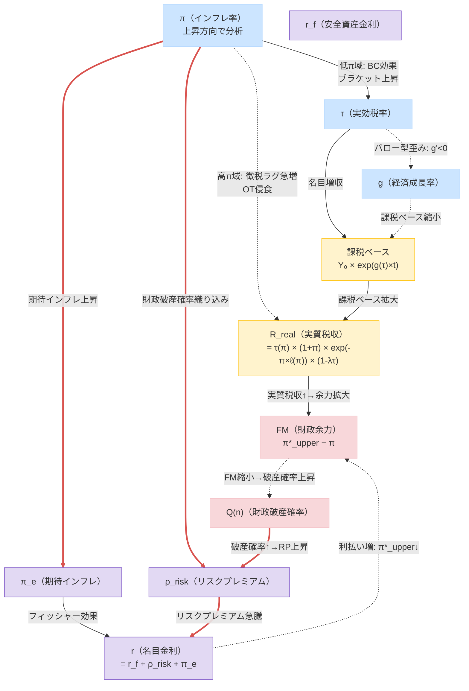
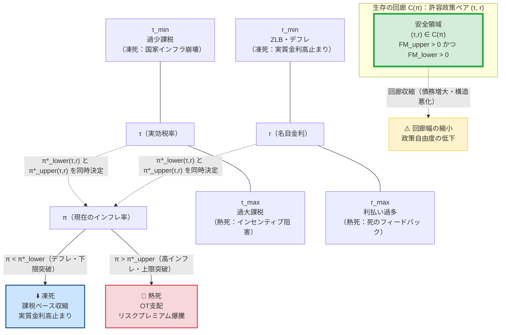

<style>
  h1 { font-size: 1.4rem; margin-top: 2.8rem; margin-bottom: 1.2rem; font-weight: bold; border-bottom: 1px solid #eee; padding-bottom: 0.3rem; }
  h2 { font-size: 1.25rem; margin-top: 2.4rem; margin-bottom: 1.0rem; font-weight: bold; }
  h3 { font-size: 1.15rem; margin-top: 2.0rem; margin-bottom: 0.8rem; font-weight: bold; }
  p, table, blockquote, pre { line-height: 1.25; margin-bottom: 1.3rem; }
</style>

---

> **V16改訂の趣旨（V15→V16）：**
> 著者コメントおよびGrok・Geminiレビューを反映した改訂。主な変更点は以下の通り。
> (1) **上下限対称性の完成（本稿の核心的拡張）**：税率・金利に**下限臨界（$\tau_{\min}$, $r_{\min}$）**を導入し、財政安定フロンティアを**「生存の回廊（Corridor of Stability）」**として再定義（§4.4・§5.4 新設、図4追加）。臨界インフレ率も上限 $\pi^*_{\text{upper}}$ と下限 $\pi^*_{\text{lower}}$ の二重構造に拡張し、FM・FSM・FIMの各指標を上下対称的に完備化した（Grok・Geminiコメント共通）。
> (2) **図2にデフレ行追加**：$\pi\downarrow$（デフレ）の行を追加し、デフレ下での財政への影響（$\tau\downarrow$・$g\downarrow$・$r_{\text{real}}\uparrow$・FM$\downarrow$）を明示（著者コメント）。
> (3) **図1を大幅改善**：ノード内改行を `<br>` に統一、$R^{\text{real}}$ノードを独立させ、名目金利を「安全資産金利＋リスクプレミアム＋期待インフレ」に分解して図に反映（著者コメント・Grok指摘）。
> (4) **§5.0の直感説明を数学的直感に改訂**：「家のローン」等の日常比喩から、プライマリーバランス条件・確率的持続可能性といった数理的本質への言い換えに変更（著者コメント）。
> (5) **Appendix R（現代マクロ経済学とBCOTの接続）新設**：RBC・NK定常状態のBCOTストレステスト、および10の革新的パラダイムをBCOTフレームで統一的に解釈するまとめを、数式レベルと経済的本質レベルで記述。後日の別記事深堀りに向けた土台として位置づける（著者コメント・Grok・Geminiコメント共通）。
> (6) **Mermaid・KaTeXレンダリング修正**：全Mermaidノードの `\n` を `<br>` に統一、中括弧・アスタリスク等の特殊文字をエスケープ処理（Grok・Gemini指摘）。
>
> **（参考）V15改訂の趣旨（V14→V15）：**
> (1) 図3のASCIIアートをMermaidに移行・π-τ断面図新設。(2) §5.2に二つの算定基準の理由を追記。(3) §5.0（実務家・大学生向け説明）新設。(4) Technical Appendix §Lのステップバイステップ拡充。(5) ブログ設定ガイド追加。

---

# Part I：本文――インフレと財政持続性の非線形ダイナミクス

## ― BC-OT財政安定性フレームワーク：ブラケット・クリープとオリベラ＝タンジ効果の統合理論 ―

---

## 1. はじめに：インフレ財政学の錯覚と本稿の問い

インフレは政府債務を実質的に軽くする。このため「インフレは財政にとって有利である」という見方がしばしば語られる。しかし歴史を振り返ると、高インフレやハイパーインフレは必ずしも財政を改善しなかった。ワイマール共和国、ジンバブエ、アルゼンチンなどの事例では、インフレが税収基盤そのものを破壊し、財政危機を深刻化させている。

一方で、2022〜2025年の日本や欧米では、インフレ率が2〜3%程度に上昇した局面において、政府の税収は目減りするどころか過去最高を更新し続けた。この明白な現実を従来の理論は説明できなかった。

**本稿の中心的問い：** なぜ低インフレでは財政が改善し、高インフレでは財政が崩壊するのか。この非対称性の根拠は何か。さらに、なぜデフレも財政を悪化させるのか。そして財政運営者はどのような指標で政策を判断すべきか。

この問いに答えるために、本稿は**ブラケット・クリープ効果（BC）**と**オリベラ＝タンジ効果（OT）**を統合した**BC-OT財政安定性フレームワーク**を構築する。

### 1.1 本稿の主要貢献

1. **BC-OT統合モデル**：BC効果（有界）とOT効果（累積的支配）の数理統合
2. **インフレ・ラッファー曲線**：実質税収 $R^{\mathrm{real}}(\pi)$ の山型構造の導出
3. **臨界インフレ率 $\pi^*$**：BC効果とOT効果が均衡する転換点の内生的決定
4. **財政余力（Fiscal Margin）**：$FM = \pi^* - \pi$ による財政健全性の定量指標
5. **財政安定フロンティア**：$\pi^*(\tau, r)$ として政策変数が安定境界を動かすメカニズム
6. **FTPLとの接続**：将来黒字現在価値の侵食として統一的に解釈
7. **動学的不安定性**：ギャンブラーの破産によるOTレジームの「制度変更強制」特性の解明
8. **需要プル・コストプッシュの非対称性**：インフレ原因による $\pi^*$ のシフト
9. **生存の回廊（V16新設）**：上下の臨界インフレ率 $\pi^*_{\text{lower}} < \pi < \pi^*_{\text{upper}}$ による双方向フロンティア

---

## ◆ 図1：主要変数（π・τ・r・g）の相互フィードバック関係図

本稿の核心を理解するために、インフレ率 $\pi$、実効税率 $\tau$、金利 $r$、経済成長率 $g$ の四変数がどのように相互作用するかを図示する。実線矢印（`-->`）は「上昇させる正のチャネル」、破線矢印（`-.->`）は「低下させる負のチャネル」、**赤太線（`==>`）は「死のフィードバック・ループ」**を示す。

> **名目金利の分解：** 名目金利 $r$ は以下のように分解される：$r = r^f + \rho^{\text{risk}} + \pi^e$（安全資産金利 $r^f$＋リスクプレミアム $\rho^{\text{risk}}$＋期待インフレ $\pi^e$）。図では $\pi$ の上昇が $\pi^e$（フォワードルッキング）と $\rho^{\text{risk}}$（財政危機確率の織り込み）を通じて $r$ を押し上げることを示す。



> **読み方のガイド：** 「低インフレ域」では $\pi$ 上昇→$\tau$ 上昇（BC効果）→$R^{\text{real}}$ 増という正のフィードバックが働く。「高インフレ域」では $\pi$ 上昇→OTラグ急増→$R^{\text{real}}$ 崩落。さらに赤太線の**「死のフィードバック・ループ」**（$\pi \uparrow \Rightarrow Q(n) \uparrow \Rightarrow \rho^{\text{risk}} \uparrow \Rightarrow r \uparrow \Rightarrow FM \downarrow$）が金利を自己実現的に暴騰させる。金利上昇はまた、FTPL的に「純利息支払い増→将来PBの実質現在価値減少→物価水準の調整」という経路でインフレを誘発しうる点にも注意（§7参照）。

---

## 2. なぜBCは有界でOTは累積的に支配的になるか：理論の核心

### 2.0 直感的理解：「BCが勝つ世界」と「OTが勝つ世界」

数式に入る前に、二つの世界のコントラストを直感的に把握しておきたい。

**BCが勝つ世界（低インフレ域）：**
名目所得がインフレで膨らみ、税率区分はそのまま据え置かれているため、納税者は自動的に高い税率区分へと移動する（ブラケット・クリープ）。行政は電子申告・源泉徴収で税を素早く徴収できており、「稼いだその月に近い時点」で税収として回収される。インフレが穏やかである限り、この「課税ベースの名目拡大＋実効税率の自動上昇」という恩恵が財政を潤し続ける。

**OTが勝つ世界（高インフレ域）：**
インフレが急加速すると、行政処理能力が追いつかなくなる。徴税には申告・審査・納付という手続きが伴い、どうしても数週間から数ヶ月のラグが発生する。このラグの間に通貨価値が急落し、「帳簿上は100の税収」が実質的には50・30・10に目減りする。さらに納税者も合理的に支払いを先延ばしする。BC効果は最高税率で飽和しているため「もう引き上げようがない」状態にあり、OT侵食に対抗できなくなる。

**なぜ転換点（$\pi^*_{\text{upper}}$）が存在するか：** BCの増収力は「最高税率という天井」によって有界（上限あり）だが、OTの侵食力は「ラグの急増速度」に上限がない。この非対称性から、インフレがある閾値を超えた瞬間に両者の力関係が逆転する。

**なぜ下限の転換点（$\pi^*_{\text{lower}}$）も存在するか：（V16新設）** デフレ域では、名目所得の減少によって課税ベースが収縮し、BC効果は逆転する（ブラケットの逆方向移動）。また実質金利がプラスに高止まりし（ZLB下：$r = i - \pi \approx 0 - (-|\pi|) = |\pi| > 0$）、債務のGDP比が加速的に拡大する。つまり「凍死」に向かう転換点が下側にも存在する。

インフレが起きると、税収は二つの経路で増加する。

**経路①（課税ベースの名目拡大）：** 名目所得がインフレによって押し上げられる。課税対象となる名目所得・利益そのものが膨らむため、税率が変わらなくても税収は増加する。

**経路②（税率区分の上昇・ブラケット効果）：** 累進課税制度では、名目所得が増加した納税者が自動的により高い税率区分へと移動する。社会全体の実効税率が内生的に上昇し、税収はインフレ率以上の速度で膨らむ。

しかし、BC効果には**物理的な上限**が存在する。第一に、所得税の最高税率には法定上限がある。第二に、より根本的には、税率上昇は経済成長を阻害する（バロー型の歪みコスト）。実効税率 $\tau$ の上昇は成長率 $g(\tau)$ を押し下げ（$g'(\tau) < 0$）、課税ベースそのものが長期的に縮小する。この「**税率上昇→成長率低下→課税ベース縮小**」という経路が、BC効果を有界にする経済学的な実質的根拠である。

> **Proposition（BC有界性の根拠）：** 税率が経済成長を阻害するならば（$g'(\tau) < 0$）、実質税収に対するBC効果の総貢献は有限の上限を持つ。

### 2.2 オリベラ＝タンジ効果（OT効果）：財政の潜在的な敵

OT効果の根底にあるのは**徴税タイムラグ**という経済的摩擦である。税は課税事由の発生から納税まで数週間から1年超のラグを経る。高インフレ下では、このラグの間に貨幣価値が急落し、実質税収が侵食される。

重要なのは、OT効果の**累積的支配性**である。インフレが加速すると、行政混乱・納税者の意図的な引き延ばしにより徴税ラグが閾値的に急拡大する。OT侵食因子 $e^{-\pi \ell(\pi)}$ は0〜1に有界だが、**インフレ上昇に伴うその*限界的な侵食力*（$\ell(\pi) + \pi\ell'(\pi)$）はBCの限界増収力を高インフレ域で累積的・動学的に圧倒する**。

> **Proposition（OT累積支配性）：** 高インフレ域では徴税ラグが閾値的に急増し、OTによる限界侵食力の累積効果はBCの有界な限界増収力を圧倒し続ける。侵食因子 $e^{-\pi\ell(\pi)}$ そのものは有界だが、その**急落速度（$-\partial e^{-\pi\ell(\pi)}/\partial\pi$）は上限を持たない。**

### 2.3 非対称性の帰結：臨界インフレ率 $\pi^*$ の存在

**有界なBC**と**累積的に支配的なOT**のこの非対称性から、必然的に次の帰結が導かれる。

**低インフレ域：** BC効果がOT効果を上回り、$\partial R^{\mathrm{real}} / \partial \pi > 0$（財政の味方）。

**高インフレ域：** OT効果の限界侵食力がBC効果の限界増収力を追い越し、$\partial R^{\mathrm{real}} / \partial \pi < 0$（財政の敵）。

したがって、両効果が均衡する点として**上限臨界インフレ率 $\pi^*_{\text{upper}}$** が内生的に決定される。これが**インフレ・ラッファー曲線**の極大点（相転移点）である。

$$\frac{\partial R^{\mathrm{real}}(\pi^*_{\text{upper}})}{\partial \pi} = 0 \tag{式1}$$

> **【式1の注釈】**
> - **変数：** $R^{\mathrm{real}}(\pi)$ = 実質政府税収（インフレ率の関数）；$\pi^*_{\text{upper}}$ = 上限臨界インフレ率（V16：下限との対称化に合わせて表記変更）
> - **意味：** 実質税収のインフレに対する限界変化率がゼロになる点。これより低いと「+（BC優勢）」、高いと「−（OT優勢）」。
> - **V16の対称化：** 上限臨界 $\pi^*_{\text{upper}}$（熱死の境界）と下限臨界 $\pi^*_{\text{lower}}$（凍死の境界）の二重構造に拡張（§4.4参照）。

先進国の典型的なパラメーターを用いた例示的キャリブレーションでは $\pi^*_{\text{upper}} \approx 13 \sim 15\%$ となる（数理的詳細はPart II参照）。ただしこの数値は基準パラメーター依存の典型例であり、本モデルの本質は「$\pi^*$ が存在すること」にある。

---

## 3. インフレ・ラッファー曲線と二相構造

### 3.1 実質税収の山型構造

統合実質政府収入関数 $R^{\mathrm{real}}(\pi)$ は山型の「インフレ・ラッファー曲線」を描く：

- $\pi < \pi^*_{\text{upper}}$（**BC優勢フェーズ**）：インフレ上昇とともに実質税収は増加（$\partial R^{\mathrm{real}} / \partial \pi > 0$）
- $\pi = \pi^*_{\text{upper}}$（**上限臨界点**）：実質税収が最大値に到達
- $\pi > \pi^*_{\text{upper}}$（**OT優勢フェーズ**）：実質税収が急崖的に崩落（$\partial R^{\mathrm{real}} / \partial \pi \ll 0$）

V16では、デフレ方向にも下限の臨界が存在し（$\pi^*_{\text{lower}} < 0$）、ラッファー曲線の左端でも実質税収が低下する構造を持つ（§4.4参照）。

### 3.2 フェーズ①：BC優勢フェーズ（$\pi^*_{\text{lower}} < \pi < \pi^*_{\text{upper}}$）

マイルドなインフレ領域では、OT侵食はほぼ発生しない一方で、BC効果（課税ベース拡大＋実効税率上昇）が支配的となり、インフレが上昇するほど実質税収は増加する。

日本の税収過去最高更新という現実はこのフェーズとして説明される。

### 3.3 フェーズ②：OT優勢フェーズ（$\pi > \pi^*_{\text{upper}}$）

インフレが上限閾値を超えると、行政処理能力の低下と納税者の合理的な引き延ばし行動が相まって、徴税ラグがロジスティック的に急拡大する。BC効果は最高税率で飽和しているため増収余地がなく、OT侵食に対抗できなくなる。

### 3.4 フェーズ③：デフレ・凍死フェーズ（$\pi < \pi^*_{\text{lower}}$）（V16新設）

デフレが進むと、名目課税ベースが収縮してBC効果が逆転し（名目所得減少→低税率ブラケットへの逆移動）、かつZLB下で実質金利が高止まりして債務のGDP比が加速的に拡大する。この「凍死」へ向かうフェーズが下限臨界 $\pi^*_{\text{lower}}$ によって定義される（§4.4・§5.4詳述）。

---

## ◆ 図2：π（インフレ）変化が τ・g・r・財政余力に与える影響の方向図

<div style="overflow-x:auto;">
<table style="border-collapse:collapse; width:100%; font-size:0.9em;">
<thead>
<tr style="background:#3a3a5c; color:white; text-align:center;">
  <th style="padding:8px 10px; text-align:left; min-width:180px;">π（インフレ率）の変化</th>
  <th style="padding:8px 10px;">τ（実効税率）</th>
  <th style="padding:8px 10px;">g（成長率）</th>
  <th style="padding:8px 10px;">r（金利・リスクプレミアム）</th>
  <th style="padding:8px 10px;">FM（財政余力）</th>
  <th style="padding:8px 10px;">Q(n)（破産確率）</th>
</tr>
</thead>
<tbody>
<tr style="background:#cce5ff;">
  <td style="padding:8px 10px; font-weight:bold;">🔵 デフレ域 π↓（凍死方向）</td>
  <td style="padding:8px 10px; text-align:center;">↓（ブラケット逆移動）</td>
  <td style="padding:8px 10px; text-align:center;">↓（需要収縮）</td>
  <td style="padding:8px 10px; text-align:center;">↑↑（実質金利高止まり）</td>
  <td style="padding:8px 10px; text-align:center;">↓（π*_lowerに近づく）</td>
  <td style="padding:8px 10px; text-align:center;">↑（悪化）</td>
</tr>
<tr style="background:#d4edda;">
  <td style="padding:8px 10px; font-weight:bold;">✅ 低インフレ域 π↑（BC優勢）</td>
  <td style="padding:8px 10px; text-align:center;">↑（BC効果）</td>
  <td style="padding:8px 10px; text-align:center;">微低下</td>
  <td style="padding:8px 10px; text-align:center;">ほぼ変化なし</td>
  <td style="padding:8px 10px; text-align:center;">↓（π*_upperに近づく）</td>
  <td style="padding:8px 10px; text-align:center;">↓（改善）</td>
</tr>
<tr style="background:#fff3cd;">
  <td style="padding:8px 10px; font-weight:bold;">⚡ 上限臨界点 π≈π*_upper</td>
  <td style="padding:8px 10px; text-align:center;">↑（飽和）</td>
  <td style="padding:8px 10px; text-align:center;">低下</td>
  <td style="padding:8px 10px; text-align:center;">やや↑</td>
  <td style="padding:8px 10px; text-align:center;">→ 0</td>
  <td style="padding:8px 10px; text-align:center;">中立</td>
</tr>
<tr style="background:#fde8d8;">
  <td style="padding:8px 10px; font-weight:bold;">⚠️ 高インフレ域 π↑（OT優勢）</td>
  <td style="padding:8px 10px; text-align:center;">↑（飽和・固定）</td>
  <td style="padding:8px 10px; text-align:center;">↓↓</td>
  <td style="padding:8px 10px; text-align:center;">↑↑（リスクプレミアム）</td>
  <td style="padding:8px 10px; text-align:center;">↓↓（FM&lt;0へ）</td>
  <td style="padding:8px 10px; text-align:center;">↑↑（急増）</td>
</tr>
<tr style="background:#f8d7da;">
  <td style="padding:8px 10px; font-weight:bold;">🔴 ハイパーインフレ</td>
  <td style="padding:8px 10px; text-align:center;">飽和</td>
  <td style="padding:8px 10px; text-align:center;">↓↓↓</td>
  <td style="padding:8px 10px; text-align:center;">↑↑↑（死のループ）</td>
  <td style="padding:8px 10px; text-align:center;">≪0</td>
  <td style="padding:8px 10px; text-align:center;">→1（確実な崩壊）</td>
</tr>
</tbody>
</table>
</div>

> **デフレ行の補足（V16追加）：** デフレ下では $\tau$ が下落（名目所得減少による逆ブラケット移動）し、ZLB下で名目金利をゼロにしても実質金利がプラスに高止まりする（$r_{\text{real}} = i - \pi \approx |\pi| > 0$）。この実質金利高止まりが債務のGDP比を加速させ（Blanchard の $r > g$ 問題の悪化）、FMを下方から侵食する。これが「凍死」のメカニズムである。
>
> **各変数の動きのロジック：** （V15から継続）
> - **τ（実効税率）の動き：** π上昇→累進課税ブラケットの自動移動（BC効果）により実効税率が上昇。最高税率（$\tau_{\max}$）で飽和。デフレ下では逆方向。
> - **g（成長率）の微低下：** τ上昇→バロー型歪みコスト（$g'(\tau)<0$）により成長率が緩やかに低下。時間差による政策誤認リスクに注意。
> - **r（金利）の動き：** 高インフレ域ではリスクプレミアム急上昇。デフレ下では名目金利ZLBにより実質金利が高止まり。
> - **FM（財政余力）の動き：** FMはπ*_upper（上限）とπ*_lower（下限）の両方からの距離指標（V16拡張）。
> - **Q(n)（破産確率）の動き：** FM縮小→OT優勢（または凍死方向）→勝率p低下→破産確率急増。

---

## 4. 財政余力（Fiscal Margin）と財政安定フロンティア

### 4.1 財政余力（FM）の定義

**なぜインフレが財政健全性の指標になるのか：**
財政政策とインフレは、二つの経路で深く結びついている。第一に、生産要素がフル稼働している状態で財政支出を拡大すると、総需要が供給を超えてインフレが生じる（需要プル経路）。第二に、より根本的には、FTPLが示すように、政府債務の実質価値は将来プライマリー黒字の現在価値で決まる（式14参照）。財政の持続性が疑われると、その差額を埋めるように物価水準が上昇する——つまり財政政策の行き過ぎは最終的にインフレに帰結する。

$$\boxed{FM \equiv \pi^*_{\text{upper}} - \pi} \tag{式2}$$

> **【式2の注釈】**
> - **変数：** $\pi^*_{\text{upper}}$ = 上限臨界インフレ率；$\pi$ = 現在のインフレ率
> - **意味：** 現在のインフレ率が上限臨界点までどれだけ余裕があるかを測る距離指標。
> - **V16の拡張：** 下限方向の余力も $FM_{\text{lower}} \equiv \pi - \pi^*_{\text{lower}} \ge 0$ として対称的に定義（§4.4参照）。
> - **日本の現状（参考）：** $\pi \approx 2\%$、$\pi^*_{\text{upper}} \approx 13 \sim 15\%$ → $FM \approx 11 \sim 13\%$

| $FM$ の値 | 財政状況 | 政策の余地 |
| :--- | :--- | :--- |
| $FM > 0$（大） | BC優勢フェーズ・安全域 | 減税・積極的財政政策の検討余地あり |
| $FM \approx 0$ | 上限臨界点（危険接近） | 財政改革が緊急 |
| $FM < 0$ | OT優勢フェーズ・危険域 | 財政危機リスクが急増 |

### 4.2 財政安定フロンティア：$\pi^*$ は政策で動く

臨界インフレ率 $\pi^*$ は固定値ではなく、税率 $\tau$ や金利 $r$ などの政策変数に依存して動く内生変数である：

$$\pi^*_{\text{upper}} = \pi^*_{\text{upper}}(\tau, r, \ell_0, g) \tag{式3}$$

**税率 $\tau$ の効果（二面性）：**

$$\frac{\partial \pi^*_{\text{upper}}}{\partial \tau}: \text{符号は } g'(\tau) \text{ の大きさに依存} \tag{式4}$$

**金利 $r$ の効果（明確）：**

$$\frac{\partial \pi^*_{\text{upper}}}{\partial r} < 0 \tag{式5}$$

**徴税タイムラグ短縮化の効果（明確）：**

$$\frac{\partial \pi^*_{\text{upper}}}{\partial \ell_0} < 0 \quad (\ell_0 \downarrow \Rightarrow \pi^*_{\text{upper}} \uparrow) \tag{式6}$$

### 4.3 財政フロンティアとしての政策空間

$(\pi, \tau, r)$ の三次元空間において、$\pi^*_{\text{upper}}(\tau, r) = \pi$ を満たす面が**上限財政安定フロンティア**を、$\pi^*_{\text{lower}}(\tau, r) = \pi$ を満たす面が**下限財政安定フロンティア**を構成する（§4.4参照）。

---

## ◆ 図3a：財政安定フロンティアの概念図（π-r 平面の断面図）

> **読み方：** 縦軸が金利 $r$、横軸がインフレ率 $\pi$。上限フロンティア（π*_upper線）より**左下（低π・低r側）が安全域（FM>0）**。V16では下限フロンティア（π*_lower線、デフレ側）も追加され、安全域が左右から挟まれた「帯」として定義される。


---

### 4.4 対称的財政安定フロンティアと生存の回廊（V16新設）

これまでのモデルは主に**上限側の破綻（熱死）**に焦点を当てていたが、財政持続性には**下限側の破綻（凍死）**も存在する。V16では両側を明示的に定義し、財政安定フロンティアを**「生存の回廊（Corridor of Stability）」**として完備化する。

#### 税率の下限臨界 $\tau_{\min}$（過少課税による国家インフラ崩壊境界）

政府が最低限の国家機能（徴税インフラ・法秩序・公共財）を維持するための最小政府支出を $G_{\min}$ とする。実質税収がこれを下回る最低税率が $\tau_{\min}$ である：

$$\tau_{\min} \equiv \arg\min_\tau \left\{ \max_\pi R^{\mathrm{real}}(\pi, \tau) \ge G_{\min} \right\} \tag{式3b}$$

> **【式3bの注釈】**
> - **意味：** $\tau < \tau_{\min}$ になると、どのインフレ率にしても国家インフラを維持できない。徴税権そのものが崩壊し、通貨信認が失われる（ハイパーインフレへの転落、または財政凍結）。
> - **V15の $\tau_{\min}^{\text{risk}}$ との関係：** $\tau_{\min}^{\text{risk}}$（式7）は「破産確率を許容水準以下に保つ最低税率」であり確率的な下限。$\tau_{\min}$（式3b）は「国家機能維持の絶対的な下限」。$\tau_{\min} < \tau_{\min}^{\text{risk}}$ が通常の関係。

#### 金利の下限臨界 $r_{\min}$（ZLB・デフレ下の凍死境界）

名目金利にはゼロ金利制約（ZLB）が存在する：$i \ge i_{\min} \approx 0$。実質金利で表現すると：

$$r_{\min} = i_{\min} - \pi \approx -\pi \tag{式3c}$$

デフレ（$\pi < 0$）下では $r_{\min} = -\pi > 0$ となり、中銀が名目金利をゼロまで下げても実質金利がプラスに高止まりする。また財政支配下で名目金利を不当に抑制した場合（$r < r_{\min}$）、国債市場への資金逃避が生じる。いずれも債務のGDP比が加速的に発散する「凍死ループ」を引き起こす。

#### 生存の回廊の定義

政策変数 $(\tau, r)$ の対と現在のインフレ率 $\pi$ に対して、**生存の回廊（Corridor of Stability）**を以下のように定義する：

$$\pi^*_{\text{lower}}(\tau, r) < \pi < \pi^*_{\text{upper}}(\tau, r) \tag{式46}$$

$$\mathcal{C}(\pi) \equiv \left\{ (\tau, r) \;\middle|\; \pi^*_{\text{lower}}(\tau, r) < \pi < \pi^*_{\text{upper}}(\tau, r) \right\} \tag{式47}$$

$$\tau_{\min} \le \tau \le \tau_{\max}(\pi, r), \quad r_{\min}(\pi, \tau) \le r \le r_{\max}(\pi, \tau) \tag{式48a, b}$$

**統一生存条件**：

$$(\tau, r) \in \mathcal{C}(\pi) \quad \Leftrightarrow \quad FM_{\text{upper}} > 0 \quad \text{かつ} \quad FM_{\text{lower}} > 0 \tag{式49}$$

ここで $FM_{\text{upper}} \equiv \pi^*_{\text{upper}}(\tau, r) - \pi$、$FM_{\text{lower}} \equiv \pi - \pi^*_{\text{lower}}(\tau, r)$。

> **政策含意：**
> - 増税（$\tau \uparrow$）は通常 $\pi^*_{\text{upper}}$ を下げるが、$\tau_{\min}$ との関係で回廊を狭める可能性もある（歪みコストによる）。
> - 利上げ（$r \uparrow$）は $\pi^*_{\text{upper}}$ を下げ、ZLB制約が引き上がることで回廊を上方向に圧縮する。
> - 構造改革（徴税デジタル化・成長促進）は $\pi^*_{\text{upper}}$ を上げ $\pi^*_{\text{lower}}$ を下げることで回廊全体を**拡大**させる。

---

## ◆ 図4：BC-OT生存の回廊概念図（V16新設）



> **読み方：** 回廊の内側（青緑領域）が財政持続可能な許容政策ペア $(τ, r)$ の集合。左側の下限（$τ_{\min}$・$r_{\min}$）を破ると「凍死（デフレ・国家機能低下）」へ、右側の上限（$τ_{\max}$・$r_{\max}$）を破ると「熱死（OT支配・リスクプレミアム爆騰）」へと転落する。債務増大や構造悪化が進むと回廊そのものが収縮し、政策の自由度が失われる。

---

## 5. 最低税率・最高金利・金利フィードバック：破産を免れるための境界条件

### 5.0 経済的本質：なぜ「上下限境界」が必要か

**大局的な問い：** 財政運営者は「どこまで減税できるか」「どこまで増税すべきか」「中央銀行はどこまで利上げ・利下げしても財政が安全か」を知りたい。この問いに答えるには、**財政が崩壊しない上下両方向のギリギリの境界線**を特定する必要がある。

**四つの境界線の算定基準：**

本稿では以下の四境界を定義するが、それぞれの算定基準が異なる理由は各変数が財政に作用する**時間的性格の違い**にある：

| 変数 | 上限 | 下限 | 算定基準の論理 |
|:---|:---|:---|:---|
| **税率 $\tau$** | $\tau_{\max}$（BC飽和・成長阻害） | $\tau_{\min}$（国家インフラ崩壊） | 長期確率的持続可能性（$Q(n) \le \epsilon$）：税率は徐々に財政バッファを変化させるため |
| **金利 $r$** | $r_{\max}$（利払い過多） | $r_{\min}$（ZLB・凍死） | 単年度フロー収支（$PS \ge 0$）：金利は当期の利払いに即時反映されるため |

**大学院・実務家レベルの直感：** $\tau_{\min}^{\text{risk}}$（式7）は確率的なゲームにおける「勝率が $\epsilon$ 確率以内で破産するギリギリの勝率」を実現する最低税率であり、ギャンブラーの破産問題（式41）の逆問題として解く。一方 $r_{\max}$（式9）はプライマリーバランスの符号が反転する静的なゼロ条件として定義される——前者が確率微積分の問題、後者が単純な代数方程式であることが、算定基準の非対称性の数理的根拠である。

**大学生・学部生レベルの直感：** 税率の下限・上限は「長期的なサステナビリティ」の問題——毎年の財政バッファの積み上げ（勝率）が長期的に破産しない確率で評価する。金利の下限・上限は「短期的なキャッシュフロー」の問題——当期の収支がゼロを下回った瞬間から債務が加速する転換点として定義する。

### 5.1 リスク調整最低税率 $\tau_{\min}^{\mathrm{risk}}$

財政破産確率 $Q(n)$ を社会的許容上限 $\epsilon$（例：5%）以下に抑えるために必要な**最低実効税率**：

$$\tau_{\min}^{\mathrm{risk}} \equiv \inf \left\{ \tau \;\middle|\; R^{\mathrm{real}}(\pi; \tau) \ge g^{\mathrm{gov}} + \mathcal{D}_t b^{\mathrm{net}} + PS^*(\epsilon) \right\} \tag{式7}$$

財政安全マージン（FSM）は現在の実効税率と最低税率の差：

$$FSM \equiv \tau(\pi) - \tau_{\min}^{\mathrm{risk}} \tag{式8}$$

### 5.2 最大許容金利 $r_{\max}$ と死のフィードバック・ループ

プライマリーバランスがゼロを下回らないための**最大許容名目金利**：

$$r_{\max} \equiv g(\tau) + \frac{R^{\mathrm{real}}(\pi) - g^{\mathrm{gov}}}{b^{\mathrm{net}}} \tag{式9}$$

中央銀行がこの金利を超えると財政はOTレジームへ転落するリスクが急増する。さらに重要なのは**「死のフィードバック・ループ」**の存在である：

$$\pi \uparrow \;\Rightarrow\; Q(n) \uparrow \;\Rightarrow\; \text{リスクプレミアム} \uparrow \;\Rightarrow\; r \uparrow \;\Rightarrow\; \pi^*_{\text{upper}} \downarrow \;\Rightarrow\; FM \downarrow \;\Rightarrow\; \pi \text{の危険域が拡大} \tag{式10}$$

なお、金利上昇はFTPL的にも「純利息支払い増→将来PB合計の実質現在価値減少→物価水準の上昇調整」という経路でインフレを誘発しうる（§7参照）。

> **純債務ベースのデュレーション非対称性：** 日本の場合、政府資産（外国為替資金特別会計・GPIF等）は比較的流動性が高く、金利上昇が受取収益に反映されるラグが短い。一方、国債サイドは平均デュレーションが約8〜9年と長いため、利上げ直後の数年間は「国債の利払い増よりも政府資産の運用リターン上昇の方が先に発現する」という時間軸の非対称性が存在する。

### 5.3 財政余力指標（FIM）の導入

$$FIM \equiv r_{\max} - r_{\mathrm{current}} \tag{式11}$$

### 5.4 金利の下限臨界 $r_{\min}$ と凍死フィードバック・ループ（V16新設）

ZLB制約（$i \ge 0$）の下でデフレが進むと、実質金利が高止まりして「凍死ループ」が発動する：

$$\pi \downarrow \;\Rightarrow\; r_{\text{real}} = i - \pi \uparrow \;\Rightarrow\; \mathcal{D}_t = r_{\text{real}} - g \uparrow \;\Rightarrow\; \dot{b}^{\mathrm{net}} \uparrow \;\Rightarrow\; PS^*({\epsilon}) \uparrow \;\Rightarrow\; \tau_{\min}^{\mathrm{risk}} \uparrow \;\Rightarrow\; FSM \downarrow \tag{式10b}$$

**金利の下限臨界** $r_{\min}$ は国債保有者が貨幣・外貨への逃避を開始する実質利回りの下限として定義される：

$$r_{\min} = -\rho \quad (\rho > 0 \text{ は貨幣の利便性イールド}) \tag{式9b}$$

財政金利下限余力（FIM_lower）：

$$FIM_{\text{lower}} \equiv r_{\mathrm{current}} - r_{\min} \tag{式11b}$$

**六指標の統合体系（V16完備化）：**

| 指標 | 空間 | 正の意味 | 負の意味 |
|:---|:---|:---|:---|
| $FM_{\text{upper}} = \pi^*_{\text{upper}} - \pi$ | インフレ空間（上限） | 安全域 | 熱死危険域 |
| $FM_{\text{lower}} = \pi - \pi^*_{\text{lower}}$ | インフレ空間（下限） | 安全域 | 凍死危険域 |
| $FSM = \tau - \tau_{\min}^{\text{risk}}$ | 税率空間（下限） | 減税余地あり | 増税必要 |
| $FSM_{\text{upper}} = \tau_{\max} - \tau$ | 税率空間（上限） | 増税余地 | 過大課税域 |
| $FIM = r_{\max} - r$ | 金利空間（上限） | 引き締め余地 | 金利危険水準超過 |
| $FIM_{\text{lower}} = r - r_{\min}$ | 金利空間（下限） | 低金利余地 | ZLB・凍死危険域 |

---

## 6. 減税の判定フレームワーク：恒久・時限の決定ロジック

（V15から継続。V16では $FM_{\text{lower}} > 0$ かつ $FIM_{\text{lower}} > 0$ の条件を判定マトリクスに追加。）

### 6.1 恒久減税が許容される条件

$$\tau_{\mathrm{new}}(\pi_t) \ge \tau_{\min}^{\mathrm{risk}} \quad (\forall t \ge 0) \tag{式12}$$

### 6.2 時限減税に留めるべき条件

$$E[S_T] \approx n + T \cdot (R^{\mathrm{real}}(\pi; \tau_{\mathrm{temp}}) - g^{\mathrm{gov}} - \mathcal{D}_t b^{\mathrm{net}}) \ge S_{\min} \tag{式13}$$

### 6.3 政策判定マトリクス（V16更新）

| 条件 | 判定 | 根拠 |
| :--- | :--- | :--- |
| 全六指標 $\gg 0$ かつ 構造改革済み | 恒久大規模減税 | 回廊内で $\tau_{\min}^{\text{risk}}$ が恒久低下 |
| 全六指標 $> 0$ かつ $n$ が大きい | 時限減税（中規模） | バッファの一時的切り崩し |
| いずれか一指標 $\approx 0$ | 現状維持 | バッファ回復を優先 |
| いずれか一指標 $< 0$ | 増税・歳出削減・金利調整 | 回廊逸脱リスクへの対応 |

---

## 7. FTPLとの接続：成立条件の侵食

（V15から継続）

### 7.1 FTPLの基本構造

$$\frac{B_t}{P_t} = E_t \sum_{j=0}^{\infty} \beta^j PS_{t+j} \equiv PV(PS) \tag{式14}$$

### 7.2 OT効果はFTPLの成立条件を侵食する

本モデルでは $PS_t = R^{\mathrm{real}}(\pi_t) - g^{\mathrm{gov}} - \mathcal{D}_t b^{\mathrm{net}}$ であり、OT効果の増大は $R^{\mathrm{real}}$ を低下させ $PS_t$ を悪化させる。

> **Proposition（FTPLの侵食）：** OT効果が十分大きい場合（$\pi > \pi^*_{\text{upper}}$）、将来プライマリー黒字の現在価値は減少する：$\partial PV(PS) / \partial OT < 0$。

### 7.3 $\pi^*$ はFTPL安定境界の実用的近似指標として機能する

$$\Omega \equiv PV(PS) - \frac{B_t}{P_t}: \quad \Omega > 0 \text{（FTPL安定）} \leftrightarrow \pi^*_{\text{lower}} < \pi < \pi^*_{\text{upper}} \tag{式15}$$

> **V16の追記：** 凍死フェーズ（$\pi < \pi^*_{\text{lower}}$）でも、実質金利高止まりによる債務発散がPV(PS)を侵食し、$\Omega < 0$ となる経路が存在する。FTPLの安定条件は上下の臨界インフレ率で挟まれた「生存の回廊」内でのみ維持される。

---

## 8. 動学的不安定性：ギャンブラーの破産の二層解釈

（V15から継続）

### 8.1 財政のランダムウォーク表現

- **BC優勢フェーズ（$\pi^*_{\text{lower}} < \pi < \pi^*_{\text{upper}}$）：** $p > 0.5$（財政改善トレンド）
- **臨界フェーズ（$\pi \approx \pi^*_{\text{upper}}$ または $\pi \approx \pi^*_{\text{lower}}$）：** $p \approx 0.5$（中立的ランダムウォーク）
- **OT優勢フェーズ（$\pi > \pi^*_{\text{upper}}$）または凍死フェーズ（$\pi < \pi^*_{\text{lower}}$）：** $p < 0.5$（財政悪化トレンド）

### 8.2 破産確率の解析解

$$Q(n) = \frac{\gamma^a - \gamma^n}{\gamma^a - 1}, \quad \gamma \equiv \frac{1-p(\pi)}{p(\pi)} \tag{式16}$$

### 8.3〜8.4 レベル1・レベル2（V15から継続）

（内容省略—V15と同一。Level 1：構造固定下の数学的帰結。Level 2：政策介入によるゲームのルール変更。）

---

## 9. 需要プルとコストプッシュ：インフレ原因による $\pi^*$ の非対称性

（V15から継続）

$$Y_t^{\mathrm{demand-pull}} = Y_0 e^{(g_0 + \mu_D \pi)t}, \quad \mu_D > 0 \tag{式17}$$

$$Y_t^{\mathrm{cost-push}} = Y_0 e^{(g_0 - \mu_C \pi)t}, \quad \mu_C > 0 \tag{式18}$$

> **Corollary I：** 同じインフレ率 $\pi$ でも、需要プル型は $\pi^*_{\text{upper}}$ を高め財政の耐久性を増すが、コストプッシュ型は $\pi^*_{\text{upper}}$ を低め財政を急速に脆弱化させる。

---

## 10. 日本への示唆と政策パッケージ

### 10.1 現状の定量評価（例示的キャリブレーション）

<div style="overflow-x:auto;">
<table style="border-collapse:collapse; width:100%; font-size:0.92em;">
<thead>
<tr style="background:#3a3a5c; color:white; text-align:center;">
  <th style="padding:8px 12px; text-align:left;">シナリオ</th>
  <th style="padding:8px 12px;">π（インフレ率）</th>
  <th style="padding:8px 12px;">FM_upper = π*_upper−π</th>
  <th style="padding:8px 12px;">FM_lower = π−π*_lower</th>
  <th style="padding:8px 12px;">Q(8)（破産確率）</th>
  <th style="padding:8px 12px; text-align:left;">財政状況</th>
</tr>
</thead>
<tbody>
<tr style="background:#cce5ff;">
  <td style="padding:8px 12px; font-weight:bold;">🔵 デフレ</td>
  <td style="padding:8px 12px; text-align:center;">-1%</td>
  <td style="padding:8px 12px; text-align:center;">約14〜16%</td>
  <td style="padding:8px 12px; text-align:center;">約1〜3%（下限接近）</td>
  <td style="padding:8px 12px; text-align:center;">↑（ZLB悪化）</td>
  <td style="padding:8px 12px;">凍死フェーズ入口</td>
</tr>
<tr style="background:#d4edda;">
  <td style="padding:8px 12px; font-weight:bold;">✅ 現行</td>
  <td style="padding:8px 12px; text-align:center;">2%</td>
  <td style="padding:8px 12px; text-align:center;">約11〜13%</td>
  <td style="padding:8px 12px; text-align:center;">十分な余裕</td>
  <td style="padding:8px 12px; text-align:center;">約1.4%</td>
  <td style="padding:8px 12px;">生存の回廊内・安全</td>
</tr>
<tr style="background:#fff3cd;">
  <td style="padding:8px 12px; font-weight:bold;">⚠️ ストレス</td>
  <td style="padding:8px 12px; text-align:center;">10%</td>
  <td style="padding:8px 12px; text-align:center;">約3〜5%</td>
  <td style="padding:8px 12px; text-align:center;">十分な余裕</td>
  <td style="padding:8px 12px; text-align:center;">約60%</td>
  <td style="padding:8px 12px;">Stress regime入口</td>
</tr>
<tr style="background:#f8d7da;">
  <td style="padding:8px 12px; font-weight:bold;">🔴 臨界点超過</td>
  <td style="padding:8px 12px; text-align:center;">15%</td>
  <td style="padding:8px 12px; text-align:center;">0以下</td>
  <td style="padding:8px 12px; text-align:center;">—</td>
  <td style="padding:8px 12px; text-align:center;">約99%</td>
  <td style="padding:8px 12px;">事実上の財政崩壊域</td>
</tr>
</tbody>
</table>
</div>

> **注：** 上記は先進国の典型的なパラメーターを用いた**例示的キャリブレーション**。$\pi^*_{\text{lower}}$ の具体的な推計は今後の課題。

### 10.2 三本柱＋一の政策パッケージ

**政策I（徴税タイムラグ短縮化）：** $\ell_0$ 縮小→$\pi^*_{\text{upper}}$ 上昇→$FM_{\text{upper}}$ 内生的拡大。

**政策II（ALM最適化）：** ネット利子率 $r^{\mathrm{net}}$ の低下→$r_{\max}$ と $FIM$ 引き上げ。デュレーション管理の改善は $r_{\min}$ との距離（$FIM_{\text{lower}}$）も改善する。

**政策III（サプライサイド改革）：** 潜在成長率向上→$g(\tau)$ 改善→BC優勢フェーズでの財政健全化モメンタム加速＆凍死フェーズへの転落リスク低減（$\pi^*_{\text{lower}}$ の下方シフト）。

**政策IV（純債務管理の明示化）：** $b^{\mathrm{net}}$ ベースの財政健全性評価の制度化。六指標すべての分母・基準となる純債務の正確な把握が前提。

---

## 11. 結論（Part I）

**BC-OT財政安定性フレームワーク（V16完備版）**の中心的メッセージは以下の一本の論理連鎖に集約される：

$$g'(\tau) < 0 \Rightarrow BC\text{が有界} \Rightarrow OT\text{が累積的に支配的} \Rightarrow \pi^*_{\text{upper}}\text{の存在（式1）}$$
$$\Rightarrow \text{下限} \pi^*_{\text{lower}}\text{の存在（式3c）} \Rightarrow \text{生存の回廊（式46-49）}$$
$$\Rightarrow FM_{\text{upper}} \cdot FM_{\text{lower}} \cdot FSM \cdot FSM_{\text{upper}} \cdot FIM \cdot FIM_{\text{lower}}\text{の六指標体系（§5.4）}$$
$$\Rightarrow FTPL\text{の成立条件悪化（式14-15）} \Rightarrow \text{動学的不安定性（ギャンブラーの破産・式16）} \Rightarrow \text{制度変更の強制}$$

財政は「熱死（高インフレ・OT支配）」と「凍死（デフレ・実質金利高止まり）」の双方から挟まれた生存の回廊内でのみ持続可能である。財政安定フロンティア $\pi^*_{\text{upper}}(\tau, r)$ を右方にシフトさせ、$\pi^*_{\text{lower}}(\tau, r)$ を左方にシフトさせる政策（徴税タイムラグ短縮化・ALM・成長政策）こそが、生存の回廊を広げる正攻法である。

**現在の低インフレ・BC優勢フェーズ（日本：$\pi \approx 2\%$、$FM_{\text{upper}} \approx 11 \sim 13\%$）は、生存の回廊を恒久的に拡大する「機会の窓」である。**

---

# Part II：Technical Appendix（数理モデル・証明編）


# Part II：Technical Appendix（数理モデル・証明編）

---

## 目次（Technical Appendix）

- [A. 基本環境：変数の定義と分類](#vars)
- [B. 税の歪みと成長率：BC有界性の経済学的基礎](#distortion)
- [C. ブラケット・クリープ関数：定義とBC有界性の証明](#bc)
- [D. オリベラ＝タンジ関数：定義とOT累積支配性の証明](#ot)
- [E. 統合BC-OT実質収入関数](#unified)
- [F. インフレ・ラッファー曲線と臨界インフレ率 $\pi^*$（Existence Theorem）](#laffer)
- [G. 財政余力・財政安定フロンティアの比較静学](#margin)
- [H. FTPL整合性条件：将来黒字現在価値の侵食](#ftpl)
- [I. 需要プル・コストプッシュとインフレ原因の非対称性](#demandpush)
- [J. 確率動学拡張：財政バッファ過程とギャンブラーの破産](#stoch)
- [K. 統合政府予算制約式とデュレーション項の厳密化](#budget)
- [L. リスク調整最低税率と最大許容金利](#taumin)
- [M. 日本への適用：破産確率・ストレスシナリオ](#japan)
- [N. G8諸国比較：OT破産確率 vs 国債CDSスプレッド](#g8)
- [O. ハイパーインフレ史的検証](#hyperinflation)
- [P. 感度分析・ストレスシナリオ](#sensitivity)
- [Q. ロバストネスと拡張可能性](#robustness)
- [**R. 現代マクロ経済学とBCOTの接続（V16新設）**](#modern-macro)
- [付録Z. 数学・確率論用語解説](#appendix-z)
- [参考文献](#refs)

---


---


## A. 基本環境：変数の定義と分類 {#vars}

### A.1 内生変数・状態変数

| 記号 | 定義 | モデルでの役割 |
| :--- | :--- | :--- |
| $\pi_t$ | インフレ率 | BC・OT効果の中心状態変数 |
| $\tau(\pi_t)$ | 内生実効税率（ロジスティック型BC） | BC効果のキャリア |
| $\ell(\pi_t)$ | 内生徴税タイムラグ（ロジスティック閾値型） | OT効果の非線形崩壊の源泉 |
| $g(\tau_t)$ | 内生成長率：$g_0 - \lambda\tau(\pi_t)$ | 税の歪み効果・$\mathcal{D}_t$ への入力 |
| $R^{\mathrm{real}}(\pi_t)$ | 統合実質政府収入関数 | インフレ・ラッファー曲線 |
| $\mathcal{D}_t$ | 財政動学指標：$r^{\mathrm{net}}_t - g(\tau_t)$ | 債務運動方程式の成長・金利チャネル |
| $PS_t$ | 実質プライマリーバランス（フロー） | ロジスティック勝率の入力変数 |
| $p(\pi_t)$ | 1期財政改善確率（勝率） | 破産確率の制御変数 |
| $Q(n)$ | 財政破産確率（初期バッファ $n$ の関数） | リスク評価の主指標 |
| $S_t$ | 実質財政バッファ | ギャンブラーの破産の状態変数 |
| $\pi^*$ | 臨界インフレ率 | インフレ・ラッファー曲線の極大点 |
| $FM$ | 財政余力：$\pi^* - \pi$ | 財政健全性の距離指標 |
| $FIM$ | 財政金利余力：$r_{\max} - r$ | 金利空間の財政健全性指標（V13追加） |

### A.2 外生変数・政策パラメーター（日本基準値）

| 記号 | 定義 | 基準値 |
| :--- | :--- | :---: |
| $g_0$ | 基礎的実質成長率 | 0.7% |
| $\tau_0$ | インフレゼロ時の基礎的実効税率 | 0.20 |
| $\tau_{\max}$ | BC飽和時の最大実効税率 | 0.55 |
| $\alpha_{\mathrm{BC}}$ | BC感応度 | 8.0 |
| $\pi_{\mathrm{BC}}$ | BC関数の変曲点 | 0.10 |
| $\ell_0$ | 基礎的徴税タイムラグ（年） | 0.25 |
| $\bar{\ell}$ | 崩壊時の追加タイムラグ（年） | 1.00 |
| $\kappa_\ell$ | ℓ関数のロジスティック急峻さ | 15.0 |
| $\hat{\pi}$ | OT発動閾値インフレ率 | 0.15 |
| $\lambda$ | 税の成長歪み係数 | 0.04 |
| $r^b_t$ | 国債実質利子率 | 0.5% |
| $r^a_t$ | 政府資産実質利回り | 2.5% |
| $\kappa$ | $\pi_t$ の平均回帰速度（OU） | 0.3 |
| $\bar{\pi}$ | $\pi_t$ の長期均衡値 | 2.0% |
| $\sigma_\pi$ | $\pi_t$ のボラティリティ | 0.02 |
| $\epsilon$ | 許容財政破産確率の上限 | 0.05 |

---

## B. 税の歪みと成長率：BC有界性の経済学的基礎 {#distortion}

### B.1 成長率の税率依存性

バロー型の歪みコスト仮定：

$$g(\tau) = g_0 - \lambda \tau, \quad g'(\tau) = -\lambda < 0 \tag{式19}$$

> **【式19の注釈】**
> - **変数：** $g_0$ = 税率ゼロ時の潜在成長率；$\lambda > 0$ = 税の歪み係数（税率1%上昇で成長率が $\lambda$% 低下）
> - **意味：** 増税は成長を阻害する（バロー型の「税の歪みコスト」）。
> - **代替形：** $g(\tau) = g_0 - \lambda\tau^2$（凸型歪み：高税率ほど歪みコストが加速）も許容。

より一般的な凸型歪みも許容：$g(\tau) = g_0 - \lambda \tau^2$（$g'(\tau) < 0$, $g''(\tau) < 0$）。

### B.2 課税ベースの時間積分的縮小

時点 $t$ における課税ベース（実質GDP）：

$$Y_t = Y_0 e^{g(\tau_t) \cdot t} \tag{式20}$$

> **【式20の注釈】**
> - **意味：** 現在の税率 $\tau_t$ が実質成長率 $g(\tau_t)$ を決め、その成長率で課税ベースが複利的に拡大（または縮小）する。
> - **重要性：** 増税（$\tau\uparrow$）は成長率 $g$ を下げ、課税ベース $Y_t$ の成長軌道を恒久的に下方シフトする。一時的な税収増が長期的な課税ベース縮小をもたらす。

$$\frac{\partial Y_t}{\partial \tau}\bigg|_{t>0} = Y_0 e^{g(\tau)t} \cdot g'(\tau) \cdot t < 0 \tag{式21}$$

> **【式21の注釈】**
> - **意味：** 増税が課税ベースに与える影響はマイナス（$g'(\tau) < 0$ かつ $t > 0$）。しかも時間 $t$ が長いほど影響が大きい（長期的歪みの蓄積）。

### B.3 BC有界性の帰結

名目税収 $R_t = \tau Y_0 e^{g(\tau)t}$ を $\tau$ について最大化すると（Laffer条件）：

$$\frac{\partial R_t}{\partial \tau} = Y_0 e^{g(\tau)t} \left(1 + \tau g'(\tau) t\right) = 0 \Rightarrow \tau^* = -\frac{1}{g'(\tau^*) t} \tag{式22}$$

> **【式22の注釈（動学的ラッファー条件）】**
> - **意味：** 税収最大化税率 $\tau^*$ は時間 $t$ が長くなるほど小さくなる。「長期的にはより低い税率が税収最大」。
> - **BC有界性の帰結：** $t \to \infty$ で $\tau^* \to 0$。どれだけ累進課税を強化しても、長期的な実質税収の上限は有限。

> **Proposition B（BC有界性）：** $g'(\tau) < 0$ ならば、実質税収に対するBC効果の長期的総貢献 $BC_{\max}$ は有限の上限を持つ。

---

## C. ブラケット・クリープ関数 {#bc}

### C.1 ロジスティック型BC内生化

$$\boxed{\tau(\pi_t) = \tau_0 + \frac{\tau_{\max} - \tau_0}{1 + e^{-\alpha_{\mathrm{BC}}(\pi_t - \pi_{\mathrm{BC}})}}} \tag{式23}$$

> **【式23の注釈（BC関数）】**
> - **変数：** $\tau_0$ = 基礎税率；$\tau_{\max}$ = 最大実効税率（BC飽和時）；$\alpha_{\mathrm{BC}}$ = BC感応度（大きいほど急峻なS字）；$\pi_{\mathrm{BC}}$ = BC関数の変曲点（最大感応インフレ率）
> - **形状：** S字型（ロジスティック関数）。低インフレでは $\tau \approx \tau_0$（ほぼ変化なし）、インフレが $\pi_{\mathrm{BC}}$ 近傍で急上昇し、高インフレでは $\tau_{\max}$ に漸近（飽和）。
> - **経済的意味：** 累進課税ブラケットのインフレによる自動的な上昇を近似。飽和は「最高税率の法定上限」に対応。

| $\pi$ | $\tau(\pi)$ | 経済的解釈 |
| :--- | :---: | :--- |
| 0% | $\tau_0 = 0.20$ | インフレなし：基礎税率 |
| 2% | $\approx 0.204$ | マイルドインフレ：BCは微小 |
| 10% | $\approx 0.375$ | BC最大速度域 |
| 20% | $\approx 0.526$ | BC飽和開始 |
| $\infty$ | $\tau_{\max} = 0.55$ | 物理的限界 |

### C.2 BC×歪みコスト交差項

$$BC_{\mathrm{net}}(\pi, \tau) = \tau(\pi) \cdot (1 + \pi) \cdot (1 - \lambda \tau(\pi)) \tag{式24}$$

> **【式24の注釈】**
> - **第1項 $\tau(\pi)$：** BC効果による実効税率上昇
> - **第2項 $(1 + \pi)$：** 名目課税ベース（インフレによる名目膨張）
> - **第3項 $(1 - \lambda\tau(\pi))$：** バロー型歪みコスト（税率上昇による成長低下の一次近似）
> - **意味：** 純BC効果は「税率上昇による増収」から「歪みコストによる損失」を差し引いたもの。基準値 $\lambda = 0.04$ では、増収効果の約2〜4%が歪みコストで相殺される。

---

## D. オリベラ＝タンジ関数 {#ot}

### D.1 ロジスティック閾値型ℓ関数

$$\boxed{\ell(\pi_t) = \ell_0 + \frac{\bar{\ell}}{1 + e^{-\kappa_\ell(\pi_t - \hat{\pi})}}} \tag{式25}$$

> **【式25の注釈（OT徴税ラグ関数）】**
> - **変数：** $\ell_0$ = 通常時の基礎的徴税タイムラグ（例：0.25年＝3ヶ月）；$\bar{\ell}$ = インフレ崩壊時の追加ラグ上限（例：1.0年）；$\kappa_\ell$ = ラグ急増の急峻さ；$\hat{\pi}$ = OT発動閾値（例：15%）
> - **形状：** S字型。低インフレでは $\ell \approx \ell_0$（通常の徴税タイムラグ）、$\hat{\pi}$ 近傍で急増し、ハイパーインフレでは $\ell_0 + \bar{\ell}$（最大ラグ）へ漸近。
> - **経済的意味：** 通常は電子申告・源泉徴収で最小化されているラグが、高インフレ時に行政混乱・納税者の合理的遅延行動によって閾値的に急拡大する構造を近似。

| $\pi$ | $\ell(\pi)$ | レジーム | 経済的解釈 |
| :--- | :---: | :--- | :--- |
| 2〜5% | $\approx \ell_0 = 0.25$ | Normal | 電子申告・源泉徴収で最小ラグ |
| $\approx 15\%$ | 急増 | Stress | 行政混乱・意図的遅延 |
| 50%超 | $\to 1.25$ | Collapse | 徴税実質停止 |

### D.2 OT累積支配性の証明

OT侵食因子 $\phi(\pi) \equiv e^{-\pi \ell(\pi)}$ について：

$$\frac{\partial (-\phi)}{\partial \pi} = e^{-\pi\ell(\pi)} \cdot [\ell(\pi) + \pi\ell'(\pi)] > 0 \quad (\text{高インフレ域で} \ell'(\pi) > 0) \tag{式26}$$

> **【式26の注釈】**
> - **$\ell(\pi) + \pi\ell'(\pi)$：** OTの「限界侵食力」。前者 $\ell(\pi)$ は既存ラグによる侵食、後者 $\pi\ell'(\pi)$ はラグの急増による追加侵食（高インフレ域で支配的）。
> - **BCとの比較：** BCの限界増収力は $\tau'(\pi)/\tau(\pi) + 1/(1+\pi)$（有界）。OTの限界侵食力 $\ell(\pi) + \pi\ell'(\pi)$ は高インフレ域で $\pi\ell'(\pi) \gg 0$ となり上限なく拡大。
> - **「非有界」の正確な表現：** 侵食因子 $\phi$ 自体は $[0,1]$ に有界だが、その**急落速度（＝侵食の加速度）** $\partial(-\phi)/\partial\pi = e^{-\pi\ell(\pi)}\cdot[\ell(\pi)+\pi\ell'(\pi)]$ は上限を持たない。

> **Proposition D（OT累積支配性）：** $\ell(\pi)$ が単調増加するとき（高インフレ域での徴税システム崩壊）、OTによる限界侵食力 $[\ell(\pi) + \pi\ell'(\pi)]$ はBCの限界増収力を高インフレ域で累積的・動学的に圧倒する。

---

## E. 統合BC-OT実質収入関数 {#unified}

### E.1 統合式

$$\boxed{R^{\mathrm{real}}(\pi_t) = \tau(\pi_t) \cdot (1 + \pi_t) \cdot e^{-\pi_t \cdot \ell(\pi_t)} \cdot (1 - \lambda\tau(\pi_t))} \tag{式27}$$

> **【式27の注釈（統合実質収入関数：本モデルの中心）】**
> - **変数（各項）：**
>   - **$\tau(\pi_t)$（式23）：** BC効果。インフレによる実効税率の内生的上昇（有界・飽和）。
>   - **$(1 + \pi_t)$：** 名目課税ベースの拡大。インフレ自体による名目膨張。単調増加・上限なし。
>   - **$e^{-\pi_t \cdot \ell(\pi_t)}$：** OT実質侵食因子。徴税タイムラグによる実質価値の目減り。$[0,1]$ に有界だが急落速度は無制限。
>   - **$(1 - \lambda\tau(\pi_t))$：** バロー型歪み項。税率上昇による成長阻害の一次近似補正。
> - **全体の意味：** 実質税収＝「税率（BC）×課税ベース（名目膨張）×実質価値保持率（OT）×歪み補正」
> - **インフレ・ラッファー曲線の直感：** 低πでは第1・2項が優勢（BC）→R^{real}↑。高πでは第3項が崩落（OT）→R^{real}↓。この転換点が π*。

各項の役割：

| 項 | 名称 | インフレ上昇の効果 |
| :--- | :--- | :--- |
| $\tau(\pi_t)$ | BC内生実効税率（ロジスティック型） | 増加（飽和） |
| $(1 + \pi_t)$ | 名目課税ベースの拡大 | 単調増加 |
| $e^{-\pi_t \cdot \ell(\pi_t)}$ | OT実質侵食因子 | 減少（閾値型急落） |
| $(1 - \lambda\tau(\pi_t))$ | バロー型歪み項 | 緩やかに減少 |

---

## F. インフレ・ラッファー曲線と臨界インフレ率 $\pi^*$ {#laffer}

### F.1 Existence Theorem（臨界インフレ率の存在定理）

> **Existence Theorem（臨界インフレ率の存在）：** 以下の条件が満たされるとき、$R^{\mathrm{real}}(\pi)$ は $(0, \infty)$ に少なくとも一つの極大点 $\pi^*$ を持つ。
> 1. $R^{\mathrm{real}}(0) > 0$（ゼロインフレでも税収は正）
> 2. $\lim_{\pi \to \infty} R^{\mathrm{real}}(\pi) = 0$（超ハイパーインフレで税収はゼロへ）
> 3. $R^{\mathrm{real}}(\pi)$ は連続かつ滑らか

**V12→V13修正：** V12では「存在と一意性（Theorem 1）」としていたが、一意性は $R^{\mathrm{real}}$ の単峰性の厳密証明を要するため、存在のみを定理として示す。一意性は以下のNumerical Propositionとして分離する。

> **Numerical Proposition（一意性）：** 基準パラメーター（§A.2）の典型値のもとでは、数値計算により $\pi^*$ は一意に決定される（約13〜15%）。一般的なパラメーター範囲での一意性の解析的証明は今後の課題。

**存在証明の概略：** 中間値定理と $\partial R^{\mathrm{real}} / \partial \pi$ の符号変化から、$\partial R^{\mathrm{real}} / \partial \pi = 0$ を満たす点の存在が保証される。

### F.2 臨界点の超越方程式

$\partial R^{\mathrm{real}} / \partial \pi = 0$（歪み項を近似 $1 - \lambda\tau \approx \mathrm{const.}$ として）：

$$\boxed{\frac{\tau'(\pi^*)}{\tau(\pi^*)} + \frac{1}{1+\pi^*} = \ell(\pi^*) + \pi^* \ell'(\pi^*)} \tag{式28}$$

> **【式28の注釈（臨界点の超越方程式）】**
> - **左辺 $\frac{\tau'(\pi^*)}{\tau(\pi^*)} + \frac{1}{1+\pi^*}$：** BC・名目拡大の「限界増収率」
>   - $\tau'/\tau$：税率の相対増加率（ブラケット効果の強さ）
>   - $1/(1+\pi)$：名目拡大の限界寄与（インフレが高いほど小さい）
> - **右辺 $\ell(\pi^*) + \pi^* \ell'(\pi^*)$：** OTの「限界侵食力」
>   - $\ell(\pi^*)$：現在のラグによる侵食
>   - $\pi^* \ell'(\pi^*)$：ラグ急増による追加侵食（高インフレで支配的）
> - **等号の意味：** 「BC・名目拡大の限界増収力＝OTの限界侵食力」が成立する点が $\pi^*$。

### F.3 数値解（基準パラメーター）

$$\pi^* \approx 0.13 \sim 0.15 \quad（13 \sim 15\%） \tag{式29}$$

> **政策的含意：** 現行の日本（$\pi \approx 2\%$）は臨界点の約1/7〜1/8の位置にあり、財政余力 $FM \approx 11 \sim 13\%$ と実質的に安全域にある。

---

## G. 財政余力・財政安定フロンティアの比較静学 {#margin}

### G.1 財政余力の定義と性質

$$FM(\pi, \tau, r) \equiv \pi^*(\tau, r) - \pi \tag{式30}$$

$FM$ の比較静学：

$$\frac{\partial FM}{\partial \pi} = -1 < 0 \quad (\text{インフレ上昇はFMを縮小}) \tag{式31a}$$

$$\frac{\partial FM}{\partial r} = \frac{\partial \pi^*}{\partial r} < 0 \quad (\text{金利上昇はFMを縮小}) \tag{式31b}$$

$$\frac{\partial FM}{\partial \ell_0} = \frac{\partial \pi^*}{\partial \ell_0} < 0 \quad (\text{徴税ラグ縮小はFMを拡大}) \tag{式31c}$$

> **【式31a-cの注釈（比較静学まとめ）】**
> - 式31a：πが上昇するとFMは1:1で縮小（直接効果）
> - 式31b：金利上昇は利払い増→財政余力縮小→π*を左シフト→FM縮小
> - 式31c：徴税ラグ短縮（ℓ₀↓）はOT発動閾値を右シフト→π*↑→FM拡大

### G.2 税率 $\tau$ の二面的効果

$$\frac{\partial FM}{\partial \tau} = \frac{\partial \pi^*}{\partial \tau}: \quad \text{符号は} \; \frac{g'(\tau) \cdot \lambda}{BC\text{の感応度}} \text{の大きさに依存} \tag{式32}$$

- 短期（$g'(\tau)$ の効果小）：$\partial \pi^* / \partial \tau > 0$（増税で安全域拡大）
- 長期（$g'(\tau)$ の効果大）：$\partial \pi^* / \partial \tau < 0$（増税が成長を阻害し安全域縮小）

---

## H. FTPL整合性条件：将来黒字現在価値の侵食 {#ftpl}

### H.1 FTPL基本式とOTの接続

$$\frac{B_t}{P_t} = E_t \sum_{j=0}^{\infty} \beta^j PS_{t+j} \equiv PV(PS) \tag{式33}$$

ここで $PS_t = R^{\mathrm{real}}(\pi_t) - g^{\mathrm{gov}} - \mathcal{D}_t b^{\mathrm{net}}$。

> **【式33の注釈（FTPL基本式；Technical版）】**
> - **$B_t/P_t$：** 実質政府債務残高（名目債務÷物価水準）
> - **$\beta^j$：** $j$期先の割引因子（実質金利 $\approx 1/(1+r)$）
> - **$PS_{t+j}$：** $j$期先のプライマリーバランス＝$R^{\mathrm{real}}(\pi_{t+j}) - g^{\mathrm{gov}} - \mathcal{D}_{t+j} b^{\mathrm{net}}_{t+j}$
> - **OTとの接続：** $\pi > \pi^*$ になると $R^{\mathrm{real}}$ が崩落→$PS_t$ が悪化→$PV(PS)$↓→FTPLの成立条件（$PV(PS) \ge B_t/P_t$）が崩れる。

### H.2 Proposition H：OT効果による侵食

> **Proposition H1：** $\partial PV(PS) / \partial OT < 0$：OT効果の増大は将来黒字現在価値を低下させる。

> **Proposition H2（FTPL安定境界の実用的近似）：** $\pi^*$ は $\Omega \equiv PV(PS) - B_t/P_t$ の符号が変わる境界点の**実用的近似指標**として機能する。$\pi < \pi^*$ ならば $\Omega > 0$（FTPL安定）、$\pi > \pi^*$ ならば $\Omega < 0$（FTPL成立困難）となる傾向がある。

$$\Omega \equiv PV(PS) - \frac{B_t}{P_t}: \quad \Omega > 0 \text{（FTPL安定）} \leftrightarrow \pi < \pi^* \tag{式34}$$

**注（V12→V13修正）：** $\pi^*$ は完全なFTPL境界ではなく、BC-OT統合モデルの文脈での**実用的近似指標（practical proxy）**である。FTPLの完全な成立条件には、合理的期待形成・財政ルール・金融政策ルールが複雑に絡む。

### H.3 FTPL固定点写像と分岐の可能性

物価水準 $P_0$ の固定点方程式：

$$G(P_0) \equiv P_0 \cdot PV(s; P_0) - B_0 = 0 \tag{式35}$$

$R^{\mathrm{real}}(\pi)$ の非線形構造から、$\pi > \pi^*$ では $PV(PS)$ が急落し $G(P_0) < 0$ となる領域が出現する可能性がある（分岐の厳密証明は今後の課題）。

---

## I. 需要プル・コストプッシュとインフレ原因の非対称性 {#demandpush}

### I.1 需要プルインフレ下の修正モデル

$$Y_t^{\mathrm{demand-pull}} = Y_0 e^{(g_0 + \mu_D \pi)t}, \quad \mu_D > 0 \tag{式36}$$

BC効果が補強され、$\pi^*$ は上方シフト。

### I.2 コストプッシュインフレ下の修正モデル

$$Y_t^{\mathrm{cost-push}} = Y_0 e^{(g_0 - \mu_C \pi)t}, \quad \mu_C > 0 \tag{式37}$$

BC効果が弱化し、OT効果のみが残存。$\pi^*$ は下方シフト。

> **Corollary I：** 同じインフレ率 $\pi$ でも、需要プル型は $\pi^*$ を高め財政の耐久性を増すが、コストプッシュ型は $\pi^*$ を低め財政を急速に脆弱化させる。

---

## J. 確率動学拡張：財政バッファ過程とギャンブラーの破産 {#stoch}

### J.1 インフレ率の確率過程

$$d\pi_t = \kappa(\bar{\pi} - \pi_t)\,dt + \sigma_\pi\,dW_t \tag{式38} \quad (\text{OU過程})$$

> **【式38の注釈（OU過程）】**
> - **変数：** $\kappa$ = 平均回帰速度（金融政策の強さに対応）；$\bar{\pi}$ = 長期均衡インフレ（中銀目標）；$\sigma_\pi$ = インフレのボラティリティ；$dW_t$ = ブラウン運動（ランダムショック）
> - **意味：** インフレは「金融政策によって目標 $\bar{\pi}$ に引き戻されつつ、ランダムに変動する」という現実的な確率過程。永遠に上昇し続けるのではなく、平均回帰性がある。

### J.2 財政バッファのランダムウォーク表現

$$S_{t+1} = \begin{cases} S_t + 1 & \text{確率 } p(\pi_t) \\ S_t - 1 & \text{確率 } 1 - p(\pi_t) \end{cases} \tag{式39}$$

> **【式39の注釈】**
> - **$S_t$：** 政府の実質財政バッファ（財政余剰の蓄積量。例：$n=8$ は過去8期分の黒字蓄積）
> - **吸収障壁：** $S_t = 0$（財政実質崩壊＝Fiscal Collapse）；$S_t = a$（財政持続可能均衡到達）
> - **$p(\pi_t)$：** 1期あたりの財政改善確率（BC優勢なら $>0.5$、OT優勢なら $<0.5$）

吸収障壁：$S_t = 0$（財政実質崩壊）, $S_t = a$（財政持続可能均衡到達）

> **定義（財政破産 $S_t = 0$ の意味）：** 名目的な法的デフォルトではなく、OT効果の累積的侵食によって実質税収が限界まで収縮し、インターテンポラル予算制約を満たす実質財政余剰を二度と創出できなくなった状態（Fiscal Collapse）。

> **自国通貨建て国債でも $Q(n)$ が上昇する理由（Gemini補足）：** 自国通貨建て国債を発行する政府は技術的にはデフォルトしない。しかし $\pi > \pi^*$ の状況では、（a）実質的なインフレ課税による通貨価値の不可逆的な崩壊（ソフト・デフォルト）、（b）国債市場の流動性枯渇による入札未達（市場機能の停止）、（c）ハイパーインフレによる通貨信認そのものの幾何級数的崩壊——これらが「事実上の財政崩壊」として顕現する。$Q(n)$ はこうした「ソフト崩壊」の確率を総合的に代理する指標として解釈することで、FTPLや現代的マクロ財政理論と完全に整合する。

### J.3 ロジスティック勝率関数

$$p(\pi_t) = \frac{1}{1 + e^{-(\delta_0 + \delta_1 \cdot PS_t)}} \tag{式40}$$

> **【式40の注釈】**
> - **変数：** $\delta_0$ = 定数項（平均的な財政体力）；$\delta_1$ = PSに対する勝率の感応度；$PS_t$ = プライマリーバランス（実質）
> - **形状：** ロジスティック関数。$PS_t > 0$（黒字）なら $p > 0.5$（改善トレンド）、$PS_t < 0$（赤字）なら $p < 0.5$（悪化トレンド）。

### J.4 破産確率の解析解（Feller 1968, 定理9.2）

**$p = 1/2$ の場合：** $Q(n) = 1 - n/a$

**一般の場合（$p \ne 1/2$）：**

$$\boxed{Q(n) = \frac{\gamma^a - \gamma^n}{\gamma^a - 1}, \quad \gamma \equiv \frac{1-p(\pi)}{p(\pi)}} \tag{式41}$$

- $\gamma < 1$（BC優勢）：$Q(n)$ は小さい（有限バッファでも実質安全）
- $\gamma > 1$（OT優勢）：$\gamma^a \to \infty$ で $Q(n) \to 1$（長期的に確実に崩壊）

### J.5 Level 1とLevel 2の明確な分離

**Level 1（構造固定下の数学定理）：**
BC-OT構造が不変で $p < 1/2$ が恒久的に維持されれば、$Q(n) \to 1$。これは純粋な数学的帰結であり、「現実のルール変更なし」という仮定の下での理論的予測。

**Level 2（政策介入のBC-OT的再解釈）：**
増税・歳出削減・徴税タイムラグ短縮化・IMF支援などは、BC-OTフレームの構造パラメータを変更して $p > 1/2$ の領域にシステムを戻す行為。「別のゲームへの移行」として数理的に記述できる。

---

## K. 統合政府予算制約式とデュレーション項の厳密化 {#budget}

### K.1 修正済み動学方程式

$$\dot{b}^{\mathrm{net}}(t) = \mathcal{D}_t \cdot b^{\mathrm{net}}(t) - \omega (\pi_t - \pi^e_t)\,\mathcal{D}^{\mathrm{net}}\, b^{\mathrm{net}}(t) + g^{\mathrm{gov}} - R^{\mathrm{real}}(\pi_t) \tag{式42}$$

【式42の注釈（純債務の動学方程式）】**
> - **$\dot{b}^{\mathrm{net}}(t)$：** 純有利子負債（GDP比）の変化率
> - **$\mathcal{D}_t = r^{\mathrm{net}}_t - g(\tau_t)$：** 財政動学指標。$r > g$ なら債務比率が自然発散（Blanchard問題）
> - **$\omega(\pi_t - \pi^e_t)\mathcal{D}^{\mathrm{net}}b^{\mathrm{net}}$：** 非予想インフレによる国債時価下落（バリュエーション効果）
> - **$g^{\mathrm{gov}}$：** 政府実質支出の成長率（GDP比での支出増加）
> - **$R^{\mathrm{real}}(\pi_t)$：** 式27の統合実質税収

ここで $\mathcal{D}_t = r^{\mathrm{net}}_t - g(\tau(\pi_t))$ は金利・成長率・内生税率を統合した財政動学指標。

### K.2 予想・非予想インフレの分離

- **予想インフレ：** フィッシャー効果で相殺されるが、**BC効果は予想インフレでも機械的に発生**（財政自動安定化機能）
- **非予想インフレ：** 国債の時価が即時下落し、政府に実質的な資本利得（バリュエーション効果）をもたらす

---

## L. リスク調整最低税率と最大許容金利 {#taumin}

### L.0 二つの基準の設計思想（なぜ異なるロジックか）

$\tau_{\min}^{\mathrm{risk}}$ と $r_{\max}$ は、同じ「財政の安全域の境界」を定量化するが、異なる評価軸を使う。その理由は §5.0（本文）で論じた通りであるが、Technical Appendix として数理的に再整理する。

**公理的な対比：**

| | $\tau_{\min}^{\mathrm{risk}}$ | $r_{\max}$ |
|:---|:---|:---|
| **評価基準** | 長期確率的持続可能性：$Q(n) \le \epsilon$ | 単年度フロー収支：$PS \ge 0$ |
| **時間軸** | 無限期間（破産確率の漸近挙動） | 単期（当期プライマリーバランス） |
| **数理構造** | ギャンブラーの破産問題（式41） | 静的な予算制約の等号条件 |
| **政策含意** | 税制改革は長期的なゲームの勝率を変える | 金利は当期の収支に即時に効く |

この非対称設計は恣意的ではなく、各変数の**経済的作用チャネルの性格の違い**を数理的に正確に反映している。

---

### L.1 リスク調整最低税率 $\tau_{\min}^{\mathrm{risk}}$（ステップバイステップ）

$$\tau_{\min}^{\mathrm{risk}} \equiv \inf \left\{ \tau \;\middle|\; R^{\mathrm{real}}(\pi; \tau) \ge g^{\mathrm{gov}} + \mathcal{D}_t b^{\mathrm{net}} + PS^*(\epsilon) \right\} \tag{式43}$$

**なぜ「財政破産確率 $Q(n) \le \epsilon$」を基準にするか：**

税率は毎年の財政収支（PS）を通じて財政バッファ $S_t$ を徐々に変化させる。このバッファが枯渇するリスクを評価するには、一時点の収支ではなく**長期的な確率的軌道**を見る必要がある。ギャンブラーの破産問題（式41）は、まさにこの「長期的に破綻しない確率」を解析的に与えるものであり、$Q(n) \le \epsilon$（例：破産確率5%以下）という基準が税率の下限設定に自然に対応する。

**ステップ1：許容破産確率から限界勝率 $p^*$ を逆算する**

破産確率の式（式41）：$Q(n) = \dfrac{\gamma^a - \gamma^n}{\gamma^a - 1}$、$\gamma = (1-p)/p$

$Q(n) \le \epsilon$ を満たす最小勝率 $p^*$ を求める。$Q(n)$ は $p$（勝率）の単調減少関数であるから、$Q(n) = \epsilon$ となる $\gamma^*$ を数値的に逆算し：

$$\gamma^* \le 1 \;\Rightarrow\; p^* = \frac{1}{1 + \gamma^*} \ge 0.5$$

例（$n=8, a=20, \epsilon=5\%$）：$Q(8)=\epsilon=0.05$ を満たす $\gamma^* \approx 0.754$（BC優勢フェーズ相当）、$p^* \approx 0.57$。

**ステップ2：限界勝率から必要プライマリーバランス $PS^*$ を求める**

勝率関数（式40）：$p(\pi_t) = \Lambda(\delta_0 + \delta_1 \cdot PS_t)$

$p^* = \Lambda(\delta_0 + \delta_1 \cdot PS^*)$ を $PS^*$ について逆解きする：

$$PS^* = \frac{\text{logit}(p^*) - \delta_0}{\delta_1}, \quad \text{logit}(p) = \ln\frac{p}{1-p}$$

例：$p^* = 0.57$、$\delta_0 = 0.3$、$\delta_1 = 2.0$ のとき、$\text{logit}(0.57) \approx 0.28$、$PS^* = (0.28 - 0.3)/2.0 = -0.01$（わずかな赤字でも許容される水準）。

**ステップ3：$PS^*$ から最低税率 $\tau_{\min}^{\mathrm{risk}}$ を解く**

プライマリーバランスの定義：$PS_t = R^{\mathrm{real}}(\pi_t; \tau) - g^{\mathrm{gov}} - \mathcal{D}_t b^{\mathrm{net}}$

$PS_t \ge PS^*$ の条件を $\tau$ について解く。$R^{\mathrm{real}}(\pi; \tau)$ は $\tau$ の増加関数（ただしラッファー曲線の上昇域に限る）ため：

$$R^{\mathrm{real}}(\pi; \tau_{\min}^{\mathrm{risk}}) = g^{\mathrm{gov}} + \mathcal{D}_t b^{\mathrm{net}} + PS^*(\epsilon)$$

この方程式を $\tau$ について数値的に解いたものが $\tau_{\min}^{\mathrm{risk}}$ である。

**ステップ4：財政安全マージン（FSM）の評価**

$$FSM = \tau_{\mathrm{current}}(\pi) - \tau_{\min}^{\mathrm{risk}} \tag{式44'} $$

$FSM > 0$：現在の税率に余裕あり（減税余地 = $FSM$の大きさ）。$FSM < 0$：財政危険域。

> **注意（税率のラッファー的二面性）：** $\tau$ を引き上げても $R^{\mathrm{real}}$ は単調増加しない。高税率域では歪みコスト（$\lambda\tau$）が増収を上回り始め、$R^{\mathrm{real}}$ が減少に転じる（動学的ラッファー条件・式22参照）。したがって単純な増税でこの制約を満たそうとすると逆効果になりうる。

---

### L.2 最大許容金利 $r_{\max}$（ステップバイステップ）

$$r_{\max} \equiv g(\tau) + \frac{R^{\mathrm{real}}(\pi) - g^{\mathrm{gov}}}{b^{\mathrm{net}}} \tag{式44}$$

**なぜ「プライマリーバランス $PS \ge 0$」を基準にするか：**

金利は毎期の利払い（$r \cdot b^{\mathrm{net}}$）を通じて当期のプライマリーバランスに即時に作用する。プライマリーバランスがマイナスになった瞬間から、純有利子負債の動学方程式（式42）において債務比率が加速的に発散し始める（Blanchard の $r > g$ 条件と接続）。この「フロー収支の符号転換点」は長期確率計算を待たずに特定できるため、$PS = 0$ のゼロ条件が金利の上限定義として自然かつ実用的である。

**ステップ1：プライマリーバランスをゼロにする金利方程式を立てる**

プライマリーバランスの定義式より：

$$PS = R^{\mathrm{real}}(\pi) - g^{\mathrm{gov}} - \underbrace{(r - g(\tau))}_{= \mathcal{D}_t} \cdot b^{\mathrm{net}} = 0$$

**ステップ2：$r$ について解く**

$$r_{\max} = g(\tau) + \frac{R^{\mathrm{real}}(\pi) - g^{\mathrm{gov}}}{b^{\mathrm{net}}}$$

この式の直感：

- **第1項 $g(\tau)$：** 経済成長率。成長が速いほど債務のGDP比が自然に下がるため、より高い金利を許容できる（Blanchard命題）。
- **第2項 $\dfrac{R^{\mathrm{real}}(\pi) - g^{\mathrm{gov}}}{b^{\mathrm{net}}}$：** 実質税収から政府支出成長を引いた「財政の余剰創出力」を純債務で割ったもの。税収余剰が大きいほど、また純債務が小さいほど、より高い金利に耐えられる。

例（日本の基準パラメーター）：$g(\tau) \approx 0.7\% - 0.04 \times 0.3 = 0.58\%$、$R^{\mathrm{real}} \approx 0.15$（GDP比）、$g^{\mathrm{gov}} \approx 0.18$（GDP比）、$b^{\mathrm{net}} \approx 0.50$（GDP比純有利子負債）のとき、$r_{\max} \approx 0.58\% + (0.15 - 0.18)/0.50 = 0.58\% - 6\% = -5.42\%$。

これは現実には「名目金利でこの水準を超えると財政収支が悪化を始める」ことを示す。実質金利換算（フィッシャー方程式で調整）すると、金融政策の安全余地（FIM）が算出される。

**ステップ3：財政金利余力（FIM）の評価**

$$FIM = r_{\max} - r_{\mathrm{current}} \tag{式45}$$

$FIM > 0$：現在の金利は安全域内（中央銀行に引き締め余地あり）。$FIM < 0$：現在の金利がすでに財政の安全水準を超過している。

> **純債務ベースの注意：** $b^{\mathrm{net}}$ は政府のグロス債務ではなく、資産（GPIF・外準等）の運用収益を差し引いたネット有利子負債。日本の場合、グロス対比でネットは大幅に小さくなるため $r_{\max}$ の計算で重要。

---

### L.3 財政金利余力（FIM）と三指標の統合

$$FIM \equiv r_{\max} - r_{\mathrm{current}} \tag{式45}$$

FM・FSM・FIMの三指標が財政健全性の多角的評価を可能にする：

| 指標 | 空間 | 正 | 負 |
|:---|:---|:---|:---|
| $FM = \pi^* - \pi$ | インフレ空間 | 安全域 | 危険域 |
| $FSM = \tau - \tau_{\min}^{\mathrm{risk}}$ | 税率空間 | 減税余地あり | 増税必要 |
| $FIM = r_{\max} - r$ | 金利空間 | 引き締め余地 | 金利が危険水準超過 |

**三指標の一致性チェック：** 三指標が同時にプラスなら財政は多面的に安全。いずれか一つがマイナスに転じると要警戒。FM・FSM・FIMのうち一つが危険域でも他二つが安全域にある場合、そのシグナルを軽視するのは危険であり、複合的なリスク評価が必要である。

---

## M. 日本への適用：破産確率・ストレスシナリオ {#japan}

### M.1 日本の現状評価（$n=8$, $a=20$）

| シナリオ | $\pi$ | $p(\pi)$ | $\gamma$ | $Q(8)$ | $FM$ |
| :--- | :---: | :---: | :---: | :---: | :---: |
| 現行 | 2% | 0.57 | 0.754 | 約1.4% | 約11〜13% |
| ストレス | 10% | 0.35 | 1.857 | 約60% | 約3〜5% |
| 臨界点超過 | 15% | 0.15 | 5.67 | 約99% | ≤0% |

### M.2 政策効果のシミュレーション

| 政策 | 効果 | $\tau_{\min}^{\mathrm{risk}}$ への影響 | 減税余地への影響 |
| :--- | :--- | :--- | :--- |
| 徴税タイムラグ短縮化（$\ell_0: 0.25 \to 0.10$） | $\hat{\pi} \uparrow$, $\pi^* \uparrow$ | 低下 | 拡大 |
| ALM最適化（$r^{\mathrm{net}}: 0.5\% \to -0.5\%$） | $\mathcal{D}_t \downarrow$ | 低下 | 拡大 |
| 成長率向上（$g_0: 0.7\% \to 1.5\%$） | $\mathcal{D}_t \downarrow$ | 低下 | 拡大 |

---

## N. G8諸国比較 {#g8}

（V11の §A8 を継承。各国の $\ell_0$・$\tau_{\max}$・$\hat{\pi}$ のパラメーター差異によるOT破産確率の定性的比較。徴税タイムラグ短縮化（電子化・税制簡素化・納期短縮等）が進んだドイツ・カナダは $\pi^*$ が高く、制度的インフラが脆弱なロシア・イタリアは $\pi^*$ が低い傾向と整合する。）

---

## O. ハイパーインフレ史的検証 {#hyperinflation}

（V11の §A9 を継承し、ワイマール・ジンバブエ・アルゼンチン・ブラジル・イスラエルのケースを本フレームで再解釈。特にブラジル・イスラエルの中インフレ帯（20〜100%）事例は $\pi^*$ 近傍のフィットを検証する上で重要。）

---

## P. 感度分析・ストレスシナリオ {#sensitivity}

（V11の §A11 を継承。$\alpha_{\mathrm{BC}}$・$\hat{\pi}$・$\kappa_\ell$ の変動に対する $\pi^*$ の感度。将来の課題として bifurcation diagram・Monte Carlo シミュレーションを追加予定。）

---

---

## Q. ロバストネスと拡張可能性 {#robustness}

本稿のコア結果（臨界インフレ率 $\pi^*$ の存在、FM・FSM・FIMによる三次元余力空間）の頑健性を4つの軸から検証・展望する。

### Q.1 パラメーター感度（基準値±50%変化）

モデルの中核結論（「$\pi^*$ が存在し、BC/OT非対称性が成立する」）は、主要パラメーターを大きく変動させても維持される。各パラメーターが $\pi^*$ の水準に与える影響の方向は以下の通り：

| パラメーター | 基準値 | $\pi^*$ への影響 | 方向 |
|:---|:---:|:---|:---:|
| $\tau_{\max}$（最大実効税率） | 0.55 | BC飽和点を高める | ↑ |
| $\kappa_\ell$（OTラグの急峻さ） | 15.0 | 大きいほどOTが急激に発動 | ↓ |
| $\ell_0$（基礎ラグ） | 0.25 | 徴税タイムラグ短縮で $\pi^*$↑ | ↓ → $\pi^*$↑ |
| $\lambda$（歪み係数） | 0.04 | 歪みが大きいほどBC有界化が早い | ↓ |
| $\hat{\pi}$（OT発動閾値） | 0.15 | 発動が遅いほど $\pi^*$ は高い | ↑ |

> **結論：** $\pi^* \approx 13\sim15\%$ は基準パラメーターの典型値であり、パラメーターによって10〜20%超の範囲で変動しうる。本稿の本質的主張は「$\pi^*$ の特定の数値」ではなく、「**$\pi^*$ が内生的に存在し、BC-OT非対称性から一意的な転換点が生じる**」という構造的事実にある。

### Q.2 離散時間版との整合性

本稿の主モデルは連続時間（$Y_t = Y_0 e^{gt}$）に基づく。離散時間版（$Y_{t+1} = Y_t(1+g)$）で再構築した場合も、以下の点でコア結果は維持される。

$$Y_{t+1}^{\text{discrete}} = Y_t (1 + g(\tau_t)) \approx Y_t e^{g(\tau_t)} \quad (g \text{ が小さい場合})$$

離散モデルでは極大点 $\pi^*$ の数値がわずかに変動するが、「存在定理（Existence Theorem）」の条件（$R^{\text{real}}(0) > 0$、$R^{\text{real}}(\infty) \to 0$、連続性）は離散版でも近似的に成立する。

### Q.3 テイラー・ルール下での拡張

本稿では名目金利 $r$ を外生変数として扱っているが、テイラー・ルールを導入してインフレ連動的に内生化することができる：

$$r_t = r^* + \phi_\pi (\pi_t - \pi^*_{\text{CB}})$$

ここで $\phi_\pi > 1$（テイラー原理）の場合、金融政策は自動的に「死のフィードバック・ループ」を抑制する方向に働く（$r$ 上昇がインフレを抑制）。しかし財政の自動安定化力（FM）が低下している局面（$FM \to 0$）では、テイラー原理が成立していても「金利上昇→利払い増→FM縮小→リスクプレミアム上昇」という財政チャネルを通じてループが再起動する可能性がある。Taylor Rule導入の完全な動学分析は今後の課題。

### Q.4 合理的期待の完全内生化

現行モデルでは期待インフレ $\pi^e$ が部分的にのみ扱われている（§5.2・式42参照）。合理的期待を完全内生化すると：

$$r_t = i_t - \pi^e_t, \quad \pi^e_t = E_t[\pi_{t+1}]$$

合理的期待下では、$\pi$ が $\pi^*$ に近づく前に市場がそれを先読みして $r$ を暴騰させる（相転移の前倒し）。これにより、**「モデルが予測するFM>0の安全期間よりも、現実の崩壊タイミングが早まる」**という「安全錯覚」リスクが顕現する。FMは楽観的下限として解釈すべきであり、実際の政策余裕はFMが示す値より小さい可能性がある。合理的期待を含む完全な動学シミュレーション（Python/Mathematicaコード付録）は今後の拡張方向として位置づける。


## R. 現代マクロ経済学とBCOTの接続（V16新設） {#modern-macro}

本Appendixは、現代マクロ経済学の10の革新的パラダイムとBCOTフレームワークとの接続を、**数式レベル**と**経済的本質レベル**の両面で整理する。これは後日の別記事（「BCOTフレームワークと現代マクロ経済学の接続」）への土台である。

### R.0 接続の大局的視点

BCOTモデルの核心は「徴税タイムラグ $\ell(\pi)$ という制度的摩擦」である。標準的なRBC・NKモデルが暗黙に前提とする「徴税ラグ＝ゼロ（完全・即時の税回収）」という仮定を緩めたとき、何が起きるか——これがBCOTと現代マクロの接続の根本的問いである。

---

### R.1 RBC・NK定常状態のBCOTストレステスト

#### 数式レベル

標準的なNKモデルの定常状態 $\{\pi_{SS}, b_{SS}, g_{SS}, r_{SS}\}$ をBCOTモデルの初期値として代入する。NK均衡条件より：

$$r_{SS} = \rho, \quad g_{SS} = g_0, \quad \pi_{SS} = \pi^{\text{CB}}_{\text{target}} \tag{R-1}$$

BCOTモデルにおけるプライマリーバランス（NK初期値代入後）：

$$PS_{SS}^{\text{BCOT}} = R^{\mathrm{real}}(\pi_{SS}; \tau_0) - g^{\mathrm{gov}} - \mathcal{D}_{SS} \cdot b_{SS}$$

$$= \tau_0 \cdot (1 + \pi_{SS}) \cdot e^{-\pi_{SS} \cdot \ell(\pi_{SS})} \cdot (1 - \lambda\tau_0) - g^{\mathrm{gov}} - (r_{SS} - g_{SS}) b_{SS} \tag{R-2}$$

**ストレステスト条件：** NK定常状態が「BCOT安定」であるための必要条件は：

$$PS_{SS}^{\text{BCOT}} \ge PS^*(\epsilon) \quad \Leftrightarrow \quad \tau_0 \ge \tau_{\min}^{\text{risk}}(\pi_{SS}, r_{SS}, b_{SS}) \tag{R-3}$$

#### 経済的本質レベル

NKモデルでは「均衡が美しく解ける」が、それはテイラー・ルールが機能し徴税ラグがゼロに近い制度的条件を前提とする。BCOTは「徴税インフラが現実の制度的摩擦を持つとき、NK均衡が実は空中楼閣（プライマリーバランスが崩壊する）になりうること」を示す。

> **命題R1（NK定常状態のBCOTストレステスト）：** NKモデルの定常均衡 $\{\pi_{SS}, b_{SS}\}$ が式R-3を満たさない場合（$\tau_0 < \tau_{\min}^{\text{risk}}$）、その均衡はBCOT環境下では維持不能であり、実際の財政収支は動学的に発散する。

---

### R.2 10パラダイムのBCOT解釈

#### パラダイム①：$m > g > r$（Reis, 2021）

**数式レベル：**

Reisの拡張FTPL式：

$$v_t = E_t \sum_{j=1}^{\infty} \left(\prod_{k=1}^j \frac{1+g_{t+k}}{1+m_{t+k}}\right) s_{t+j} + (m_{t+j} - r_{t+j})b_{t+j-1} \tag{R-4}$$

BCOTでは $s_{t+j} = R^{\mathrm{real}}(\pi_{t+j}) - g^{\mathrm{gov}} - \mathcal{D}_{t+j} b^{\mathrm{net}}_{t+j}$ であり、OT効果が $R^{\mathrm{real}}$ を侵食すると $(m-r)b$ によるバブル収入がそれを補填するかどうかが財政安定の鍵となる。

BCOTフレームでの $r_{\max}$ 修正式：

$$r_{\max}^{\text{Reis}} = g(\tau) + \frac{R^{\mathrm{real}}(\pi) - g^{\mathrm{gov}}}{b^{\mathrm{net}}} + (m - g) \cdot \frac{b^{\mathrm{safe}}}{b^{\mathrm{net}}} \tag{R-5}$$

ここで第3項は安全資産プレミアムによる $r_{\max}$ の上方修正分。

**経済的本質レベル：** 「安全資産としての国債が流動性プレミアムを生む」という事実は、$r_{\max}$ を引き上げる（生存の回廊を上方に拡大する）。ただしBCOT的には、そのプレミアムはOT効果が侵食した実質税収を補填する「保険料」であり、プレミアムが消失すれば（信任危機）回廊が急激に収縮する。

---

#### パラダイム②：自己完結的資金調達（Angeletos et al., 2024）

**数式レベル：**

Angeletos et al.の自己完結比率 $\nu$：

$$\epsilon_0 = \text{Adjustment} + \tau_y \sum_{k=0}^{\infty} \beta^k E_0 y_k + \frac{D^{ss}}{Y^{ss}} (\pi_0 - E_{-1}\pi_0) \tag{R-6}$$

BCOTフレームでは、税基盤拡大項 $\tau_y \sum \beta^k y_k$ を修正：

$$\tau_y^{\text{BCOT}} = \tau_y \cdot e^{-\pi \cdot \ell(\pi)} \quad (\text{OT効果による実効税率の目減り補正}) \tag{R-7}$$

**経済的本質レベル：** 「減税が自己完結する（税収が自動的に拡大する）」メカニズムは、BC優勢フェーズ（$\pi < \pi^*_{\text{upper}}$）では有効だが、OT優勢フェーズでは $\tau_y^{\text{BCOT}} \ll \tau_y$ となり自己完結比率が劇的に低下する。BCOTは「自己完結が成立する制度的条件（生存の回廊内にいること）」を明示する。

---

#### パラダイム③：連結政府のキャリー・トレード（Chien et al., 2025）

**数式レベル：**

連結政府のキャリー収益とBCOTの接続：

$$C_t = \sum_i a_{it}(r_{it} - r_t^f) \quad \text{（連結キャリー）} \tag{R-8}$$

BCOTの $r_{\max}$ 修正（キャリー収益を考慮）：

$$r_{\max}^{\text{carry}} = g(\tau) + \frac{R^{\mathrm{real}}(\pi) - g^{\mathrm{gov}} + C_t}{b^{\mathrm{gross}}} \tag{R-9}$$

デュレーション・ミスマッチによる利上げ時の純資産毀損：

$$\Delta W \approx -(D_A \cdot A - D_L \cdot L) \Delta r \tag{R-10}$$

BCOTフレームでは $\Delta W < 0$（利上げによる資産価値毀損）が $b^{\mathrm{net}}$ を実効的に拡大させ、$r_{\max}$ を低下させる（生存の回廊の上限が収縮）。

**経済的本質レベル：** 日本の連結政府は「低利の変動負債で借り、高利の長期資産で運用するキャリー・トレード」を行っており、これがBCOT的には $r_{\max}$ を見かけ上引き上げている。しかし利上げ時にはデュレーション・ミスマッチにより $\Delta W \ll 0$ となり、突然 $r_{\max}$ が低下して生存の回廊が収縮する——これが「負のデュレーション・ミスマッチ」リスクのBCOT的表現である。

---

#### パラダイム④：安全資産のバブル採掘（Brunnermeier et al., 2022）

**数式レベル：**

国債の安全資産サービス・フローをBCOTの $r_{\max}$ に組み込む：

$$r_{\max}^{\text{bubble}} = r_{\max} + \frac{S_t}{b^{\mathrm{net}}} \tag{R-11}$$

ここで $S_t$ は国債が提供する流動性・保険サービスの価値（採掘されるバブル収入）。

**経済的本質レベル：** 国債が「安全資産」として機能する限り、そのサービス・フロー $S_t$ は実質的に $r_{\max}$ を引き上げる（回廊を広げる）。しかし信任危機（$\pi \to \pi^*_{\text{upper}}$ への接近・Q(n)の急増）により $S_t \to 0$ となった瞬間、BCOTの回廊は突然収縮する。これが「バブルの消失（サドン・ストップ）」のBCOT的メカニズムである。

---

#### パラダイム⑤：ゴールドリックス・ゾーン（Mian et al., 2021）

**数式レベル：**

Mian et al.のゴールドリックス・ゾーン：$b \in [b_{\text{ZLB}}, \bar{b}]$

BCOTの生存の回廊との対応：

$$b_{\text{ZLB}} \leftrightarrow \text{凍死フロンティア（FM}_{\text{lower}} = 0\text{）に対応する債務水準}$$
$$\bar{b} \leftrightarrow \text{熱死フロンティア（FM}_{\text{upper}} = 0\text{）に対応する債務水準}$$

より正確には、$r(b) > g(b)$ となる $\bar{b}$ が $r_{\max}$ 制約に相当し、$R(b) < G_{ZLB}$ となる $b_{\text{ZLB}}$ が $r_{\min}$ 制約に相当する：

$$PS(b) = R^{\mathrm{real}}(\pi; \tau) - g^{\mathrm{gov}} - (r(b) - g(b)) \cdot b = 0 \quad \text{が生存の回廊の境界} \tag{R-12}$$

**経済的本質レベル：** ゴールドリックス・ゾーンは「債務水準」で安全域を定義するが、BCOTは同じ安全域を「インフレ率・税率・金利の政策ペア $(\pi, \tau, r)$」の多次元空間で定義する。両フレームは式R-12で接続され、BCOTの方が政策変数の自由度を明示的に扱えるという利点を持つ。

---

#### パラダイム⑥：FTPL（Cochrane, 2023）

**数式レベル：**（本文§7・Technical Appendix §Hで詳述済み）

BCOTとFTPLの接続の要点：

$$\frac{B_t}{P_t} = PV(PS) \quad \Leftrightarrow \quad P_t = \frac{B_t}{PV(R^{\mathrm{real}}(\pi) - g^{\mathrm{gov}} - \mathcal{D} b)} \tag{R-13}$$

OT効果（$\pi \to \pi^*_{\text{upper}}$）で $R^{\mathrm{real}}$ が崩落すると $PV(PS) \to 0$ となり $P_t \to \infty$（ハイパーインフレ）が自己実現的に発生する——これがBCOTとFTPLの交点である。

**経済的本質レベル：** FTPLは「なぜ財政危機がインフレをもたらすか」の理論。BCOTは「なぜ高インフレが財政を崩壊させるか」の理論。両者は双方向の因果を持ち、$\pi > \pi^*_{\text{upper}}$ において「相互強化的な自己崩壊ループ」が完成する。

---

#### パラダイム⑦：無限の借り換え（Morimoto, 2026）

**数式レベル：**

Morimotoの固有値条件（国債価格作用素の最大固有値 $\lambda_1 < e^{-g}$）をBCOTに接続する。

財政バッファの確率過程（式38-41）において、BCOTの勝率 $p(\pi)$ と固有値条件の関係：

$$p(\pi) > 1/2 \quad \Leftrightarrow \quad \lambda_1(\pi) < e^{-g(\tau)} \tag{R-14}$$

これはBCOT安定条件（$\pi < \pi^*_{\text{upper}}$、すなわち $\gamma < 1$）と固有値条件が同値であることを示す。

**経済的本質レベル：** 「無限の借り換えが持続可能」であることは、BCOTでは「生存の回廊内にシステムがある」ことと等価である。固有値 $\lambda_1$ がBCOTの $\gamma = (1-p)/p$ に対応し、$\gamma < 1$（すなわち $p > 1/2$）がBC優勢フェーズと直接対応する。

---

#### パラダイム⑧：現代版トリフィン・ジレンマ（Farhi & Maggiori, 2018）

**数式レベル：**

安全資産供給量 $b$ とデフォルト確率 $\alpha(b)$ の非線形関係（式8-1）をBCOT生存の回廊に接続する。

生存の回廊の幅を $W(\pi, \tau, r) \equiv \pi^*_{\text{upper}} - \pi^*_{\text{lower}}$ とすると：

$$W(b) = W_0 - \kappa_b \cdot b \quad (\kappa_b > 0: \text{債務増大による回廊収縮係数}) \tag{R-15}$$

$b$ が増大するほど $\alpha(b)$ が上昇し、安全資産プレミアム $(R_r - R_s)$ が消失して $r_{\max}$ が低下（回廊上限が内側に移動）する。

**経済的本質レベル：** 「安全資産を出しすぎると安全でなくなる」逆説は、BCOTでは「債務増大が生存の回廊を収縮させる動学」として表現される。回廊の幅 $W(b)$ が $b$ に対して単調減少するならば、ある閾値 $b^*$ で $W(b^*) = 0$ となり、生存の回廊が消失する（財政の制度的破綻点）。

---

#### パラダイム⑨：公共流動性（Angeletos et al., 2023）

**数式レベル：**

民間担保制約：$k_{it+1} \le \phi(k_{it}, b_{it+1})$（式9-2）をBCOTに接続する。

国債 $b$ が民間の投資制約を緩和する場合、課税ベース $Y_t$ が拡大する：

$$Y_t^{\text{liquidity}} = Y_t \cdot (1 + \mu_b \cdot b^{\mathrm{net}}) \quad (\mu_b > 0: \text{流動性乗数}) \tag{R-16}$$

BCOTの統合実質収入関数に組み込むと：

$$R^{\mathrm{real,liq}}(\pi) = \tau(\pi) \cdot (1 + \pi) \cdot e^{-\pi\ell(\pi)} \cdot (1 - \lambda\tau) \cdot (1 + \mu_b b^{\mathrm{net}}) \tag{R-17}$$

**経済的本質レベル：** 「国債が担保として民間投資を増やす」効果はBCOTフレームでは課税ベース拡大（$Y_t$ の増加）として表現される。これは $\pi^*_{\text{upper}}$ を引き上げる（回廊を広げる）好循環をもたらすが、過大な国債供給（トリフィン的限界）と拮抗する。最適な国債供給量 $b^*$ は式R-16の $\mu_b b$ 効果と式R-15の回廊収縮効果が均衡する点として内生的に決定される。

---

#### パラダイム⑩：確率的債務持続可能性分析（Blanchard et al., 2021）

**数式レベル：**

Blanchardの確率的ファン・チャートとBCOTの破産確率 $Q(n)$ の対応：

$$\Pr\left[d_T > d_{\max}\right] \le \epsilon \quad \Leftrightarrow \quad Q(n) \le \epsilon \tag{R-18}$$

ここで $d_T$ は $T$ 期後の債務GDP比、$Q(n)$ はBCOTの財政破産確率。両者はインフレ率の確率過程（OU過程・式38）を通じて接続される。

BCOTの勝率 $p(\pi)$ がOU過程上で確率的に変動する場合の修正破産確率：

$$Q^{\text{stoch}}(n) = E_\pi\left[Q(n; p(\pi))\right] = \int Q(n; p(\pi)) f(\pi) d\pi \tag{R-19}$$

**経済的本質レベル：** Blanchardの「点ではなく分布で評価する」アプローチは、BCOTの「$\pi$ の確率的変動を通じた破産確率 $Q(n)$ の期待値評価」に対応する。BCOTは更に「インフレ率が $\pi^*_{\text{upper}}$ を超えた瞬間に $p(\pi)$ が $1/2$ を下回る非線形な相転移」を明示することで、ファン・チャートには捉えにくい「尾部リスクの急変」を自然に記述する。

---

### R.3 統一BCOTフレームによる10パラダイムのまとめ

<div style="overflow-x:auto;">
<table style="border-collapse:collapse; width:100%; font-size:0.85em;">
<thead>
<tr style="background:#3a3a5c; color:white; text-align:center;">
  <th style="padding:8px 10px; text-align:left;">#</th>
  <th style="padding:8px 10px; text-align:left;">パラダイム</th>
  <th style="padding:8px 10px;">BCOTへの組み込み先</th>
  <th style="padding:8px 10px; text-align:left;">経済的本質（BCOT視点）</th>
  <th style="padding:8px 10px;">回廊への効果</th>
</tr>
</thead>
<tbody>
<tr>
  <td style="padding:6px 10px; font-weight:bold;">①</td>
  <td style="padding:6px 10px;">m&gt;g&gt;r（Reis）</td>
  <td style="padding:6px 10px; text-align:center;">r_max修正（式R-5）</td>
  <td style="padding:6px 10px;">安全資産プレミアムが r_max を引き上げる</td>
  <td style="padding:6px 10px; text-align:center; color:green;">拡大↑</td>
</tr>
<tr style="background:#f8f8f8;">
  <td style="padding:6px 10px; font-weight:bold;">②</td>
  <td style="padding:6px 10px;">自己完結的資金調達（Angeletos et al.）</td>
  <td style="padding:6px 10px; text-align:center;">τ_y^BCOT修正（式R-7）</td>
  <td style="padding:6px 10px;">BC優勢域でのみ自己完結が成立；OT域では劇的低下</td>
  <td style="padding:6px 10px; text-align:center; color:green;">条件付き拡大</td>
</tr>
<tr>
  <td style="padding:6px 10px; font-weight:bold;">③</td>
  <td style="padding:6px 10px;">連結政府キャリー（Chien et al.）</td>
  <td style="padding:6px 10px; text-align:center;">r_max^carry（式R-9）</td>
  <td style="padding:6px 10px;">キャリー収益が r_max を見かけ上引き上げるが利上げで突然収縮</td>
  <td style="padding:6px 10px; text-align:center; color:orange;">短期拡大・利上げ時収縮</td>
</tr>
<tr style="background:#f8f8f8;">
  <td style="padding:6px 10px; font-weight:bold;">④</td>
  <td style="padding:6px 10px;">バブルの採掘（Brunnermeier et al.）</td>
  <td style="padding:6px 10px; text-align:center;">r_max^bubble（式R-11）</td>
  <td style="padding:6px 10px;">信任がある間は回廊拡大；信任崩壊（Q(n)急増）で突然消失</td>
  <td style="padding:6px 10px; text-align:center; color:orange;">信任依存型拡大</td>
</tr>
<tr>
  <td style="padding:6px 10px; font-weight:bold;">⑤</td>
  <td style="padding:6px 10px;">ゴールドリックス・ゾーン（Mian et al.）</td>
  <td style="padding:6px 10px; text-align:center;">生存の回廊の債務表現（式R-12）</td>
  <td style="padding:6px 10px;">BCOTは政策ペア空間で、ゴールドリックスは債務空間で同じ安全域を定義</td>
  <td style="padding:6px 10px; text-align:center;">等価な表現</td>
</tr>
<tr style="background:#f8f8f8;">
  <td style="padding:6px 10px; font-weight:bold;">⑥</td>
  <td style="padding:6px 10px;">FTPL（Cochrane）</td>
  <td style="padding:6px 10px; text-align:center;">§H・式R-13</td>
  <td style="padding:6px 10px;">FTPLとBCOTは双方向の因果で接続；π*_upper が両理論の交点</td>
  <td style="padding:6px 10px; text-align:center;">相互強化的崩壊</td>
</tr>
<tr>
  <td style="padding:6px 10px; font-weight:bold;">⑦</td>
  <td style="padding:6px 10px;">無限の借り換え（Morimoto）</td>
  <td style="padding:6px 10px; text-align:center;">固有値条件（式R-14）</td>
  <td style="padding:6px 10px;">固有値 λ_1 &lt; e^{-g} ≡ BCOT勝率 p &gt; 1/2 （BC優勢フェーズ）</td>
  <td style="padding:6px 10px; text-align:center;">等価な条件</td>
</tr>
<tr style="background:#f8f8f8;">
  <td style="padding:6px 10px; font-weight:bold;">⑧</td>
  <td style="padding:6px 10px;">現代版トリフィン（Farhi &amp; Maggiori）</td>
  <td style="padding:6px 10px; text-align:center;">回廊収縮動学（式R-15）</td>
  <td style="padding:6px 10px;">債務増大が回廊幅 W(b) を単調収縮させる；臨界点 b* で回廊消失</td>
  <td style="padding:6px 10px; text-align:center; color:red;">収縮↓</td>
</tr>
<tr>
  <td style="padding:6px 10px; font-weight:bold;">⑨</td>
  <td style="padding:6px 10px;">公共流動性（Angeletos et al.）</td>
  <td style="padding:6px 10px; text-align:center;">課税ベース拡大（式R-17）</td>
  <td style="padding:6px 10px;">国債が担保として課税ベースを拡大し R^real を押し上げる</td>
  <td style="padding:6px 10px; text-align:center; color:green;">拡大↑（最適量あり）</td>
</tr>
<tr style="background:#f8f8f8;">
  <td style="padding:6px 10px; font-weight:bold;">⑩</td>
  <td style="padding:6px 10px;">確率的持続可能性（Blanchard et al.）</td>
  <td style="padding:6px 10px; text-align:center;">確率的破産（式R-18-19）</td>
  <td style="padding:6px 10px;">BCOTのQ(n)がファン・チャートに相当；非線形相転移を自然に記述</td>
  <td style="padding:6px 10px; text-align:center;">尾部リスクの明示化</td>
</tr>
</tbody>
</table>
</div>

### R.4 統一BCOTフレームの拡張定式化

10パラダイムを統合した拡張BCOTの財政余力 $\widetilde{FM}$ を以下のように定義する：

$$\widetilde{FM}_{\text{upper}} \equiv \pi^*_{\text{upper}}(\tau, r, \ell_0, g, S_t, C_t, \mu_b, b) - \pi \tag{R-20}$$

ここで $S_t$（安全資産プレミアム）・$C_t$（連結キャリー収益）・$\mu_b$（公共流動性乗数）・$b$（回廊収縮効果）が $\pi^*_{\text{upper}}$ を内生的に決定する。

生存の回廊の幅の動学方程式（V16-拡張版）：

$$\dot{W} = \dot{W}^{\text{reform}} - \kappa_b \dot{b} - \kappa_S \dot{S}^{-}_t + \kappa_g \dot{g} \tag{R-21}$$

- $\dot{W}^{\text{reform}}$：構造改革（徴税ラグ短縮化・成長政策）による回廊拡大
- $-\kappa_b \dot{b}$：債務増大による回廊収縮（トリフィン効果）
- $-\kappa_S \dot{S}^{-}_t$：安全資産プレミアム消失による収縮（$\dot{S}^{-} \equiv \max(0, -\dot{S})$）
- $+\kappa_g \dot{g}$：成長率上昇による回廊拡大（$\pi^*_{\text{lower}}$ の下方シフト）

> **命題R2（生存の回廊の持続条件）：** $\dot{W} \ge 0$ を維持する（回廊が収縮しない）ためには、構造改革と成長の効果が債務増大とプレミアム消失を上回る必要がある。これが「生産性向上・徴税デジタル化・ALM最適化」を財政改革の最優先課題とする数理的根拠である。

---

## Z. 数学・確率論用語解説（V15から継続）

### Z.1 ランダムウォーク（Random Walk）

コインを投げて「表なら+1、裏なら−1」を繰り返す過程。本稿では財政バッファ $S_t$ のモデルに採用。

- 勝率 $p > 1/2$：長期的にプラス方向へ（財政改善）
- 勝率 $p < 1/2$：長期的にマイナス方向へ（財政悪化）

### Z.2 OU（オルンシュタイン＝ウーレンベック）過程

$$d\pi_t = \kappa(\bar{\pi} - \pi_t)\,dt + \sigma_\pi\,dW_t$$

インフレ率 $\pi_t$ は「永遠に上がり続ける」わけではなく、金融政策によって長期平均 $\bar{\pi}$ へ引き戻されようとする。ただしランダムショックで時々大きくぶれる。

### Z.3 ロジスティック関数

$$\Lambda(z) = \frac{1}{1 + e^{-z}} \in (0, 1)$$

任意の実数を $(0, 1)$ に圧縮する飽和型非線形関数。上限・下限を持つモデリングに有用。本稿では $\tau(\pi)$・$\ell(\pi)$・$p(\pi)$ すべてに採用。

### Z.4 ギャンブラーの破産問題

勝率 $p$、初期資金 $n$（上限 $a$）のプレイヤーが破産する確率（Feller 1968, 定理9.2）：

$$Q(n) = \frac{\gamma^a - \gamma^n}{\gamma^a - 1}, \quad \gamma = \frac{1-p}{p}$$

本稿ではこれを財政バッファ $S_t$ に適用。政策変数によって $p$ や $n$ を変更することが、破産確率を制御する根本的なメカニズム。

### Z.5 FTPL（財政的物価決定理論）

$$\frac{B_t}{P_t} = E_t \sum_{j=0}^{\infty} \beta^j PS_{t+j}$$

政府債務の実質価値は将来プライマリー黒字の現在価値で決まるという理論。本稿では、$\pi^*$ がFTPL安定領域の境界の**実用的近似指標**として機能することを示した。

### Z.6 式番号一覧

| 式番号 | 内容 | 掲載箇所 |
|:---|:---|:---|
| 式1 | $\pi^*$ の定義条件（実質税収極大） | §2.3 |
| 式2 | 財政余力 $FM \equiv \pi^* - \pi$ | §4.1 |
| 式3 | 財政安定フロンティア $\pi^* = \pi^*(\tau, r, \ell_0, g)$ | §4.2 |
| 式4 | 税率効果の符号不確定性 | §4.2 |
| 式5 | $\partial\pi^*/\partial r < 0$（金利上昇でπ*↓） | §4.2 |
| 式6 | $\partial\pi^*/\partial\ell_0 < 0$（ラグ短縮でπ*↑） | §4.2 |
| 式7 | リスク調整最低税率 $\tau_{\min}^{\mathrm{risk}}$ | §5.1 |
| 式8 | 財政安全マージン $FSM$ | §5.1 |
| 式9 | 最大許容金利 $r_{\max}$ | §5.2 |
| 式10 | 死のフィードバック・ループ | §5.2 |
| 式11 | 財政金利余力 $FIM$ | §5.3 |
| 式12 | 恒久減税の条件 | §6.1 |
| 式13 | 時限減税の期間条件 | §6.2 |
| 式14 | FTPL基本式 | §7.1 |
| 式15 | FTPL安定指標 $\Omega$ | §7.3 |
| 式16 | 破産確率の解析解 $Q(n)$ | §8.2 |
| 式17 | 需要プル課税ベース | §9.1 |
| 式18 | コストプッシュ課税ベース | §9.2 |
| 式19 | バロー型成長関数 $g(\tau)$ | Part II §B.1 |
| 式20 | 課税ベースの動学 $Y_t$ | Part II §B.2 |
| 式21 | 増税による課税ベース縮小 | Part II §B.2 |
| 式22 | 動学的ラッファー条件 | Part II §B.3 |
| 式23 | BC関数（ロジスティック型） | Part II §C.1 |
| 式24 | 純BC効果 | Part II §C.2 |
| 式25 | OTラグ関数（ロジスティック閾値型） | Part II §D.1 |
| 式26 | OT限界侵食力 | Part II §D.2 |
| 式27 | 統合実質収入関数 $R^{\mathrm{real}}(\pi)$ | Part II §E.1 |
| 式28 | 臨界点の超越方程式 | Part II §F.2 |
| 式29 | 数値解 $\pi^* \approx 13\sim15\%$（基準パラメーター典型例） | Part II §F.3 |
| 式30〜32 | FM比較静学 | Part II §G |
| 式33〜35 | FTPL（Technical） | Part II §H |
| 式36〜37 | 需要プル・コストプッシュ（Technical） | Part II §I |
| 式38〜41 | 確率動学・破産確率（Technical） | Part II §J |
| 式42 | 純債務動学方程式 | Part II §K |
| 式43〜45 | τ_min, r_max, FIM（Technical） | Part II §L |

---

---


## ブログ設定ガイド：MermaidとKaTeXを正しく表示するために {#blog-config}

（V15から継続し、Mermaidベストプラクティスを強化）

### KaTeX数式が表示されない場合

**対処（`_layouts/post.html` または `_includes/head.html` に追加）：**

```html
<link rel="stylesheet"
  href="https://cdn.jsdelivr.net/npm/katex@0.16.9/dist/katex.min.css">
<script defer
  src="https://cdn.jsdelivr.net/npm/katex@0.16.9/dist/katex.min.js"></script>
<script defer
  src="https://cdn.jsdelivr.net/npm/katex@0.16.9/dist/contrib/auto-render.min.js"
  onload="renderMathInElement(document.body, {
    delimiters: [
      {left: '$$', right: '$$', display: true},
      {left: '$',  right: '$',  display: false},
      {left: '\\\\(', right: '\\\\)', display: false},
      {left: '\\\\[', right: '\\\\]', display: true}
    ],
    throwOnError: false
  });"></script>
```

**`_config.yml` の確認：**

```yaml
markdown: kramdown
kramdown:
  math_engine: null
  input: GFM
```

### Mermaid図が表示されない場合

**対処（`_layouts/post.html` の `</body>` 直前に追加）：**

```html
<script src="https://cdn.jsdelivr.net/npm/mermaid@10/dist/mermaid.min.js"></script>
<script>
  mermaid.initialize({
    startOnLoad: true,
    theme: 'default',
    flowchart: { useMaxWidth: true, htmlLabels: true }
  });
</script>
```

### Mermaidベストプラクティス（V16強化版）

**重要ルール一覧：**

1. **改行は `\n` でなく `<br>` を使用**（最重要）：
   ```
   × BASE["課税ベース\nY₀·e^{g(τ)·t}"]
   ○ BASE["課税ベース<br>Y₀ × exp(g(τ)×t)"]
   ```

2. **中括弧 `{ }` はノード内で使用不可**（Mermaidの構文と衝突）：
   ```
   × FM["FM\nπ*−π"]
   ○ FM["FM（財政余力）<br>π_upper* − π"]
   ```

3. **アスタリスク `*` は最小限に**（Markdownのイタリック・太字と衝突リスク）：
   ```
   × π*   ○ π_upper*  または  π*_upper
   ```

4. **下付き文字は `<sub>min</sub>` を使用**（HTMLタグが有効）：
   ```
   ○ τ<sub>min</sub>    ○ r<sub>max</sub>
   ```

5. **特殊文字 `( )` `[ ]` `< >` はダブルクォート内に閉じ込める**：
   ```
   ○ NODE["(τ, r) ∈ C(π)"]
   ```

6. **テーブル内の数式はプレーンテキストで記述**：
   ```
   × $FM < 0$   ○ FM < 0   または   FM &lt; 0（HTML内）
   ```

### リポジトリ全体の修正について

Mermaid・KaTeX の表示問題を根本的に修正するには、以下のファイルへのアクセスが必要です：

- `_layouts/post.html`（または対応するレイアウトファイル）
- `_includes/head.html`（またはhead相当）
- `_config.yml`

Jekyllリポジトリ全体（または上記ファイルのみ）をzip等で共有いただければ、直接修正して返却できます。GitHubリポジトリのURLを共有いただく場合は、`_layouts/` と `_includes/` フォルダの確認が必要です。

---

## 参考文献 {#refs}

**OT効果の原典：**
- Olivera, J. H. G. (1967). "Money, Prices and Fiscal Lags." *Banca Nazionale del Lavoro Quarterly Review*, 77, 258–267.
- Tanzi, V. (1977). "Inflation, Lags in Collection, and the Real Value of Tax Revenue." *IMF Staff Papers*, 24(1), 154–167.
- Tanzi, V. (1978). "Inflation, Real Tax Revenue, and the Case for Inflationary Finance." *IMF Staff Papers*, 25(3), 417–451.

**FTPL・財政理論：**
- Leeper, E. M. (1991). "Equilibria under 'Active' and 'Passive' Monetary and Fiscal Policies." *Journal of Monetary Economics*, 27(1), 129–147.
- Sims, C. A. (1994). "A Simple Model for Study of the Determination of the Price Level." *Economic Theory*, 4(3), 381–399.
- Woodford, M. (1995). "Price-Level Determinacy without Control of a Monetary Aggregate." *Carnegie-Rochester Conference Series*, 43, 1–46.
- Sims, C. A. (2013). "Paper Money." *American Economic Review*, 103(2), 563–584.
- Cochrane, J. H. (2023). *The Fiscal Theory of the Price Level*. Princeton University Press.
- Blanchard, O. (2019). "Public Debt and Low Interest Rates." *American Economic Review*, 109(4), 1197–1229.

**現代マクロ経済学（V16追加）：**
- Reis, R. (2021). "The Constraint on Public Debt when r < g but g < m." *CEPR Discussion Paper*.
- Angeletos, G.-M., Lian, C., & Wolf, C. K. (2024). "Can Deficits Finance Themselves?" *NBER Working Paper* 31185.
- Chien, Y.-L., Cole, H. L., & Lustig, H. (2025). "What about Japan?" *NBER Working Paper*.
- Brunnermeier, M., Merkel, S., & Sannikov, Y. (2022). "Debt as a Safe Asset: Mining the Bubble." *NBER Working Paper*.
- Mian, A., Straub, L., & Sufi, A. (2021). "A Goldilocks Theory of Fiscal Policy." *NBER Working Paper*.
- Farhi, E., & Maggiori, M. (2018). "A Model of the International Monetary System." *QJE*, 133(1), 295–355.
- Angeletos, G.-M., Collard, F., & Dellas, H. (2023). "Public Debt as Private Liquidity: Optimal Policy." *JPE*, 131(11), 2893–2947.
- Blanchard, O., Leandro, Á., & Zettelmeyer, J. (2021). "Redesigning EU fiscal rules: From rules to standards." *Economic Policy*, 36(106), 195–236.
- Morimoto, K. (2026). "Debt Rollover and Term Structure in an Overlapping Generations Economy." *Working Paper*.

**ハイパーインフレ・財政崩壊：**
- Cagan, P. (1956). "The Monetary Dynamics of Hyperinflation." In *Studies in the Quantity Theory of Money* (Ed. Friedman, M.). University of Chicago Press.
- Sargent, T. J. (1982). "The Ends of Four Big Inflations." In *Inflation: Causes and Effects* (Ed. Hall, R. E.). NBER / University of Chicago Press.
- Bruno, M., & Fischer, S. (1990). "Seigniorage, Operating Rules, and the High Inflation Trap." *QJE*, 105(2), 353–374.
- Fischer, S., Sahay, R., & Végh, C. A. (2002). "Modern Hyper- and High Inflations." *JEL*, 40(3), 837–880.

**確率論・数理ファイナンス：**
- Feller, W. (1968). *An Introduction to Probability Theory and Its Applications, Vol. 1* (3rd ed.). Wiley. [定理9.2（ギャンブラーの破産）]

**財政持続性・動学：**
- Barro, R. J. (1979). "On the Determination of Public Debt." *JPE*, 87(5), 940–971.
- Saez, E. (2001). "Using Elasticities to Derive Optimal Income Tax Rates." *RES*, 68(1), 205–229.
- Creedy, J. (1985). *Dynamics of Income Distribution*. Basil Blackwell.

**統計・データ出典：**
- 財務省 (2025).「国の財務書類」.
- GPIF (2025).「2024年度運用状況報告書」.
- IMF (2025). *World Economic Outlook*, April 2025.
- OECD (2025). *Fiscal Monitor*, October 2025.