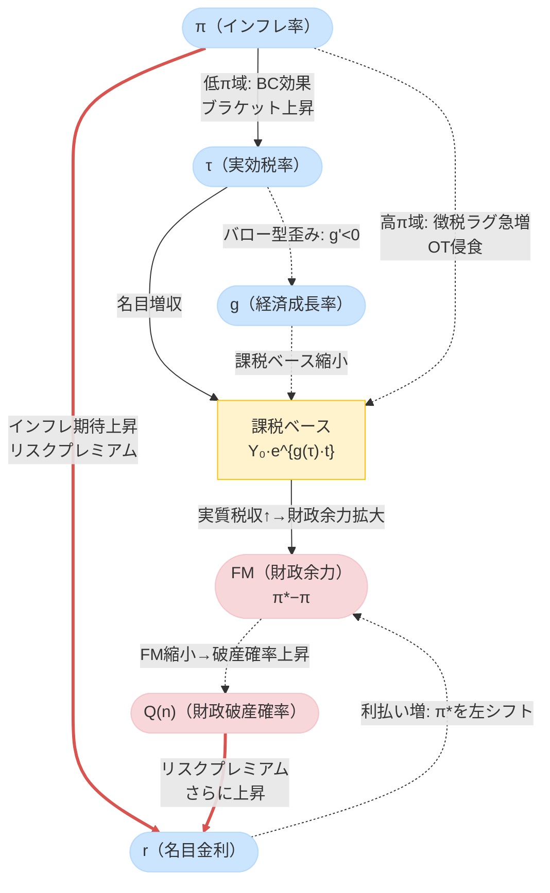

<style>
  h1 { font-size: 1.4rem; margin-top: 2.8rem; margin-bottom: 1.2rem; font-weight: bold; border-bottom: 1px solid #eee; padding-bottom: 0.3rem; }
  h2 { font-size: 1.25rem; margin-top: 2.4rem; margin-bottom: 1.0rem; font-weight: bold; }
  h3 { font-size: 1.15rem; margin-top: 2.0rem; margin-bottom: 0.8rem; font-weight: bold; }
  p, table, blockquote, pre { line-height: 1.25; margin-bottom: 1.3rem; }
</style>

---

> **V15改訂の趣旨（V14→V15）：**
> 著者コメントを反映した改訂。主な変更点は以下の通り。
> (1) 図3（財政安定フロンティア概念図）のASCIIアートをMermaidフローチャートに全面移行。加えて $\pi$-$\tau$ 平面の断面図も新設（著者コメント）。
> (2) §5.2に「最大許容金利と最低実効税率で異なる算定基準を採用した理由」を本文中で説明。プライマリーバランス基準と財政破産確率基準の二軸を明示したうえで、それぞれの変数への適用根拠を論述した（著者コメント）。
> (3) §5（最低税率・最高金利）に実務家・大学生向けの経済的本質説明を追加（§5.0 新設）（著者コメント）。
> (4) Technical Appendix §Lにステップバイステップの計算手順説明を大幅拡充した（著者コメント）。
> (5) KaTeX数式・Mermaid図が正しくレンダリングされない問題への対処として、Jekyll blogの設定変更ガイドを巻末（§ブログ設定ガイド）に追加した（著者コメント）。
>
> **（参考）V14改訂の趣旨（V13→V14）：**
> (1) `<style>`タグにより見出しのフォントサイズと余白を調整。(2) 図1をMermaid flowchartへ移行。(3) §2冒頭にBC/OT直感説明追加。(4) FM定義前にFTPL的背景を説明。(5) $\pi^* \approx 13\sim15\%$ の表現をソフト化。(6) 図2の注釈追加。(7) §5.2にデュレーション非対称性補足。(8) §7.3に期待インフレの非対称性言及。(9) §8に経路依存性補足。(10) §D補足として自国通貨建て国債の崩壊理由注記。(11) Appendix Q（ロバストネス）新設。

---

# Part I：本文――インフレと財政持続性の非線形ダイナミクス

## ― BC-OT財政安定性フレームワーク：ブラケット・クリープとオリベラ＝タンジ効果の統合理論 ―

---

## 1. はじめに：インフレ財政学の錯覚と本稿の問い

インフレは政府債務を実質的に軽くする。このため「インフレは財政にとって有利である」という見方がしばしば語られる。しかし歴史を振り返ると、高インフレやハイパーインフレは必ずしも財政を改善しなかった。ワイマール共和国、ジンバブエ、アルゼンチンなどの事例では、インフレが税収基盤そのものを破壊し、財政危機を深刻化させている。

一方で、2022〜2025年の日本や欧米では、インフレ率が2〜3%程度に上昇した局面において、政府の税収は目減りするどころか過去最高を更新し続けた。この明白な現実を従来の理論は説明できなかった。

**本稿の中心的問い：** なぜ低インフレでは財政が改善し、高インフレでは財政が崩壊するのか。この非対称性の根拠は何か。そして財政運営者はどのような指標で政策を判断すべきか。

この問いに答えるために、本稿は**ブラケット・クリープ効果（BC）**と**オリベラ＝タンジ効果（OT）**を統合した**BC-OT財政安定性フレームワーク**を構築する。

### 1.1 本稿の主要貢献

1. **BC-OT統合モデル**：BC効果（有界）とOT効果（累積的支配）の数理統合
2. **インフレ・ラッファー曲線**：実質税収 $R^{\mathrm{real}}(\pi)$ の山型構造の導出
3. **臨界インフレ率 $\pi^*$**：BC効果とOT効果が均衡する転換点の内生的決定
4. **財政余力（Fiscal Margin）**：$FM = \pi^* - \pi$ による財政健全性の定量指標
5. **財政安定フロンティア**：$\pi^*(\tau, r)$ として政策変数が安定境界を動かすメカニズム
6. **FTPLとの接続**：将来黒字現在価値の侵食として統一的に解釈
7. **動学的不安定性**：ギャンブラーの破産によるOTレジームの「制度変更強制」特性の解明
8. **需要プル・コストプッシュの非対称性**：インフレ原因による $\pi^*$ のシフト

---

## ◆ 図1：主要変数（π・τ・r・g）の相互フィードバック関係図

本稿の核心を理解するために、インフレ率 $\pi$、実効税率 $\tau$、金利 $r$、経済成長率 $g$ の四変数がどのように相互作用するかを図示する。実線矢印（`-->`）は「上昇させる正のチャネル」、破線矢印（`-.->`）は「低下させる負のチャネル」、**赤太線（`==>`）は「死のフィードバック・ループ」**を示す。



> **読み方のガイド：** 「低インフレ域」では $\pi$ 上昇→$\tau$ 上昇（BC効果）→実質税収増という正のフィードバックが働く。一方「高インフレ域」では $\pi$ 上昇→OTラグ急増→実質税収崩落という逆転が起き、さらに赤太線で示された**「死のフィードバック・ループ」**（$\pi \uparrow \Rightarrow Q(n) \uparrow \Rightarrow \text{リスクプレミアム} \uparrow \Rightarrow r \uparrow \Rightarrow FM \downarrow$）がリスクプレミアム経由で金利を暴騰させ、財政余力を自己実現的に消失させる。

---

## 2. なぜBCは有界でOTは累積的に支配的になるか：理論の核心

### 2.0 直感的理解：「BCが勝つ世界」と「OTが勝つ世界」

数式に入る前に、二つの世界のコントラストを直感的に把握しておきたい。

**BCが勝つ世界（低インフレ域）：**
名目所得がインフレで膨らみ、税率区分はそのまま据え置かれているため、納税者は自動的に高い税率区分へと移動する（ブラケット・クリープ）。行政は電子申告・源泉徴収で税を素早く徴収できており、「稼いだその月に近い時点」で税収として回収される。インフレが穏やかである限り、この「課税ベースの名目拡大＋実効税率の自動上昇」という恩恵が財政を潤し続ける。

**OTが勝つ世界（高インフレ域）：**
インフレが急加速すると、行政処理能力が追いつかなくなる。徴税には申告・審査・納付という手続きが伴い、どうしても数週間から数ヶ月のラグが発生する。このラグの間に通貨価値が急落し、「帳簿上は100の税収」が実質的には50・30・10に目減りする。さらに納税者も合理的に支払いを先延ばしする。税逃れが広がり、行政が混乱し、実質税収は崖のように崩落する。BC効果は最高税率で飽和しているため「もう引き上げようがない」状態にあり、OT侵食に対抗できなくなる。

**なぜ転換点（$\pi^*$）が存在するか：** BCの増収力は「最高税率という天井」によって有界（上限あり）だが、OTの侵食力は「ラグの急増速度」に上限がない。この非対称性から、インフレがある閾値を超えた瞬間に両者の力関係が逆転する。その転換点が臨界インフレ率 $\pi^*$ である。


インフレが起きると、税収は二つの経路で増加する。

**経路①（課税ベースの名目拡大）：** 名目所得がインフレによって押し上げられる。課税対象となる名目所得・利益そのものが膨らむため、税率が変わらなくても税収は増加する。

**経路②（税率区分の上昇・ブラケット効果）：** 累進課税制度では、名目所得が増加した納税者が自動的により高い税率区分へと移動する。社会全体の実効税率が内生的に上昇し、税収はインフレ率以上の速度で膨らむ。

しかし、BC効果には**物理的な上限**が存在する。第一に、所得税の最高税率には法定上限がある。第二に、より根本的には、税率上昇は経済成長を阻害する（バロー型の歪みコスト）。実効税率 $\tau$ の上昇は成長率 $g(\tau)$ を押し下げ（$g'(\tau) < 0$）、課税ベースそのものが長期的に縮小する。この「**税率上昇→成長率低下→課税ベース縮小**」という経路が、BC効果を有界にする経済学的な実質的根拠である。

> **Proposition（BC有界性の根拠）：** 税率が経済成長を阻害するならば（$g'(\tau) < 0$）、実質税収に対するBC効果の総貢献は有限の上限を持つ。

### 2.2 オリベラ＝タンジ効果（OT効果）：財政の潜在的な敵

OT効果の根底にあるのは**徴税タイムラグ**という経済的摩擦である。税は課税事由の発生から納税まで数週間から1年超のラグを経る。高インフレ下では、このラグの間に貨幣価値が急落し、実質税収が侵食される。

重要なのは、OT効果の**累積的支配性**である。インフレが加速すると、行政混乱・納税者の意図的な引き延ばしにより徴税ラグが閾値的に急拡大する。OT侵食因子 $e^{-\pi \ell(\pi)}$ は0〜1に有界だが、**インフレ上昇に伴うその*限界的な侵食力*（$\ell(\pi) + \pi\ell'(\pi)$）はBCの限界増収力を高インフレ域で累積的・動学的に圧倒する**。これがOT「支配性」の本質である。

> **Proposition（OT累積支配性）：** 高インフレ域では徴税ラグが閾値的に急増し、OTによる限界侵食力の累積効果はBCの有界な限界増収力を圧倒し続ける。侵食因子 $e^{-\pi\ell(\pi)}$ そのものは有界だが、その**急落速度（$-\partial e^{-\pi\ell(\pi)}/\partial\pi$）は上限を持たない。**

### 2.3 非対称性の帰結：臨界インフレ率 $\pi^*$ の存在

**有界なBC**と**累積的に支配的なOT**のこの非対称性から、必然的に次の帰結が導かれる。

**低インフレ域：** BC効果がOT効果を上回り、$\partial R^{\mathrm{real}} / \partial \pi > 0$（財政の味方）。

**高インフレ域：** OT効果の限界侵食力がBC効果の限界増収力を追い越し、$\partial R^{\mathrm{real}} / \partial \pi < 0$（財政の敵）。

したがって、両効果が均衡する点として**臨界インフレ率 $\pi^*$** が内生的に決定される。これが**インフレ・ラッファー曲線**の極大点（相転移点）である。

$$\frac{\partial R^{\mathrm{real}}(\pi^*)}{\partial \pi} = 0 \tag{式1}$$

> **【式1の注釈】**
> - **変数：** $R^{\mathrm{real}}(\pi)$ = 実質政府税収（インフレ率の関数）；$\pi^*$ = 臨界インフレ率
> - **意味：** 実質税収のインフレに対する限界変化率がゼロになる点。これより低いと「+（BC優勢）」、高いと「−（OT優勢）」。
> - **意図：** このゼロ点として $\pi^*$ を内生的に決定する。インフレ・ラッファー曲線の「山のてっぺん」。

先進国の典型的なパラメーターを用いた例示的キャリブレーションでは $\pi^* \approx 13 \sim 15\%$ となる（数理的詳細はPart II参照）。ただしこの数値は基準パラメーター依存の典型例であり、本モデルの本質は「$\pi^*$ が存在すること」にある。各国の制度・徴税インフラ・債務構造によって $\pi^*$ は大きく変動する（感度分析はAppendix Q参照）。

---

## 3. インフレ・ラッファー曲線と二相構造

### 3.1 実質税収の山型構造

統合実質政府収入関数 $R^{\mathrm{real}}(\pi)$ は山型の「インフレ・ラッファー曲線」を描く：

- $\pi < \pi^*$（**BC優勢フェーズ**）：インフレ上昇とともに実質税収は増加（$\partial R^{\mathrm{real}} / \partial \pi > 0$）
- $\pi = \pi^*$（**臨界点**）：実質税収が最大値に到達（$\partial R^{\mathrm{real}} / \partial \pi = 0$）
- $\pi > \pi^*$（**OT優勢フェーズ**）：実質税収が急崖的に崩落（$\partial R^{\mathrm{real}} / \partial \pi \ll 0$）

### 3.2 フェーズ①：BC優勢フェーズ（$\pi < \pi^*$）

マイルドなインフレ領域では、徴税タイムラグ短縮化（電子申告・源泉徴収・法定納期の短縮等）により、徴税タイムラグはほぼ最小値に抑えられる。OT侵食はほぼ発生しない一方で、BC効果（課税ベース拡大＋実効税率上昇）が支配的となり、インフレが上昇するほど実質税収は増加する。

日本の税収過去最高更新という現実はこのフェーズとして説明される。

### 3.3 フェーズ②：OT優勢フェーズ（$\pi > \pi^*$）

インフレが閾値を超えると経済の様相は一変する。行政処理能力の低下と納税者の合理的な引き延ばし行動が相まって、徴税ラグがロジスティック的に急拡大する。BC効果は最高税率で飽和しているため増収余地がなく、累積的に支配的なOT侵食に対抗できなくなる。

臨界点 $\pi^*$ を境に、インフレの上昇が実質税収の「崖のような急落」を招く**相転移**が発生する。

---

## ◆ 図2：π（インフレ）変化が τ・g・r・財政余力に与える影響の方向図

| π（インフレ率）の変化 | τ（実効税率） | g（成長率） | r（金利・リスクプレミアム） | FM（財政余力） | Q(n)（破産確率） |
|:---|:---:|:---:|:---:|:---:|:---:|
| **低インフレ域** π↑（BC優勢） | ↑（BC効果） | 微低下 | ほぼ変化なし | ↓（π*に近づく） | ↓（改善） |
| **臨界点 π≈π*** | ↑（飽和） | 低下 | やや↑ | → 0 | 中立 |
| **高インフレ域** π↑（OT優勢） | ↑（飽和・固定） | ↓↓ | ↑↑（リスクプレミアム） | ↓↓（FM<0へ） | ↑↑（急増） |
| **ハイパーインフレ** | 飽和 | ↓↓↓ | ↑↑↑（死のループ） | ≪0 | →1（確実な崩壊） |

> **各変数の動きのロジック：**
> - **τ（実効税率）の動き：** π上昇→累進課税ブラケットの自動移動（BC効果）により実効税率が上昇。ただし最高税率（$\tau_{\max}$）で飽和するため高インフレ域では変化しなくなる（§2.1参照）。
> - **g（成長率）の微低下：** τ上昇→バロー型歪みコスト（$g'(\tau)<0$）により成長率が緩やかに低下（式19）。この効果は即座ではなく数期遅れて顕在化することに注意（時間差による政策誤認リスク）。
> - **r（金利）の動き：** 低インフレ域では変化は軽微。高インフレ域ではπ上昇→市場が財政破産確率$Q(n)$の上昇を織り込み→リスクプレミアム要求→r急上昇（§5.2・式10の「死のフィードバック・ループ」参照）。
> - **FM（財政余力）の動き：** FM＝π*−π（式2）であるため、πが上昇すると直接FMが縮小（式31a）。さらにr上昇がπ*を左シフトさせる間接効果（式31b）が加わり、二重に縮小が加速する（§4.2参照）。
> - **Q(n)（破産確率）の動き：** FM縮小→OT優勢フェーズ→勝率p<0.5→γ>1→ギャンブラーの破産公式により破産確率が急増（§8・式16参照）。

> **重要な非対称性：** τ↑はBC域では実質税収を増やすが、高π域ではOT侵食が勝るため増税しても実質税収は増えない。また r↑は理論上インフレを抑制するはずだが、高インフレ域では財政への利払い負担を増大させてFMをさらに縮小させる「逆効果」のパラドックスが生じる。

---

## 4. 財政余力（Fiscal Margin）と財政安定フロンティア

### 4.1 財政余力（FM）の定義

**なぜインフレが財政健全性の指標になるのか：**
財政政策とインフレは、二つの経路で深く結びついている。第一に、生産要素がフル稼働している状態で財政支出を拡大すると、総需要が供給を超えてインフレが生じる（需要プル経路）。第二に、より根本的には、FTPLが示すように、政府債務の実質価値は将来プライマリー黒字の現在価値で決まる（式14参照）。財政の持続性が疑われると、その差額を埋めるように物価水準が上昇する——つまり財政政策の行き過ぎは最終的にインフレに帰結する。したがって、「現在のインフレ率が臨界点までどれほど余裕があるか」は、財政持続性の代理指標として機能する。これがFMをインフレ空間で定義する理論的根拠である。

臨界インフレ率 $\pi^*$ と現在のインフレ率 $\pi$ の距離を**財政余力（Fiscal Margin）**と定義する：

$$\boxed{FM \equiv \pi^* - \pi} \tag{式2}$$

> **【式2の注釈】**
> - **変数：** $\pi^*$ = 臨界インフレ率（実質税収が最大になるインフレ率）；$\pi$ = 現在のインフレ率
> - **意味：** 現在のインフレ率が臨界点までどれだけ「余裕があるか」を測る距離指標。
> - **意図：** 財政健全性の「温度計」。FMが大きいほど安全、ゼロに近づくほど危険。
> - **日本の現状（参考）：** $\pi \approx 2\%$、$\pi^* \approx 13\sim15\%$ → $FM \approx 11\sim13\%$（十分な余裕）

| $FM$ の値 | 財政状況 | 政策の余地 |
| :--- | :--- | :--- |
| $FM > 0$（大） | BC優勢フェーズ・安全域 | 減税・積極的財政政策の検討余地あり |
| $FM \approx 0$ | 臨界点（危険接近） | 財政改革が緊急 |
| $FM < 0$ | OT優勢フェーズ・危険域 | 財政危機リスクが急増 |

### 4.2 財政安定フロンティア：$\pi^*$ は政策で動く

臨界インフレ率 $\pi^*$ は固定値ではなく、税率 $\tau$ や金利 $r$ などの政策変数に依存して動く内生変数である：

$$\pi^* = \pi^*(\tau, r, \ell_0, g) \tag{式3}$$

> **【式3の注釈】**
> - **変数：** $\tau$ = 実効税率；$r$ = 名目金利；$\ell_0$ = 基礎的徴税タイムラグ；$g$ = 経済成長率
> - **意味：** 臨界インフレ率は一定の数値ではなく、政策変数によって動く「面」（フロンティア）。
> - **意図：** 政策が「財政の安全域の広さそのもの」を変えられることを示す。デジタル化・成長政策は「フロンティアを右にずらす」行為として解釈できる。

この「財政安定フロンティア」の比較静学：

**税率 $\tau$ の効果（二面性）：**

増税（$\tau \uparrow$）は短期的には課税ベースを拡大してBC効果を強化するが、長期的には成長率を低下させる（$g'(\tau) < 0$）。この二面性から、税率と $\pi^*$ の関係は単調ではなく、構造的な条件次第で正負が変わりうる（Part II §F参照）。

$$\frac{\partial \pi^*}{\partial \tau}: \text{符号は } g'(\tau) \text{ の大きさに依存} \tag{式4}$$

> **【式4の注釈】**
> - **意味：** 増税がπ*を上げるか下げるかは、税率上昇が成長率をどれだけ阻害するかによる。歪みコスト（λ）が小さい税制改革なら π* ↑、歪みコストが大きい場合は π* ↓ になりうる。
> - **政策含意：** 単純な増税は必ずしも財政安全域を広げない。課税ベース拡大型の改革が重要。

**金利 $r$ の効果（明確）：**

政策金利の引き上げ（$r \uparrow$）は、純債務部分の利払い費を増大させ、財政の必要黒字を高める。これはBC効果を弱め、より低いインフレ水準で財政が悪化し始めるため、$\pi^*$ を左方にシフトさせる。なお、政府が資産を保有している場合、金利上昇は資産運用収益も増加させるため、**純債務（net interest-bearing debt）ベース**でみると影響は部分的に相殺される。

$$\frac{\partial \pi^*}{\partial r} < 0 \tag{式5}$$

> **【式5の注釈】**
> - **変数：** $r$ = 名目金利（純債務に適用される実効金利）
> - **意味：** 金利が1単位上昇すると、臨界インフレ率は低下（安全域が縮小）する。
> - **意図：** 金融引き締め（利上げ）は財政を支援するとは限らず、財政余力FMを縮小させる可能性がある。中央銀行と財政当局の協調の必要性の数理的表現。
> - **純債務への注意：** 日本のように政府資産が大きい場合、資産サイドの受取利息が部分相殺するため $\partial \pi^*/\partial r$ の絶対値は小さくなる。

**徴税タイムラグ短縮化の効果（明確）：**

徴税タイムラグ短縮化（リアルタイム電子申告・インボイス自動化・税制簡素化・法定納期の短縮法改正等）によって基礎ラグ $\ell_0$ が縮小すると、OT効果の発動閾値 $\hat{\pi}$ が右方にシフトし、臨界点 $\pi^*$ が上昇する。

$$\frac{\partial \pi^*}{\partial \ell_0} < 0 \quad (\ell_0 \downarrow \Rightarrow \pi^* \uparrow) \tag{式6}$$

> **【式6の注釈】**
> - **変数：** $\ell_0$ = 基礎的徴税タイムラグ（年単位；例：0.25年＝3ヶ月）
> - **意味：** 徴税ラグが短くなるほど（$\ell_0$↓）、臨界インフレ率は上昇（$\pi^*$↑）する。
> - **意図：** 徴税タイムラグ短縮化は「財政の安全域を広げる」最も直接的な構造改革。デジタル化はその一手段に過ぎない（他に税制簡素化・納期短縮法改正等）。

### 4.3 財政フロンティアとしての政策空間

$(\pi, \tau, r)$ の三次元空間において、$\pi^*(\tau, r) = \pi$ を満たす面が**財政安定フロンティア**を構成する。この面より「低インフレ側（現在のπがπ*より低い領域）」が安全域、「高インフレ側（πがπ*を超えた領域）」が危険域である。

> **【方向の直感的説明】：** インフレ率軸で「上方」を高インフレ、「下方」を低インフレとする慣習を使った場合、安全域は「フロンティアより下方（低インフレ側）」となる。政策当局は、フロンティアを「より高インフレ方向にシフト（右上方移動）」させる施策（徴税タイムラグ短縮・成長促進）を優先すべきである。

---

## ◆ 図3：財政安定フロンティアの概念図（π-r 平面の断面図）

```
   r（金利）
   ↑
   │  危険域（FM<0）         安全域（FM>0）
   │  OT優勢・破産リスク高   BC優勢・財政健全
   │                │
   │   r↑→π*↓   │← 財政安定フロンティア π*(τ,r)=π
   │   (フロンティア│   ℓ₀↓（徴税タイムラグ短縮）→右シフト
   │   が左下に)   │   g↑（成長率向上）→右上シフト
   │               │
   │               │← 日本現在地：π≈2%, FM≈11-13%
   └───────────────┴────────────────────→ π（インフレ率）
                  π*(τ,r)    π*(τ,r,ℓ₀_new) ← 改革後の新フロンティア
                               （徴税ラグ短縮・成長政策後）
```

---

## 5. 最低税率・最高金利・金利フィードバック：破産を免れるための境界条件

### 5.1 リスク調整最低税率 $\tau_{\min}^{\mathrm{risk}}$

財政破産確率 $Q(n)$ を社会的許容上限 $\epsilon$（例：5%）以下に抑えるために必要な**最低実効税率**：

$$\tau_{\min}^{\mathrm{risk}} \equiv \inf \left\{ \tau \;\middle|\; R^{\mathrm{real}}(\pi; \tau) \ge g^{\mathrm{gov}} + \mathcal{D}_t b^{\mathrm{net}} + PS^*(\epsilon) \right\} \tag{式7}$$

> **【式7の注釈】**
> - **変数：**
>   - $\tau_{\min}^{\mathrm{risk}}$ = 破産確率を許容水準以下に抑える最低実効税率
>   - $R^{\mathrm{real}}(\pi; \tau)$ = 税率τ・インフレ率πの下での実質税収（式13参照）
>   - $g^{\mathrm{gov}}$ = 政府の実質支出成長率（名目政府支出の実質増加率）
>   - $\mathcal{D}_t$ = 財政動学指標 $= r^{\mathrm{net}}_t - g(\tau_t)$（金利と成長率の差；債務比率の趨勢を決める）
>   - $b^{\mathrm{net}}$ = 純有利子負債（GDP比；資産サイドの運用収益を差し引いたネット債務残高）
>   - $PS^*(\epsilon)$ = 破産確率 $Q(n) \le \epsilon$ を実現するために必要なプライマリーバランス目標値
>   - $\inf\{\cdots\}$ = 条件を満たす最小の税率（下限）
> - **意味：** 実質税収が「政府支出＋債務利払い（ネット）＋必要黒字目標」を上回る最低税率。
> - **意図：** 減税余地（FSM）の下限を定義する。現行税率がこれを上回る分だけ減税の余地がある。
> - **注意：** 税率が高いほど歪みコストも大きく、τ↑が必ずしもR^{real}↑とはならない（税率のラッファー的二面性）。したがって単純な増税でτ_min^riskを超えようとすると逆効果になりうる。

財政安全マージン（FSM）は現在の実効税率と最低税率の差：

$$FSM \equiv \tau(\pi) - \tau_{\min}^{\mathrm{risk}} \tag{式8}$$

> **【式8の注釈】**
> - **変数：** $\tau(\pi)$ = 現在のインフレ率下での実効税率；$\tau_{\min}^{\mathrm{risk}}$ = 式7の最低税率
> - **意味：** FSMがプラスなら現行税率には余裕（減税の余地）があり、マイナスなら財政危険域。
> - **FM（式2）との対比：** FMはインフレ率の余裕（インフレ空間の余裕）、FSMは税率の余裕（税制空間の余裕）。二つの余力指標を組み合わせることで財政健全性を多面的に評価できる。

| $FSM$ の値 | 政策判定 |
| :--- | :--- |
| $FSM > 0$（大） | 減税余地あり（FSMの大きさが減税可能幅） |
| $FSM = 0$ | 中立（現在の税率が最低ライン） |
| $FSM < 0$ | 財政危険域（増税または構造改革が必要） |

### 5.2 最大許容金利 $r_{\max}$ と死のフィードバック・ループ

プライマリーバランスがゼロを下回らないための**最大許容名目金利**：

$$r_{\max} \equiv g(\tau) + \frac{R^{\mathrm{real}}(\pi) - g^{\mathrm{gov}}}{b^{\mathrm{net}}} \tag{式9}$$

> **【式9の注釈】**
> - **変数：**
>   - $g(\tau) = g_0 - \lambda\tau$ = 内生的実質成長率（税率に依存）
>   - $R^{\mathrm{real}}(\pi) - g^{\mathrm{gov}}$ = 実質税収から政府支出成長を引いた「財政の余剰創出力」
>   - $b^{\mathrm{net}}$ = 純有利子負債（GDP比）
> - **意味：** プライマリーバランスがゼロになる金利水準。これを超えると $PS < 0$（基礎的財政赤字）となり、OTレジームへの転落リスクが急増する。
> - **意図：** Blanchard（r-g議論）との接続。$r > g$ が長期的に続く場合（$\mathcal{D}_t > 0$）、債務のGDP比は発散する。$r_{\max}$ はその臨界水準を具体化する。
> - **金融・財政協調：** 中央銀行がこの水準を超えた利上げを行うと、財政がOTレジームへ転落するリスクが急増する。財政余力FMの有無が利上げの「安全余地」を定量化する。

中央銀行がこの金利を超えると財政はOTレジームへ転落するリスクが急増する。さらに重要なのは、**高インフレが金利を通じて財政悪化を加速させる「死のフィードバック・ループ」** の存在である（Gemini指摘）：

$$\pi \uparrow \;\Rightarrow\; Q(n) \uparrow \;\Rightarrow\; \text{リスクプレミアム} \uparrow \;\Rightarrow\; r \uparrow \;\Rightarrow\; \pi^* \downarrow \;\Rightarrow\; FM \downarrow \;\Rightarrow\; \pi \text{の危険域が拡大} \tag{式10}$$

> **【式10の注釈（死のフィードバック・ループ）】**
> - **意味：** インフレ率が上昇し始めると、市場は財政危機リスク（$Q(n)$）の上昇を織り込み、国債にリスクプレミアムを要求する。これが金利上昇を招き、さらに財政余力を縮小させる自己実現的な悪循環。
> - **合理的期待下での先読み（期待インフレ $\pi^e$ の時間的非対称性）：** BC効果による増収は「事後的な名目実現値 $\pi$」に遅行して発生するのに対し、市場の金利暴騰（死のループ）は「フォワード・ルッキングな期待インフレ $\pi^e$ および将来破産確率の先読み」によって先行して起動する。このため、$\pi$ が実際に $\pi^*$ に達する遥か手前でシステムが不連続に崩壊するリスクがある（相転移の前倒し）。
> - **政策含意：** FMが十分大きい（安全域にある）うちに、死のループが起動しない状態での構造改革が重要。

> **純債務ベースのデュレーション非対称性（Gemini補足）：** 日本の場合、政府資産（外国為替資金特別会計・GPIF等）は比較的流動性が高く、金利上昇が受取収益に反映されるラグが短い。一方、国債サイドは平均デュレーションが約8〜9年と長いため、利上げ直後の数年間は「国債の利払い増よりも政府資産の運用リターン上昇の方が先に発現する」という時間軸の非対称性が存在する。この短期的な相殺効果が存在する一方、長期的には利払い費の累積増大が純債務を拡大させるため、$\partial\pi^*/\partial r$ の中長期的な負の方向は変わらない。

### 5.3 財政余力指標（FIM）の導入

FIMは $r_{\max}$ との距離指標として、FSMと対称的に定義できる：

$$FIM \equiv r_{\max} - r_{\mathrm{current}} \tag{式11}$$

> **【式11の注釈】**
> - **変数：** $r_{\max}$ = 式9の最大許容金利；$r_{\mathrm{current}}$ = 現在の実効名目金利
> - **意味：** 現在の金利が最大許容水準まであとどれだけ余裕があるかを示す「金利側の財政余力」。
> - **FSMとの対称性：** FSM（式8）は税率空間の余力、FIM（式11）は金利空間の余力。FM（インフレ空間）・FSM（税率空間）・FIM（金利空間）の三指標が財政健全性を多角的に評価する。
> - **FIM>0：** 金融引き締め余地あり。**FIM<0：** 現在の金利がすでに安全水準を超過しており財政危機リスク大。

---

## 6. 減税の判定フレームワーク：恒久・時限の決定ロジック

本モデルの最も実務的な貢献は、「いつ・どの程度の減税が可能か」を定量的に判定できる点にある。

### 6.1 恒久減税が許容される条件

減税後の実効税率 $\tau_{\mathrm{new}}(\pi)$ が、いかなるインフレシナリオ下でも常に最低税率を超える場合：

$$\tau_{\mathrm{new}}(\pi_t) \ge \tau_{\min}^{\mathrm{risk}} \quad (\forall t \ge 0) \tag{式12}$$

> **【式12の注釈】**
> - **意味：** 将来のどのインフレシナリオにおいても、新しい（引き下げ後の）税率が最低必要水準を上回ること。
> - **意図：** これが成立するのは、徴税タイムラグ短縮化等の構造改革によって $\tau_{\min}^{\mathrm{risk}}$ 自体が恒久的に低下した場合。「ゲームのルールが改善された」ので低い税率でも財政が持続する。

### 6.2 時限減税に留めるべき条件

減税後の税率が $\tau_{\min}^{\mathrm{risk}}$ を一時的に下回る場合、過去に蓄積された財政バッファ $n$ が十分に大きい局面に限り、時限的な減税が許容される：

$$E[S_T] \approx n + T \cdot (R^{\mathrm{real}}(\pi; \tau_{\mathrm{temp}}) - g^{\mathrm{gov}} - \mathcal{D}_t b^{\mathrm{net}}) \ge S_{\min} \tag{式13}$$

> **【式13の注釈】**
> - **変数：**
>   - $S_T$ = T期後の財政バッファ残高
>   - $n$ = 現在の財政バッファ（初期値）
>   - $T$ = 時限減税の期間
>   - $R^{\mathrm{real}}(\pi; \tau_{\mathrm{temp}})$ = 時限的に引き下げた税率 $\tau_{\mathrm{temp}}$ 下での実質税収
>   - $S_{\min}$ = 財政持続に必要な最低バッファ水準
> - **意味：** 現在の財政バッファ $n$ を「取り崩しながら」も、T期後にバッファが最低水準を下回らないことを確認する条件。
> - **意図：** 減税が時限的に許容される上限期間 $T_{\max}$ を逆算できる実務的フレームワーク。

### 6.3 政策判定マトリクス

| 条件 | 判定 | 根拠 |
| :--- | :--- | :--- |
| $FSM \gg 0$ かつ $FM \gg 0$ かつ $FIM \gg 0$ かつ 構造改革済み | 恒久大規模減税 | $\tau_{\min}^{\mathrm{risk}}$ の恒久低下 |
| $FSM > 0$ かつ $FM > 0$ かつ $FIM > 0$ かつ $n$ が大きい | 時限減税（中規模） | バッファの一時的切り崩し |
| $FSM \approx 0$ または $FM \approx 0$ または $FIM \approx 0$ | 現状維持 | バッファ回復を優先 |
| $FSM < 0$ または $FM < 0$ または $FIM < 0$ | 増税・歳出削減 | 財政危険域への対応 |

---

## 7. FTPLとの接続：成立条件の侵食

### 7.1 FTPLの基本構造

財政的物価決定理論（FTPL）において、実質政府債務の価値は将来プライマリー黒字の現在価値で支えられる：

$$\frac{B_t}{P_t} = E_t \sum_{j=0}^{\infty} \beta^j PS_{t+j} \equiv PV(PS) \tag{式14}$$

> **【式14の注釈（FTPL基本式）】**
> - **変数：**
>   - $B_t$ = 名目政府債務残高（時点 $t$）
>   - $P_t$ = 物価水準（GDP デフレーター）
>   - $B_t/P_t$ = 実質政府債務残高
>   - $E_t[\cdot]$ = 時点 $t$ における将来期待
>   - $\beta$ = 割引因子（$0 < \beta < 1$；実質金利に対応）
>   - $PS_{t+j}$ = $j$ 期先のプライマリーバランス（実質）＝ 実質税収 − 実質政府支出
>   - $PV(PS)$ = 将来プライマリー黒字の現在価値の総和
> - **意味：** 政府の実質負債は、将来の実質財政黒字の合計（割引現在価値）によって裏打ちされている。
> - **意図：** OT効果が $PS_t$ を悪化させると $PV(PS)$ が低下し、FTPLの成立条件が崩れることを示す準備。

FTPLが成立するためには $PV(PS) > 0$ かつ有限であることが必要。

### 7.2 OT効果はFTPLの成立条件を侵食する

本モデルでは $PS_t = R^{\mathrm{real}}(\pi_t) - g^{\mathrm{gov}} - \mathcal{D}_t b^{\mathrm{net}}$ であり、OT効果の増大は $R^{\mathrm{real}}$ を低下させ $PS_t$ を悪化させる。

> **Proposition（FTPLの侵食）：** OT効果が十分大きい場合（$\pi > \pi^*$）、将来プライマリー黒字の現在価値は減少する：$\partial PV(PS) / \partial OT < 0$。

> **Corollary（FTPLの成立困難化）：** インフレが $\pi^*$ を超えると、$PV(PS) < B_t / P_t$ となり、FTPLが要求する財政的裏付け条件が維持困難になる。

### 7.3 $\pi^*$ はFTPL安定境界の実用的近似指標として機能する

臨界インフレ率 $\pi^*$ は、実質税収の最大化点であると同時に、**FTPLの安定領域と不安定領域の境界の実用的近似指標（practical proxy）**として解釈できる。

$$\Omega \equiv PV(PS) - \frac{B_t}{P_t}: \quad \Omega > 0 \text{（FTPL安定）} \leftrightarrow \pi < \pi^* \tag{式15}$$

> **【式15の注釈】**
> - **変数：** $\Omega$ = FTPLの安定度指標（FTPLサープラス；正なら安定、負なら不安定）
> - **意味：** $\pi < \pi^*$ では将来黒字が実質債務を上回り（$\Omega > 0$）、FTPLは成立可能。$\pi > \pi^*$ では逆転し成立困難となる。
> - **「実用的近似指標」の意味（V12→V13修正）：** FTPLには本来、合理的期待・財政ルール・金融政策ルールが複雑に絡む。本モデルの $\pi^*$ はBC-OT統合の文脈でのみFTPL境界を近似するものであり、一般的なFTPL理論と完全に同値ではない。「π*≈FTPL境界」は実用的な近似として活用できる。

---

## 8. 動学的不安定性：ギャンブラーの破産の二層解釈

### 8.1 財政のランダムウォーク表現

政府の実質財政バッファ $S_t$ を確率的プロセスとしてモデル化する。$\pi_t$ に依存した財政改善確率（勝率）$p(\pi_t)$ を：

- **BC優勢フェーズ（$\pi < \pi^*$）：** $p > 0.5$（財政改善トレンド）
- **臨界フェーズ（$\pi \approx \pi^*$）：** $p \approx 0.5$（中立的ランダムウォーク）
- **OT優勢フェーズ（$\pi > \pi^*$）：** $p < 0.5$（財政悪化トレンド）

> **初期条件と経路依存性（Gemini補足）：** 同じパラメーター集合であっても、初期債務比率（初期バッファ $n_0$）が一定の閾値 $\bar{n}$ を下回っている場合、マクロ経済が自律的にLevel 0へ回復することはなく、最初からLevel 1またはLevel 2の動学経路を辿る（経路依存性）。初期財政バッファが大きいほど、OT優勢フェーズ下でも政策介入のタイムリミットが長くなる。これが「FM>0の安全域にいる今こそ構造改革を行う好機」という政策的緊急性の数理的基礎づけである。

### 8.2 破産確率の解析解

$$Q(n) = \frac{\gamma^a - \gamma^n}{\gamma^a - 1}, \quad \gamma \equiv \frac{1-p(\pi)}{p(\pi)} \tag{式16}$$

> **【式16の注釈（ギャンブラーの破産公式）】**
> - **変数：**
>   - $Q(n)$ = 初期バッファ $n$ のときの財政（最終的な）破産確率
>   - $n$ = 現在の財政バッファ（実質余剰の蓄積）。例：$n = 8$ は「過去8期分の蓄積」
>   - $a$ = バッファの上限（財政持続可能均衡到達点）。例：$a = 20$ は「持続可能域の上限」
>   - $p(\pi_t)$ = 1期あたりの財政改善確率（勝率）、インフレ率に依存
>   - $\gamma = (1-p)/p$ = 敗北率/勝率の比。$\gamma < 1$（BC優勢）なら安全、$\gamma > 1$（OT優勢）なら危険
> - **意味：** 「破産するまでゲームを続けたとき、最終的に破産する確率」を表す解析解（Feller 1968, 定理9.2）。
> - **意図：** インフレ率によって $p$（勝率）が変わり、$Q(n)$ が劇的に変化する。$\gamma > 1$ になると $n$ をいくら大きくしても長期的に $Q(n) \to 1$ となる。
> - **注：** ここでの「破産」は名目的なデフォルトではなく、OT効果の累積侵食によって実質税収が永続的に財政需要を下回る「Fiscal Collapse」を指す。

| フェーズ | $\pi$ | $p$ | $\gamma = q/p$ | $Q(n=8, a=20)$ |
| :--- | :---: | :---: | :---: | :---: |
| BC優勢 | $< \pi^*$ | $> 0.5$ | $< 1$ | 小 |
| 臨界 | $\approx \pi^*$ | $\approx 0.5$ | $\approx 1$ | 中 |
| OT優勢 | $> \pi^*$ | $< 0.5$ | $> 1$ | 大（→1） |

### 8.3 レベル1：構造固定下の数学的帰結

> **Proposition（Level 1）：** BC-OT構造が不変で $p(\pi) < 1/2$ が恒久的に維持されるなら、財政バッファ過程はギャンブラーの破産問題に帰着し、長期破産確率は $Q(n) \to 1$ に収束する。

**重要：** このLevel 1の結論は、政策変更がないという仮定の下での理論的帰結である。現実の政府はルール変更ができる（→Level 2）。

### 8.4 レベル2：政策介入の再解釈

現実の財政危機対応（増税・歳出削減・IMF支援・通貨改革）は、「破産確率 $Q(n)$ を直接下げる行為」ではない。これらは**ゲームのルール（勝率 $p$）そのものを変更する行為**として解釈される：

- 増税 $\tau \uparrow$ → $PS_t$ の改善 → 勝率 $p$ の回復
- 徴税タイムラグ短縮化 → $\ell_0 \downarrow$ → $\pi^*$ の右シフト → $p > 0.5$ 領域の拡大
- IMF支援 → バッファ $n$ の直接増加

> **Interpretation（Level 2）：** OTレジーム（$\pi > \pi^*$）は、既存ルールのまま放置すれば $Q(n) \to 1$ となるため、政府に対して制度変更（増税・構造改革等）を、バッファが枯渇するタイムリミットまでに**強制的に実行させる吸収帯**として機能する。

---

## 9. 需要プルとコストプッシュ：インフレ原因による $\pi^*$ の非対称性

BC-OTフレームでは、同じインフレ率 $\pi$ であっても原因によって財政への影響が異なる。

### 9.1 需要プルインフレ（$\pi^*$ が高め）

需要超過 → 名目所得上昇 → 課税ベース拡大 → BC効果が強い。OTは存在するが、課税ベース拡大がBC効果を補強するため、同じインフレ率でも財政への打撃が小さい。したがって $\pi^*$ は相対的に高位に位置する（より高いインフレまで財政が耐えられる）。

$$Y_t^{\mathrm{demand-pull}} = Y_0 e^{(g_0 + \mu_D \pi)t}, \quad \mu_D > 0 \tag{式17}$$

> **【式17の注釈】**
> - **変数：** $Y_t$ = 実質課税ベース（GDP）；$g_0$ = 基礎成長率；$\mu_D > 0$ = 需要プルによる課税ベース追加押し上げ係数
> - **意味：** 需要プルインフレ下では、インフレがむしろ実質課税ベースを拡大させる（実質活動が活発だから）。
> - **効果：** BC効果が補強され、$\pi^*$ は上方シフト。

### 9.2 コストプッシュインフレ（$\pi^*$ が低め）

供給ショック → 実質生産減少 → 課税ベース縮小 → BCが弱く、OT侵食だけが残る。

$$Y_t^{\mathrm{cost-push}} = Y_0 e^{(g_0 - \mu_C \pi)t}, \quad \mu_C > 0 \tag{式18}$$

> **【式18の注釈】**
> - **変数：** $\mu_C > 0$ = コストプッシュによる課税ベース毀損係数
> - **意味：** コストプッシュ下では実質生産が縮小しながら物価が上がる（スタグフレーション）。BCが弱く、OT侵食のみが残る。
> - **効果：** BC効果が弱化し、$\pi^*$ は下方シフト。1970年代オイルショック財政悪化の理論的説明。

> **Corollary I：** 同じインフレ率 $\pi$ でも、需要プル型は $\pi^*$ を高め財政の耐久性を増すが、コストプッシュ型は $\pi^*$ を低め財政を急速に脆弱化させる。

---

## 10. 日本への示唆と政策パッケージ

### 10.1 現状の定量評価（例示的キャリブレーション）

| シナリオ | $\pi$ | $FM = \pi^* - \pi$ | $Q(8)$ | 財政状況 |
| :--- | :---: | :---: | :---: | :--- |
| 現行 | 2% | 約11〜13% | 約1.4% | BC優勢フェーズ・安全 |
| ストレス | 10% | 約3〜5% | 約60% | Stress regime入口 |
| 臨界点超過 | 15% | 0以下 | 約99% | 事実上の財政崩壊域 |

> **注：** 上記は先進国の典型的なパラメーターを用いた**例示的キャリブレーション**であり、各国のデータを用いた構造推定は今後の課題である。

### 10.2 三本柱＋一の政策パッケージ

**政策I（徴税タイムラグ短縮化）：** リアルタイム電子申告・インボイス自動化・税制簡素化・法定納期の短縮法改正等により基礎ラグ $\ell_0$ を縮小する。OT発動閾値 $\hat{\pi}$ を右シフトさせ $\pi^*$ を上昇させることで、財政余力 $FM$ を内生的に拡大する。最も直接的な「ゲームのルール改善」策。

**政策II（ALM最適化）：** 政府資産の運用効率化によるネット利子率 $r^{\mathrm{net}}$ の低下。$r_{\max}$（式9）と $FIM$（式11）を引き上げ、金融政策の引き締め余地を財政リスクなしに拡大する。

**政策III（サプライサイド改革）：** 潜在成長率の向上で $g(\tau)$ を改善。BC優勢フェーズでの財政健全化モメンタムを加速し、バッファ $n$ の積み上げを促進する。

**政策IV（純債務管理の明示化）：** 政府資産（GPIF・外準等）を明示的に $b^{\mathrm{net}}$ に算入し、グロス債務ではなくネット有利子負債で財政健全性を評価する枠組みを制度化する。日本のグロス債務の高さが誤解を生む源であり、純債務ベースの評価がより正確な財政余力評価を可能にする。

---

## 11. 結論（Part I）

**BC-OT財政安定性フレームワーク**の中心的メッセージは以下の一本の論理連鎖に集約される：

$$g'(\tau) < 0 \Rightarrow BC\text{が有界} \Rightarrow OT\text{が累積的に支配的} \Rightarrow \pi^*\text{の存在（式1）}$$
$$\Rightarrow FM = \pi^* - \pi\text{（式2）による財政余力評価} \Rightarrow FTPL\text{の成立条件悪化（式14-15）}$$
$$\Rightarrow \text{動学的不安定性（ギャンブラーの破産・式16）} \Rightarrow \text{制度変更の強制}$$

低インフレは財政の味方（BC優勢、$p > 0.5$）、高インフレはある閾値を超えると財政の敵となり（OT優勢、$p < 0.5$）、制度変更を強制する吸収帯として機能する。財政安定フロンティア $\pi^*(\tau, r)$（式3）を「右方・上方」にシフトさせる政策（徴税タイムラグ短縮化・ALM・成長政策）こそが、BC優勢フェーズを長期的に維持するための正攻法である。

**現在の低インフレ・BC優勢フェーズ（日本：$\pi \approx 2\%$、$FM \approx 11\sim13\%$）は、三本柱＋一の構造改革を実行し、$\tau_{\min}^{\mathrm{risk}}$ を恒久的に低下させる「機会の窓」である。**

数理モデルの定式化・Propositionの証明・歴史的検証・国際比較については、Part II（Technical Appendix）を参照されたい。

---

# Part II：Technical Appendix（数理モデル・証明編）

---

## 目次（Technical Appendix）

- [A. 基本環境：変数の定義と分類](#vars)
- [B. 税の歪みと成長率：BC有界性の経済学的基礎](#distortion)
- [C. ブラケット・クリープ関数：定義とBC有界性の証明](#bc)
- [D. オリベラ＝タンジ関数：定義とOT累積支配性の証明](#ot)
- [E. 統合BC-OT実質収入関数](#unified)
- [F. インフレ・ラッファー曲線と臨界インフレ率 $\pi^*$（Existence Theorem）](#laffer)
- [G. 財政余力・財政安定フロンティアの比較静学](#margin)
- [H. FTPL整合性条件：将来黒字現在価値の侵食](#ftpl)
- [I. 需要プル・コストプッシュとインフレ原因の非対称性](#demandpush)
- [J. 確率動学拡張：財政バッファ過程とギャンブラーの破産](#stoch)
- [K. 統合政府予算制約式とデュレーション項の厳密化](#budget)
- [L. リスク調整最低税率と最大許容金利](#taumin)
- [M. 日本への適用：破産確率・ストレスシナリオ](#japan)
- [N. G8諸国比較：OT破産確率 vs 国債CDSスプレッド](#g8)
- [O. ハイパーインフレ史的検証](#hyperinflation)
- [P. 感度分析・ストレスシナリオ](#sensitivity)
- [Q. ロバストネスと拡張可能性](#robustness)
- [付録Z. 数学・確率論用語解説](#appendix-z)
- [参考文献](#refs)

---

## A. 基本環境：変数の定義と分類 {#vars}

### A.1 内生変数・状態変数

| 記号 | 定義 | モデルでの役割 |
| :--- | :--- | :--- |
| $\pi_t$ | インフレ率 | BC・OT効果の中心状態変数 |
| $\tau(\pi_t)$ | 内生実効税率（ロジスティック型BC） | BC効果のキャリア |
| $\ell(\pi_t)$ | 内生徴税タイムラグ（ロジスティック閾値型） | OT効果の非線形崩壊の源泉 |
| $g(\tau_t)$ | 内生成長率：$g_0 - \lambda\tau(\pi_t)$ | 税の歪み効果・$\mathcal{D}_t$ への入力 |
| $R^{\mathrm{real}}(\pi_t)$ | 統合実質政府収入関数 | インフレ・ラッファー曲線 |
| $\mathcal{D}_t$ | 財政動学指標：$r^{\mathrm{net}}_t - g(\tau_t)$ | 債務運動方程式の成長・金利チャネル |
| $PS_t$ | 実質プライマリーバランス（フロー） | ロジスティック勝率の入力変数 |
| $p(\pi_t)$ | 1期財政改善確率（勝率） | 破産確率の制御変数 |
| $Q(n)$ | 財政破産確率（初期バッファ $n$ の関数） | リスク評価の主指標 |
| $S_t$ | 実質財政バッファ | ギャンブラーの破産の状態変数 |
| $\pi^*$ | 臨界インフレ率 | インフレ・ラッファー曲線の極大点 |
| $FM$ | 財政余力：$\pi^* - \pi$ | 財政健全性の距離指標 |
| $FIM$ | 財政金利余力：$r_{\max} - r$ | 金利空間の財政健全性指標（V13追加） |

### A.2 外生変数・政策パラメーター（日本基準値）

| 記号 | 定義 | 基準値 |
| :--- | :--- | :---: |
| $g_0$ | 基礎的実質成長率 | 0.7% |
| $\tau_0$ | インフレゼロ時の基礎的実効税率 | 0.20 |
| $\tau_{\max}$ | BC飽和時の最大実効税率 | 0.55 |
| $\alpha_{\mathrm{BC}}$ | BC感応度 | 8.0 |
| $\pi_{\mathrm{BC}}$ | BC関数の変曲点 | 0.10 |
| $\ell_0$ | 基礎的徴税タイムラグ（年） | 0.25 |
| $\bar{\ell}$ | 崩壊時の追加タイムラグ（年） | 1.00 |
| $\kappa_\ell$ | ℓ関数のロジスティック急峻さ | 15.0 |
| $\hat{\pi}$ | OT発動閾値インフレ率 | 0.15 |
| $\lambda$ | 税の成長歪み係数 | 0.04 |
| $r^b_t$ | 国債実質利子率 | 0.5% |
| $r^a_t$ | 政府資産実質利回り | 2.5% |
| $\kappa$ | $\pi_t$ の平均回帰速度（OU） | 0.3 |
| $\bar{\pi}$ | $\pi_t$ の長期均衡値 | 2.0% |
| $\sigma_\pi$ | $\pi_t$ のボラティリティ | 0.02 |
| $\epsilon$ | 許容財政破産確率の上限 | 0.05 |

---

## B. 税の歪みと成長率：BC有界性の経済学的基礎 {#distortion}

### B.1 成長率の税率依存性

バロー型の歪みコスト仮定：

$$g(\tau) = g_0 - \lambda \tau, \quad g'(\tau) = -\lambda < 0 \tag{式19}$$

> **【式19の注釈】**
> - **変数：** $g_0$ = 税率ゼロ時の潜在成長率；$\lambda > 0$ = 税の歪み係数（税率1%上昇で成長率が $\lambda$% 低下）
> - **意味：** 増税は成長を阻害する（バロー型の「税の歪みコスト」）。
> - **代替形：** $g(\tau) = g_0 - \lambda\tau^2$（凸型歪み：高税率ほど歪みコストが加速）も許容。

より一般的な凸型歪みも許容：$g(\tau) = g_0 - \lambda \tau^2$（$g'(\tau) < 0$, $g''(\tau) < 0$）。

### B.2 課税ベースの時間積分的縮小

時点 $t$ における課税ベース（実質GDP）：

$$Y_t = Y_0 e^{g(\tau_t) \cdot t} \tag{式20}$$

> **【式20の注釈】**
> - **意味：** 現在の税率 $\tau_t$ が実質成長率 $g(\tau_t)$ を決め、その成長率で課税ベースが複利的に拡大（または縮小）する。
> - **重要性：** 増税（$\tau\uparrow$）は成長率 $g$ を下げ、課税ベース $Y_t$ の成長軌道を恒久的に下方シフトする。一時的な税収増が長期的な課税ベース縮小をもたらす。

$$\frac{\partial Y_t}{\partial \tau}\bigg|_{t>0} = Y_0 e^{g(\tau)t} \cdot g'(\tau) \cdot t < 0 \tag{式21}$$

> **【式21の注釈】**
> - **意味：** 増税が課税ベースに与える影響はマイナス（$g'(\tau) < 0$ かつ $t > 0$）。しかも時間 $t$ が長いほど影響が大きい（長期的歪みの蓄積）。

### B.3 BC有界性の帰結

名目税収 $R_t = \tau Y_0 e^{g(\tau)t}$ を $\tau$ について最大化すると（Laffer条件）：

$$\frac{\partial R_t}{\partial \tau} = Y_0 e^{g(\tau)t} \left(1 + \tau g'(\tau) t\right) = 0 \Rightarrow \tau^* = -\frac{1}{g'(\tau^*) t} \tag{式22}$$

> **【式22の注釈（動学的ラッファー条件）】**
> - **意味：** 税収最大化税率 $\tau^*$ は時間 $t$ が長くなるほど小さくなる。「長期的にはより低い税率が税収最大」。
> - **BC有界性の帰結：** $t \to \infty$ で $\tau^* \to 0$。どれだけ累進課税を強化しても、長期的な実質税収の上限は有限。

> **Proposition B（BC有界性）：** $g'(\tau) < 0$ ならば、実質税収に対するBC効果の長期的総貢献 $BC_{\max}$ は有限の上限を持つ。

---

## C. ブラケット・クリープ関数 {#bc}

### C.1 ロジスティック型BC内生化

$$\boxed{\tau(\pi_t) = \tau_0 + \frac{\tau_{\max} - \tau_0}{1 + e^{-\alpha_{\mathrm{BC}}(\pi_t - \pi_{\mathrm{BC}})}}} \tag{式23}$$

> **【式23の注釈（BC関数）】**
> - **変数：** $\tau_0$ = 基礎税率；$\tau_{\max}$ = 最大実効税率（BC飽和時）；$\alpha_{\mathrm{BC}}$ = BC感応度（大きいほど急峻なS字）；$\pi_{\mathrm{BC}}$ = BC関数の変曲点（最大感応インフレ率）
> - **形状：** S字型（ロジスティック関数）。低インフレでは $\tau \approx \tau_0$（ほぼ変化なし）、インフレが $\pi_{\mathrm{BC}}$ 近傍で急上昇し、高インフレでは $\tau_{\max}$ に漸近（飽和）。
> - **経済的意味：** 累進課税ブラケットのインフレによる自動的な上昇を近似。飽和は「最高税率の法定上限」に対応。

| $\pi$ | $\tau(\pi)$ | 経済的解釈 |
| :--- | :---: | :--- |
| 0% | $\tau_0 = 0.20$ | インフレなし：基礎税率 |
| 2% | $\approx 0.204$ | マイルドインフレ：BCは微小 |
| 10% | $\approx 0.375$ | BC最大速度域 |
| 20% | $\approx 0.526$ | BC飽和開始 |
| $\infty$ | $\tau_{\max} = 0.55$ | 物理的限界 |

### C.2 BC×歪みコスト交差項

$$BC_{\mathrm{net}}(\pi, \tau) = \tau(\pi) \cdot (1 + \pi) \cdot (1 - \lambda \tau(\pi)) \tag{式24}$$

> **【式24の注釈】**
> - **第1項 $\tau(\pi)$：** BC効果による実効税率上昇
> - **第2項 $(1 + \pi)$：** 名目課税ベース（インフレによる名目膨張）
> - **第3項 $(1 - \lambda\tau(\pi))$：** バロー型歪みコスト（税率上昇による成長低下の一次近似）
> - **意味：** 純BC効果は「税率上昇による増収」から「歪みコストによる損失」を差し引いたもの。基準値 $\lambda = 0.04$ では、増収効果の約2〜4%が歪みコストで相殺される。

---

## D. オリベラ＝タンジ関数 {#ot}

### D.1 ロジスティック閾値型ℓ関数

$$\boxed{\ell(\pi_t) = \ell_0 + \frac{\bar{\ell}}{1 + e^{-\kappa_\ell(\pi_t - \hat{\pi})}}} \tag{式25}$$

> **【式25の注釈（OT徴税ラグ関数）】**
> - **変数：** $\ell_0$ = 通常時の基礎的徴税タイムラグ（例：0.25年＝3ヶ月）；$\bar{\ell}$ = インフレ崩壊時の追加ラグ上限（例：1.0年）；$\kappa_\ell$ = ラグ急増の急峻さ；$\hat{\pi}$ = OT発動閾値（例：15%）
> - **形状：** S字型。低インフレでは $\ell \approx \ell_0$（通常の徴税タイムラグ）、$\hat{\pi}$ 近傍で急増し、ハイパーインフレでは $\ell_0 + \bar{\ell}$（最大ラグ）へ漸近。
> - **経済的意味：** 通常は電子申告・源泉徴収で最小化されているラグが、高インフレ時に行政混乱・納税者の合理的遅延行動によって閾値的に急拡大する構造を近似。

| $\pi$ | $\ell(\pi)$ | レジーム | 経済的解釈 |
| :--- | :---: | :--- | :--- |
| 2〜5% | $\approx \ell_0 = 0.25$ | Normal | 電子申告・源泉徴収で最小ラグ |
| $\approx 15\%$ | 急増 | Stress | 行政混乱・意図的遅延 |
| 50%超 | $\to 1.25$ | Collapse | 徴税実質停止 |

### D.2 OT累積支配性の証明

OT侵食因子 $\phi(\pi) \equiv e^{-\pi \ell(\pi)}$ について：

$$\frac{\partial (-\phi)}{\partial \pi} = e^{-\pi\ell(\pi)} \cdot [\ell(\pi) + \pi\ell'(\pi)] > 0 \quad (\text{高インフレ域で} \ell'(\pi) > 0) \tag{式26}$$

> **【式26の注釈】**
> - **$\ell(\pi) + \pi\ell'(\pi)$：** OTの「限界侵食力」。前者 $\ell(\pi)$ は既存ラグによる侵食、後者 $\pi\ell'(\pi)$ はラグの急増による追加侵食（高インフレ域で支配的）。
> - **BCとの比較：** BCの限界増収力は $\tau'(\pi)/\tau(\pi) + 1/(1+\pi)$（有界）。OTの限界侵食力 $\ell(\pi) + \pi\ell'(\pi)$ は高インフレ域で $\pi\ell'(\pi) \gg 0$ となり上限なく拡大。
> - **「非有界」の正確な表現：** 侵食因子 $\phi$ 自体は $[0,1]$ に有界だが、その**急落速度（＝侵食の加速度）** $\partial(-\phi)/\partial\pi = e^{-\pi\ell(\pi)}\cdot[\ell(\pi)+\pi\ell'(\pi)]$ は上限を持たない。

> **Proposition D（OT累積支配性）：** $\ell(\pi)$ が単調増加するとき（高インフレ域での徴税システム崩壊）、OTによる限界侵食力 $[\ell(\pi) + \pi\ell'(\pi)]$ はBCの限界増収力を高インフレ域で累積的・動学的に圧倒する。

---

## E. 統合BC-OT実質収入関数 {#unified}

### E.1 統合式

$$\boxed{R^{\mathrm{real}}(\pi_t) = \tau(\pi_t) \cdot (1 + \pi_t) \cdot e^{-\pi_t \cdot \ell(\pi_t)} \cdot (1 - \lambda\tau(\pi_t))} \tag{式27}$$

> **【式27の注釈（統合実質収入関数：本モデルの中心）】**
> - **変数（各項）：**
>   - **$\tau(\pi_t)$（式23）：** BC効果。インフレによる実効税率の内生的上昇（有界・飽和）。
>   - **$(1 + \pi_t)$：** 名目課税ベースの拡大。インフレ自体による名目膨張。単調増加・上限なし。
>   - **$e^{-\pi_t \cdot \ell(\pi_t)}$：** OT実質侵食因子。徴税タイムラグによる実質価値の目減り。$[0,1]$ に有界だが急落速度は無制限。
>   - **$(1 - \lambda\tau(\pi_t))$：** バロー型歪み項。税率上昇による成長阻害の一次近似補正。
> - **全体の意味：** 実質税収＝「税率（BC）×課税ベース（名目膨張）×実質価値保持率（OT）×歪み補正」
> - **インフレ・ラッファー曲線の直感：** 低πでは第1・2項が優勢（BC）→R^{real}↑。高πでは第3項が崩落（OT）→R^{real}↓。この転換点が π*。

各項の役割：

| 項 | 名称 | インフレ上昇の効果 |
| :--- | :--- | :--- |
| $\tau(\pi_t)$ | BC内生実効税率（ロジスティック型） | 増加（飽和） |
| $(1 + \pi_t)$ | 名目課税ベースの拡大 | 単調増加 |
| $e^{-\pi_t \cdot \ell(\pi_t)}$ | OT実質侵食因子 | 減少（閾値型急落） |
| $(1 - \lambda\tau(\pi_t))$ | バロー型歪み項 | 緩やかに減少 |

---

## F. インフレ・ラッファー曲線と臨界インフレ率 $\pi^*$ {#laffer}

### F.1 Existence Theorem（臨界インフレ率の存在定理）

> **Existence Theorem（臨界インフレ率の存在）：** 以下の条件が満たされるとき、$R^{\mathrm{real}}(\pi)$ は $(0, \infty)$ に少なくとも一つの極大点 $\pi^*$ を持つ。
> 1. $R^{\mathrm{real}}(0) > 0$（ゼロインフレでも税収は正）
> 2. $\lim_{\pi \to \infty} R^{\mathrm{real}}(\pi) = 0$（超ハイパーインフレで税収はゼロへ）
> 3. $R^{\mathrm{real}}(\pi)$ は連続かつ滑らか

**V12→V13修正：** V12では「存在と一意性（Theorem 1）」としていたが、一意性は $R^{\mathrm{real}}$ の単峰性の厳密証明を要するため、存在のみを定理として示す。一意性は以下のNumerical Propositionとして分離する。

> **Numerical Proposition（一意性）：** 基準パラメーター（§A.2）の典型値のもとでは、数値計算により $\pi^*$ は一意に決定される（約13〜15%）。一般的なパラメーター範囲での一意性の解析的証明は今後の課題。

**存在証明の概略：** 中間値定理と $\partial R^{\mathrm{real}} / \partial \pi$ の符号変化から、$\partial R^{\mathrm{real}} / \partial \pi = 0$ を満たす点の存在が保証される。

### F.2 臨界点の超越方程式

$\partial R^{\mathrm{real}} / \partial \pi = 0$（歪み項を近似 $1 - \lambda\tau \approx \mathrm{const.}$ として）：

$$\boxed{\frac{\tau'(\pi^*)}{\tau(\pi^*)} + \frac{1}{1+\pi^*} = \ell(\pi^*) + \pi^* \ell'(\pi^*)} \tag{式28}$$

> **【式28の注釈（臨界点の超越方程式）】**
> - **左辺 $\frac{\tau'(\pi^*)}{\tau(\pi^*)} + \frac{1}{1+\pi^*}$：** BC・名目拡大の「限界増収率」
>   - $\tau'/\tau$：税率の相対増加率（ブラケット効果の強さ）
>   - $1/(1+\pi)$：名目拡大の限界寄与（インフレが高いほど小さい）
> - **右辺 $\ell(\pi^*) + \pi^* \ell'(\pi^*)$：** OTの「限界侵食力」
>   - $\ell(\pi^*)$：現在のラグによる侵食
>   - $\pi^* \ell'(\pi^*)$：ラグ急増による追加侵食（高インフレで支配的）
> - **等号の意味：** 「BC・名目拡大の限界増収力＝OTの限界侵食力」が成立する点が $\pi^*$。

### F.3 数値解（基準パラメーター）

$$\pi^* \approx 0.13 \sim 0.15 \quad（13 \sim 15\%） \tag{式29}$$

> **政策的含意：** 現行の日本（$\pi \approx 2\%$）は臨界点の約1/7〜1/8の位置にあり、財政余力 $FM \approx 11 \sim 13\%$ と実質的に安全域にある。

---

## G. 財政余力・財政安定フロンティアの比較静学 {#margin}

### G.1 財政余力の定義と性質

$$FM(\pi, \tau, r) \equiv \pi^*(\tau, r) - \pi \tag{式30}$$

$FM$ の比較静学：

$$\frac{\partial FM}{\partial \pi} = -1 < 0 \quad (\text{インフレ上昇はFMを縮小}) \tag{式31a}$$

$$\frac{\partial FM}{\partial r} = \frac{\partial \pi^*}{\partial r} < 0 \quad (\text{金利上昇はFMを縮小}) \tag{式31b}$$

$$\frac{\partial FM}{\partial \ell_0} = \frac{\partial \pi^*}{\partial \ell_0} < 0 \quad (\text{徴税ラグ縮小はFMを拡大}) \tag{式31c}$$

> **【式31a-cの注釈（比較静学まとめ）】**
> - 式31a：πが上昇するとFMは1:1で縮小（直接効果）
> - 式31b：金利上昇は利払い増→財政余力縮小→π*を左シフト→FM縮小
> - 式31c：徴税ラグ短縮（ℓ₀↓）はOT発動閾値を右シフト→π*↑→FM拡大

### G.2 税率 $\tau$ の二面的効果

$$\frac{\partial FM}{\partial \tau} = \frac{\partial \pi^*}{\partial \tau}: \quad \text{符号は} \; \frac{g'(\tau) \cdot \lambda}{BC\text{の感応度}} \text{の大きさに依存} \tag{式32}$$

- 短期（$g'(\tau)$ の効果小）：$\partial \pi^* / \partial \tau > 0$（増税で安全域拡大）
- 長期（$g'(\tau)$ の効果大）：$\partial \pi^* / \partial \tau < 0$（増税が成長を阻害し安全域縮小）

---

## H. FTPL整合性条件：将来黒字現在価値の侵食 {#ftpl}

### H.1 FTPL基本式とOTの接続

$$\frac{B_t}{P_t} = E_t \sum_{j=0}^{\infty} \beta^j PS_{t+j} \equiv PV(PS) \tag{式33}$$

ここで $PS_t = R^{\mathrm{real}}(\pi_t) - g^{\mathrm{gov}} - \mathcal{D}_t b^{\mathrm{net}}$。

> **【式33の注釈（FTPL基本式；Technical版）】**
> - **$B_t/P_t$：** 実質政府債務残高（名目債務÷物価水準）
> - **$\beta^j$：** $j$期先の割引因子（実質金利 $\approx 1/(1+r)$）
> - **$PS_{t+j}$：** $j$期先のプライマリーバランス＝$R^{\mathrm{real}}(\pi_{t+j}) - g^{\mathrm{gov}} - \mathcal{D}_{t+j} b^{\mathrm{net}}_{t+j}$
> - **OTとの接続：** $\pi > \pi^*$ になると $R^{\mathrm{real}}$ が崩落→$PS_t$ が悪化→$PV(PS)$↓→FTPLの成立条件（$PV(PS) \ge B_t/P_t$）が崩れる。

### H.2 Proposition H：OT効果による侵食

> **Proposition H1：** $\partial PV(PS) / \partial OT < 0$：OT効果の増大は将来黒字現在価値を低下させる。

> **Proposition H2（FTPL安定境界の実用的近似）：** $\pi^*$ は $\Omega \equiv PV(PS) - B_t/P_t$ の符号が変わる境界点の**実用的近似指標**として機能する。$\pi < \pi^*$ ならば $\Omega > 0$（FTPL安定）、$\pi > \pi^*$ ならば $\Omega < 0$（FTPL成立困難）となる傾向がある。

$$\Omega \equiv PV(PS) - \frac{B_t}{P_t}: \quad \Omega > 0 \text{（FTPL安定）} \leftrightarrow \pi < \pi^* \tag{式34}$$

**注（V12→V13修正）：** $\pi^*$ は完全なFTPL境界ではなく、BC-OT統合モデルの文脈での**実用的近似指標（practical proxy）**である。FTPLの完全な成立条件には、合理的期待形成・財政ルール・金融政策ルールが複雑に絡む。

### H.3 FTPL固定点写像と分岐の可能性

物価水準 $P_0$ の固定点方程式：

$$G(P_0) \equiv P_0 \cdot PV(s; P_0) - B_0 = 0 \tag{式35}$$

$R^{\mathrm{real}}(\pi)$ の非線形構造から、$\pi > \pi^*$ では $PV(PS)$ が急落し $G(P_0) < 0$ となる領域が出現する可能性がある（分岐の厳密証明は今後の課題）。

---

## I. 需要プル・コストプッシュとインフレ原因の非対称性 {#demandpush}

### I.1 需要プルインフレ下の修正モデル

$$Y_t^{\mathrm{demand-pull}} = Y_0 e^{(g_0 + \mu_D \pi)t}, \quad \mu_D > 0 \tag{式36}$$

BC効果が補強され、$\pi^*$ は上方シフト。

### I.2 コストプッシュインフレ下の修正モデル

$$Y_t^{\mathrm{cost-push}} = Y_0 e^{(g_0 - \mu_C \pi)t}, \quad \mu_C > 0 \tag{式37}$$

BC効果が弱化し、OT効果のみが残存。$\pi^*$ は下方シフト。

> **Corollary I：** 同じインフレ率 $\pi$ でも、需要プル型は $\pi^*$ を高め財政の耐久性を増すが、コストプッシュ型は $\pi^*$ を低め財政を急速に脆弱化させる。

---

## J. 確率動学拡張：財政バッファ過程とギャンブラーの破産 {#stoch}

### J.1 インフレ率の確率過程

$$d\pi_t = \kappa(\bar{\pi} - \pi_t)\,dt + \sigma_\pi\,dW_t \tag{式38} \quad (\text{OU過程})$$

> **【式38の注釈（OU過程）】**
> - **変数：** $\kappa$ = 平均回帰速度（金融政策の強さに対応）；$\bar{\pi}$ = 長期均衡インフレ（中銀目標）；$\sigma_\pi$ = インフレのボラティリティ；$dW_t$ = ブラウン運動（ランダムショック）
> - **意味：** インフレは「金融政策によって目標 $\bar{\pi}$ に引き戻されつつ、ランダムに変動する」という現実的な確率過程。永遠に上昇し続けるのではなく、平均回帰性がある。

### J.2 財政バッファのランダムウォーク表現

$$S_{t+1} = \begin{cases} S_t + 1 & \text{確率 } p(\pi_t) \\ S_t - 1 & \text{確率 } 1 - p(\pi_t) \end{cases} \tag{式39}$$

> **【式39の注釈】**
> - **$S_t$：** 政府の実質財政バッファ（財政余剰の蓄積量。例：$n=8$ は過去8期分の黒字蓄積）
> - **吸収障壁：** $S_t = 0$（財政実質崩壊＝Fiscal Collapse）；$S_t = a$（財政持続可能均衡到達）
> - **$p(\pi_t)$：** 1期あたりの財政改善確率（BC優勢なら $>0.5$、OT優勢なら $<0.5$）

吸収障壁：$S_t = 0$（財政実質崩壊）, $S_t = a$（財政持続可能均衡到達）

> **定義（財政破産 $S_t = 0$ の意味）：** 名目的な法的デフォルトではなく、OT効果の累積的侵食によって実質税収が限界まで収縮し、インターテンポラル予算制約を満たす実質財政余剰を二度と創出できなくなった状態（Fiscal Collapse）。

> **自国通貨建て国債でも $Q(n)$ が上昇する理由（Gemini補足）：** 自国通貨建て国債を発行する政府は技術的にはデフォルトしない。しかし $\pi > \pi^*$ の状況では、（a）実質的なインフレ課税による通貨価値の不可逆的な崩壊（ソフト・デフォルト）、（b）国債市場の流動性枯渇による入札未達（市場機能の停止）、（c）ハイパーインフレによる通貨信認そのものの幾何級数的崩壊——これらが「事実上の財政崩壊」として顕現する。$Q(n)$ はこうした「ソフト崩壊」の確率を総合的に代理する指標として解釈することで、FTPLや現代的マクロ財政理論と完全に整合する。

### J.3 ロジスティック勝率関数

$$p(\pi_t) = \frac{1}{1 + e^{-(\delta_0 + \delta_1 \cdot PS_t)}} \tag{式40}$$

> **【式40の注釈】**
> - **変数：** $\delta_0$ = 定数項（平均的な財政体力）；$\delta_1$ = PSに対する勝率の感応度；$PS_t$ = プライマリーバランス（実質）
> - **形状：** ロジスティック関数。$PS_t > 0$（黒字）なら $p > 0.5$（改善トレンド）、$PS_t < 0$（赤字）なら $p < 0.5$（悪化トレンド）。

### J.4 破産確率の解析解（Feller 1968, 定理9.2）

**$p = 1/2$ の場合：** $Q(n) = 1 - n/a$

**一般の場合（$p \ne 1/2$）：**

$$\boxed{Q(n) = \frac{\gamma^a - \gamma^n}{\gamma^a - 1}, \quad \gamma \equiv \frac{1-p(\pi)}{p(\pi)}} \tag{式41}$$

- $\gamma < 1$（BC優勢）：$Q(n)$ は小さい（有限バッファでも実質安全）
- $\gamma > 1$（OT優勢）：$\gamma^a \to \infty$ で $Q(n) \to 1$（長期的に確実に崩壊）

### J.5 Level 1とLevel 2の明確な分離

**Level 1（構造固定下の数学定理）：**
BC-OT構造が不変で $p < 1/2$ が恒久的に維持されれば、$Q(n) \to 1$。これは純粋な数学的帰結であり、「現実のルール変更なし」という仮定の下での理論的予測。

**Level 2（政策介入のBC-OT的再解釈）：**
増税・歳出削減・徴税タイムラグ短縮化・IMF支援などは、BC-OTフレームの構造パラメータを変更して $p > 1/2$ の領域にシステムを戻す行為。「別のゲームへの移行」として数理的に記述できる。

---

## K. 統合政府予算制約式とデュレーション項の厳密化 {#budget}

### K.1 修正済み動学方程式

$$\dot{b}^{\mathrm{net}}(t) = \mathcal{D}_t \cdot b^{\mathrm{net}}(t) - \omega (\pi_t - \pi^e_t)\,\mathcal{D}^{\mathrm{net}}\, b^{\mathrm{net}}(t) + g^{\mathrm{gov}} - R^{\mathrm{real}}(\pi_t) \tag{式42}$$

【式42の注釈（純債務の動学方程式）】**
> - **$\dot{b}^{\mathrm{net}}(t)$：** 純有利子負債（GDP比）の変化率
> - **$\mathcal{D}_t = r^{\mathrm{net}}_t - g(\tau_t)$：** 財政動学指標。$r > g$ なら債務比率が自然発散（Blanchard問題）
> - **$\omega(\pi_t - \pi^e_t)\mathcal{D}^{\mathrm{net}}b^{\mathrm{net}}$：** 非予想インフレによる国債時価下落（バリュエーション効果）
> - **$g^{\mathrm{gov}}$：** 政府実質支出の成長率（GDP比での支出増加）
> - **$R^{\mathrm{real}}(\pi_t)$：** 式27の統合実質税収

ここで $\mathcal{D}_t = r^{\mathrm{net}}_t - g(\tau(\pi_t))$ は金利・成長率・内生税率を統合した財政動学指標。

### K.2 予想・非予想インフレの分離

- **予想インフレ：** フィッシャー効果で相殺されるが、**BC効果は予想インフレでも機械的に発生**（財政自動安定化機能）
- **非予想インフレ：** 国債の時価が即時下落し、政府に実質的な資本利得（バリュエーション効果）をもたらす

---

## L. リスク調整最低税率と最大許容金利 {#taumin}

### L.1 リスク調整最低税率 $\tau_{\min}^{\mathrm{risk}}$

$$\tau_{\min}^{\mathrm{risk}} \equiv \inf \left\{ \tau \;\middle|\; R^{\mathrm{real}}(\pi; \tau) \ge g^{\mathrm{gov}} + \mathcal{D}_t b^{\mathrm{net}} + PS^*(\epsilon) \right\} \tag{式43}$$

計算手順：
1. $Q(n) \le \epsilon$ から逆算して、限界 $\gamma^*$ を求める
2. $\gamma^* = q/p^* \le 1$ から $p^* \ge 1/(1+\gamma^*)$ を導出
3. $p^* = \Lambda(\delta_0 + \delta_1 PS^*)$ から $PS^*(\epsilon)$ を求める
4. $PS^* = R^{\mathrm{real}}(\pi; \tau) - g^{\mathrm{gov}} - \mathcal{D}_t b^{\mathrm{net}}$ から $\tau_{\min}^{\mathrm{risk}}$ を解く

### L.2 最大許容金利 $r_{\max}$

$$r_{\max} \equiv g(\tau) + \frac{R^{\mathrm{real}}(\pi) - g^{\mathrm{gov}}}{b^{\mathrm{net}}} \tag{式44}$$

中央銀行が $r_{\max}$ を超えると財政は OT レジームへ転落するリスクが急増する。

### L.3 財政金利余力（FIM）

$$FIM \equiv r_{\max} - r_{\mathrm{current}} \tag{式45}$$

FM・FSM・FIMの三指標が財政健全性の多角的評価を可能にする：

| 指標 | 空間 | 正 | 負 |
|:---|:---|:---|:---|
| $FM = \pi^* - \pi$ | インフレ空間 | 安全域 | 危険域 |
| $FSM = \tau - \tau_{\min}^{\mathrm{risk}}$ | 税率空間 | 減税余地あり | 増税必要 |
| $FIM = r_{\max} - r$ | 金利空間 | 引き締め余地 | 金利が危険水準超過 |

---

## M. 日本への適用：破産確率・ストレスシナリオ {#japan}

### M.1 日本の現状評価（$n=8$, $a=20$）

| シナリオ | $\pi$ | $p(\pi)$ | $\gamma$ | $Q(8)$ | $FM$ |
| :--- | :---: | :---: | :---: | :---: | :---: |
| 現行 | 2% | 0.57 | 0.754 | 約1.4% | 約11〜13% |
| ストレス | 10% | 0.35 | 1.857 | 約60% | 約3〜5% |
| 臨界点超過 | 15% | 0.15 | 5.67 | 約99% | ≤0% |

### M.2 政策効果のシミュレーション

| 政策 | 効果 | $\tau_{\min}^{\mathrm{risk}}$ への影響 | 減税余地への影響 |
| :--- | :--- | :--- | :--- |
| 徴税タイムラグ短縮化（$\ell_0: 0.25 \to 0.10$） | $\hat{\pi} \uparrow$, $\pi^* \uparrow$ | 低下 | 拡大 |
| ALM最適化（$r^{\mathrm{net}}: 0.5\% \to -0.5\%$） | $\mathcal{D}_t \downarrow$ | 低下 | 拡大 |
| 成長率向上（$g_0: 0.7\% \to 1.5\%$） | $\mathcal{D}_t \downarrow$ | 低下 | 拡大 |

---

## N. G8諸国比較 {#g8}

（V11の §A8 を継承。各国の $\ell_0$・$\tau_{\max}$・$\hat{\pi}$ のパラメーター差異によるOT破産確率の定性的比較。徴税タイムラグ短縮化（電子化・税制簡素化・納期短縮等）が進んだドイツ・カナダは $\pi^*$ が高く、制度的インフラが脆弱なロシア・イタリアは $\pi^*$ が低い傾向と整合する。）

---

## O. ハイパーインフレ史的検証 {#hyperinflation}

（V11の §A9 を継承し、ワイマール・ジンバブエ・アルゼンチン・ブラジル・イスラエルのケースを本フレームで再解釈。特にブラジル・イスラエルの中インフレ帯（20〜100%）事例は $\pi^*$ 近傍のフィットを検証する上で重要。）

---

## P. 感度分析・ストレスシナリオ {#sensitivity}

（V11の §A11 を継承。$\alpha_{\mathrm{BC}}$・$\hat{\pi}$・$\kappa_\ell$ の変動に対する $\pi^*$ の感度。将来の課題として bifurcation diagram・Monte Carlo シミュレーションを追加予定。）

---

---

## Q. ロバストネスと拡張可能性 {#robustness}

本稿のコア結果（臨界インフレ率 $\pi^*$ の存在、FM・FSM・FIMによる三次元余力空間）の頑健性を4つの軸から検証・展望する。

### Q.1 パラメーター感度（基準値±50%変化）

モデルの中核結論（「$\pi^*$ が存在し、BC/OT非対称性が成立する」）は、主要パラメーターを大きく変動させても維持される。各パラメーターが $\pi^*$ の水準に与える影響の方向は以下の通り：

| パラメーター | 基準値 | $\pi^*$ への影響 | 方向 |
|:---|:---:|:---|:---:|
| $\tau_{\max}$（最大実効税率） | 0.55 | BC飽和点を高める | ↑ |
| $\kappa_\ell$（OTラグの急峻さ） | 15.0 | 大きいほどOTが急激に発動 | ↓ |
| $\ell_0$（基礎ラグ） | 0.25 | 徴税タイムラグ短縮で $\pi^*$↑ | ↓ → $\pi^*$↑ |
| $\lambda$（歪み係数） | 0.04 | 歪みが大きいほどBC有界化が早い | ↓ |
| $\hat{\pi}$（OT発動閾値） | 0.15 | 発動が遅いほど $\pi^*$ は高い | ↑ |

> **結論：** $\pi^* \approx 13\sim15\%$ は基準パラメーターの典型値であり、パラメーターによって10〜20%超の範囲で変動しうる。本稿の本質的主張は「$\pi^*$ の特定の数値」ではなく、「**$\pi^*$ が内生的に存在し、BC-OT非対称性から一意的な転換点が生じる**」という構造的事実にある。

### Q.2 離散時間版との整合性

本稿の主モデルは連続時間（$Y_t = Y_0 e^{gt}$）に基づく。離散時間版（$Y_{t+1} = Y_t(1+g)$）で再構築した場合も、以下の点でコア結果は維持される。

$$Y_{t+1}^{\text{discrete}} = Y_t (1 + g(\tau_t)) \approx Y_t e^{g(\tau_t)} \quad (g \text{ が小さい場合})$$

離散モデルでは極大点 $\pi^*$ の数値がわずかに変動するが、「存在定理（Existence Theorem）」の条件（$R^{\text{real}}(0) > 0$、$R^{\text{real}}(\infty) \to 0$、連続性）は離散版でも近似的に成立する。

### Q.3 テイラー・ルール下での拡張

本稿では名目金利 $r$ を外生変数として扱っているが、テイラー・ルールを導入してインフレ連動的に内生化することができる：

$$r_t = r^* + \phi_\pi (\pi_t - \pi^*_{\text{CB}})$$

ここで $\phi_\pi > 1$（テイラー原理）の場合、金融政策は自動的に「死のフィードバック・ループ」を抑制する方向に働く（$r$ 上昇がインフレを抑制）。しかし財政の自動安定化力（FM）が低下している局面（$FM \to 0$）では、テイラー原理が成立していても「金利上昇→利払い増→FM縮小→リスクプレミアム上昇」という財政チャネルを通じてループが再起動する可能性がある。Taylor Rule導入の完全な動学分析は今後の課題。

### Q.4 合理的期待の完全内生化

現行モデルでは期待インフレ $\pi^e$ が部分的にのみ扱われている（§5.2・式42参照）。合理的期待を完全内生化すると：

$$r_t = i_t - \pi^e_t, \quad \pi^e_t = E_t[\pi_{t+1}]$$

合理的期待下では、$\pi$ が $\pi^*$ に近づく前に市場がそれを先読みして $r$ を暴騰させる（相転移の前倒し）。これにより、**「モデルが予測するFM>0の安全期間よりも、現実の崩壊タイミングが早まる」**という「安全錯覚」リスクが顕現する。FMは楽観的下限として解釈すべきであり、実際の政策余裕はFMが示す値より小さい可能性がある。合理的期待を含む完全な動学シミュレーション（Python/Mathematicaコード付録）は今後の拡張方向として位置づける。

---


### Z.1 ランダムウォーク（Random Walk）

コインを投げて「表なら+1、裏なら−1」を繰り返す過程。本稿では財政バッファ $S_t$ のモデルに採用。

- 勝率 $p > 1/2$：長期的にプラス方向へ（財政改善）
- 勝率 $p < 1/2$：長期的にマイナス方向へ（財政悪化）

### Z.2 OU（オルンシュタイン＝ウーレンベック）過程

$$d\pi_t = \kappa(\bar{\pi} - \pi_t)\,dt + \sigma_\pi\,dW_t$$

インフレ率 $\pi_t$ は「永遠に上がり続ける」わけではなく、金融政策によって長期平均 $\bar{\pi}$ へ引き戻されようとする。ただしランダムショックで時々大きくぶれる。

### Z.3 ロジスティック関数

$$\Lambda(z) = \frac{1}{1 + e^{-z}} \in (0, 1)$$

任意の実数を $(0, 1)$ に圧縮する飽和型非線形関数。上限・下限を持つモデリングに有用。本稿では $\tau(\pi)$・$\ell(\pi)$・$p(\pi)$ すべてに採用。

### Z.4 ギャンブラーの破産問題

勝率 $p$、初期資金 $n$（上限 $a$）のプレイヤーが破産する確率（Feller 1968, 定理9.2）：

$$Q(n) = \frac{\gamma^a - \gamma^n}{\gamma^a - 1}, \quad \gamma = \frac{1-p}{p}$$

本稿ではこれを財政バッファ $S_t$ に適用。政策変数によって $p$ や $n$ を変更することが、破産確率を制御する根本的なメカニズム。

### Z.5 FTPL（財政的物価決定理論）

$$\frac{B_t}{P_t} = E_t \sum_{j=0}^{\infty} \beta^j PS_{t+j}$$

政府債務の実質価値は将来プライマリー黒字の現在価値で決まるという理論。本稿では、$\pi^*$ がFTPL安定領域の境界の**実用的近似指標**として機能することを示した。

### Z.6 式番号一覧

| 式番号 | 内容 | 掲載箇所 |
|:---|:---|:---|
| 式1 | $\pi^*$ の定義条件（実質税収極大） | §2.3 |
| 式2 | 財政余力 $FM \equiv \pi^* - \pi$ | §4.1 |
| 式3 | 財政安定フロンティア $\pi^* = \pi^*(\tau, r, \ell_0, g)$ | §4.2 |
| 式4 | 税率効果の符号不確定性 | §4.2 |
| 式5 | $\partial\pi^*/\partial r < 0$（金利上昇でπ*↓） | §4.2 |
| 式6 | $\partial\pi^*/\partial\ell_0 < 0$（ラグ短縮でπ*↑） | §4.2 |
| 式7 | リスク調整最低税率 $\tau_{\min}^{\mathrm{risk}}$ | §5.1 |
| 式8 | 財政安全マージン $FSM$ | §5.1 |
| 式9 | 最大許容金利 $r_{\max}$ | §5.2 |
| 式10 | 死のフィードバック・ループ | §5.2 |
| 式11 | 財政金利余力 $FIM$ | §5.3 |
| 式12 | 恒久減税の条件 | §6.1 |
| 式13 | 時限減税の期間条件 | §6.2 |
| 式14 | FTPL基本式 | §7.1 |
| 式15 | FTPL安定指標 $\Omega$ | §7.3 |
| 式16 | 破産確率の解析解 $Q(n)$ | §8.2 |
| 式17 | 需要プル課税ベース | §9.1 |
| 式18 | コストプッシュ課税ベース | §9.2 |
| 式19 | バロー型成長関数 $g(\tau)$ | Part II §B.1 |
| 式20 | 課税ベースの動学 $Y_t$ | Part II §B.2 |
| 式21 | 増税による課税ベース縮小 | Part II §B.2 |
| 式22 | 動学的ラッファー条件 | Part II §B.3 |
| 式23 | BC関数（ロジスティック型） | Part II §C.1 |
| 式24 | 純BC効果 | Part II §C.2 |
| 式25 | OTラグ関数（ロジスティック閾値型） | Part II §D.1 |
| 式26 | OT限界侵食力 | Part II §D.2 |
| 式27 | 統合実質収入関数 $R^{\mathrm{real}}(\pi)$ | Part II §E.1 |
| 式28 | 臨界点の超越方程式 | Part II §F.2 |
| 式29 | 数値解 $\pi^* \approx 13\sim15\%$（基準パラメーター典型例） | Part II §F.3 |
| 式30〜32 | FM比較静学 | Part II §G |
| 式33〜35 | FTPL（Technical） | Part II §H |
| 式36〜37 | 需要プル・コストプッシュ（Technical） | Part II §I |
| 式38〜41 | 確率動学・破産確率（Technical） | Part II §J |
| 式42 | 純債務動学方程式 | Part II §K |
| 式43〜45 | τ_min, r_max, FIM（Technical） | Part II §L |

---

## 参考文献 {#refs}

**OT効果の原典：**
- Olivera, J. H. G. (1967). "Money, Prices and Fiscal Lags." *Banca Nazionale del Lavoro Quarterly Review*, 77, 258–267.
- Tanzi, V. (1977). "Inflation, Lags in Collection, and the Real Value of Tax Revenue." *IMF Staff Papers*, 24(1), 154–167.
- Tanzi, V. (1978). "Inflation, Real Tax Revenue, and the Case for Inflationary Finance." *IMF Staff Papers*, 25(3), 417–451.

**FTPL・財政理論：**
- Leeper, E. M. (1991). "Equilibria under 'Active' and 'Passive' Monetary and Fiscal Policies." *Journal of Monetary Economics*, 27(1), 129–147.
- Sims, C. A. (1994). "A Simple Model for Study of the Determination of the Price Level." *Economic Theory*, 4(3), 381–399.
- Woodford, M. (1995). "Price-Level Determinacy without Control of a Monetary Aggregate." *Carnegie-Rochester Conference Series*, 43, 1–46.
- Sims, C. A. (2013). "Paper Money." *American Economic Review*, 103(2), 563–584.
- Cochrane, J. H. (2023). *The Fiscal Theory of the Price Level*. Princeton University Press.
- Blanchard, O. (2019). "Public Debt and Low Interest Rates." *American Economic Review*, 109(4), 1197–1229.

**ハイパーインフレ・財政崩壊：**
- Cagan, P. (1956). "The Monetary Dynamics of Hyperinflation." In *Studies in the Quantity Theory of Money* (Ed. Friedman, M.). University of Chicago Press.
- Sargent, T. J. (1982). "The Ends of Four Big Inflations." In *Inflation: Causes and Effects* (Ed. Hall, R. E.). NBER / University of Chicago Press.
- Bruno, M., & Fischer, S. (1990). "Seigniorage, Operating Rules, and the High Inflation Trap." *QJE*, 105(2), 353–374.
- Fischer, S., Sahay, R., & Végh, C. A. (2002). "Modern Hyper- and High Inflations." *JEL*, 40(3), 837–880.

**確率論・数理ファイナンス：**
- Feller, W. (1968). *An Introduction to Probability Theory and Its Applications, Vol. 1* (3rd ed.). Wiley. [定理9.2（ギャンブラーの破産）]
- Delbaen, F., & Schachermayer, W. (1994). "A General Version of the Fundamental Theorem of Asset Pricing." *Mathematische Annalen*, 300, 463–520.

**財政持続性・動学：**
- Angeletos, G.-M., Lian, C., & Wolf, C. K. (2024). "Can Deficits Finance Themselves?" *NBER Working Paper* 31185.
- Barro, R. J. (1979). "On the Determination of Public Debt." *JPE*, 87(5), 940–971.

**累進課税・ブラケット・クリープ：**
- Saez, E. (2001). "Using Elasticities to Derive Optimal Income Tax Rates." *RES*, 68(1), 205–229.
- Creedy, J. (1985). *Dynamics of Income Distribution*. Basil Blackwell.

**統計・データ出典：**
- 財務省 (2025).「国の財務書類」.
- GPIF (2025).「2024年度運用状況報告書」.
- IMF (2025). *World Economic Outlook*, April 2025.
- OECD (2025). *Fiscal Monitor*, October 2025.
