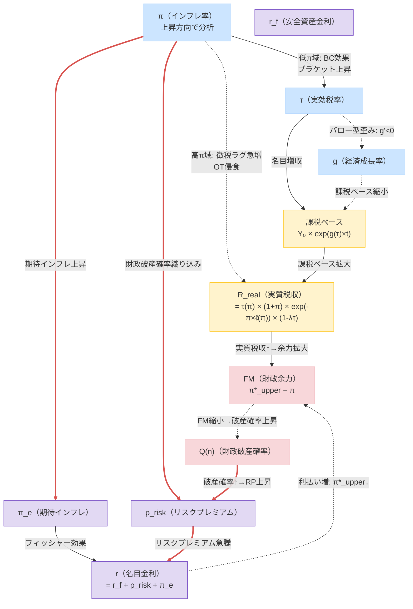
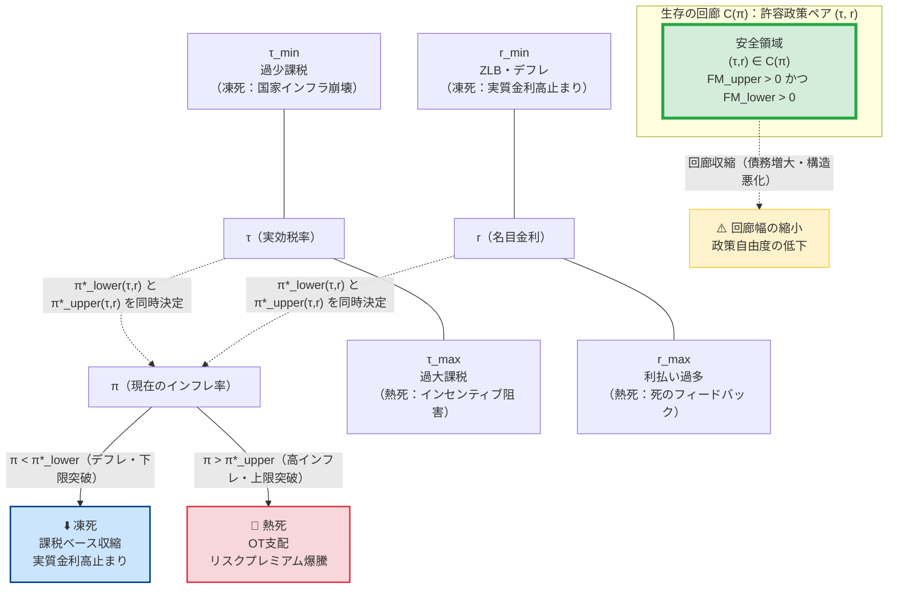

# Part I：本文――インフレと財政持続性の非線形ダイナミクス

## ― BC-OT財政安定性フレームワーク：ブラケット・クリープとオリベラ＝タンジ効果の統合理論 ―

---

## 1. はじめに：インフレ財政学の錯覚と本稿の問い

インフレは政府債務を実質的に軽くする。このため「インフレは財政にとって有利である」という見方がしばしば語られる。しかし歴史を振り返ると、高インフレやハイパーインフレは必ずしも財政を改善しなかった。ワイマール共和国、ジンバブエ、アルゼンチンなどの事例では、インフレが税収基盤そのものを破壊し、財政危機を深刻化させている。

一方で、2022〜2025年の日本や欧米では、インフレ率が2〜3%程度に上昇した局面において、政府の税収は目減りするどころか過去最高を更新し続けた。この明白な現実を従来の理論は説明できなかった。

**本稿の中心的問い：** なぜ低インフレでは財政が改善し、高インフレでは財政が崩壊するのか。この非対称性の根拠は何か。さらに、なぜデフレも財政を悪化させるのか。そして財政運営者はどのような指標で政策を判断すべきか。

この問いに答えるために、本稿は**ブラケット・クリープ効果（BC）**と**オリベラ＝タンジ効果（OT）**を統合した**BC-OT財政安定性フレームワーク**を構築する。

### 1.1 本稿の主要貢献

1. **BC-OT統合モデル**：BC効果（有界）とOT効果（累積的支配）の数理統合
2. **インフレ・ラッファー曲線**：実質税収 $R^{\mathrm{real}}(\pi)$ の山型構造の導出
3. **臨界インフレ率 $\pi^*$**：BC効果とOT効果が均衡する転換点の内生的決定
4. **財政余力（Fiscal Margin）**：$FM = \pi^* - \pi$ による財政健全性の定量指標
5. **財政安定フロンティア**：$\pi^*(\tau, r)$ として政策変数が安定境界を動かすメカニズム
6. **FTPLとの接続**：将来黒字現在価値の侵食として統一的に解釈
7. **動学的不安定性**：ギャンブラーの破産によるOTレジームの「制度変更強制」特性の解明
8. **需要プル・コストプッシュの非対称性**：インフレ原因による $\pi^*$ のシフト
9. **生存の回廊（V16新設）**：上下の臨界インフレ率 $\pi^*_{\text{lower}} < \pi < \pi^*_{\text{upper}}$ による双方向フロンティア

---

## ◆ 図1：主要変数（π・τ・r・g）の相互フィードバック関係図

本稿の核心を理解するために、インフレ率 $\pi$、実効税率 $\tau$、金利 $r$、経済成長率 $g$ の四変数がどのように相互作用するかを図示する。実線矢印（`-->`）は「上昇させる正のチャネル」、破線矢印（`-.->`）は「低下させる負のチャネル」、**赤太線（`==>`）は「死のフィードバック・ループ」**を示す。

> **名目金利の分解：** 名目金利 $r$ は以下のように分解される：$r = r^f + \rho^{\text{risk}} + \pi^e$（安全資産金利 $r^f$＋リスクプレミアム $\rho^{\text{risk}}$＋期待インフレ $\pi^e$）。図では $\pi$ の上昇が $\pi^e$（フォワードルッキング）と $\rho^{\text{risk}}$（財政危機確率の織り込み）を通じて $r$ を押し上げることを示す。

> **読み方のガイド：** 「低インフレ域」では $\pi$ 上昇→$\tau$ 上昇（BC効果）→$R^{\text{real}}$ 増という正のフィードバックが働く。「高インフレ域」では $\pi$ 上昇→OTラグ急増→$R^{\text{real}}$ 崩落。さらに赤太線の**「死のフィードバック・ループ」**（$\pi \uparrow \Rightarrow Q(n) \uparrow \Rightarrow \rho^{\text{risk}} \uparrow \Rightarrow r \uparrow \Rightarrow FM \downarrow$）が金利を自己実現的に暴騰させる。金利上昇はまた、FTPL的に「純利息支払い増→将来PBの実質現在価値減少→物価水準の調整」という経路でインフレを誘発しうる点にも注意（§7参照）。

---

## 2. なぜBCは有界でOTは累積的に支配的になるか：理論の核心

### 2.0 直感的理解：「BCが勝つ世界」と「OTが勝つ世界」

数式に入る前に、二つの世界のコントラストを直感的に把握しておきたい。

**BCが勝つ世界（低インフレ域）：**
名目所得がインフレで膨らみ、税率区分はそのまま据え置かれているため、納税者は自動的に高い税率区分へと移動する（ブラケット・クリープ）。行政は電子申告・源泉徴収で税を素早く徴収できており、「稼いだその月に近い時点」で税収として回収される。インフレが穏やかである限り、この「課税ベースの名目拡大＋実効税率の自動上昇」という恩恵が財政を潤し続ける。

**OTが勝つ世界（高インフレ域）：**
インフレが急加速すると、行政処理能力が追いつかなくなる。徴税には申告・審査・納付という手続きが伴い、どうしても数週間から数ヶ月のラグが発生する。このラグの間に通貨価値が急落し、「帳簿上は100の税収」が実質的には50・30・10に目減りする。さらに納税者も合理的に支払いを先延ばしする。BC効果は最高税率で飽和しているため「もう引き上げようがない」状態にあり、OT侵食に対抗できなくなる。

**なぜ転換点（$\pi^*_{\text{upper}}$）が存在するか：** BCの増収力は「最高税率という天井」によって有界（上限あり）だが、OTの侵食力は「ラグの急増速度」に上限がない。この非対称性から、インフレがある閾値を超えた瞬間に両者の力関係が逆転する。

**なぜ下限の転換点（$\pi^*_{\text{lower}}$）も存在するか：（V16新設）** デフレ域では、名目所得の減少によって課税ベースが収縮し、BC効果は逆転する（ブラケットの逆方向移動）。また実質金利がプラスに高止まりし（ZLB下：$r = i - \pi \approx 0 - (-|\pi|) = |\pi| > 0$）、債務のGDP比が加速的に拡大する。つまり「凍死」に向かう転換点が下側にも存在する。

インフレが起きると、税収は二つの経路で増加する。

**経路①（課税ベースの名目拡大）：** 名目所得がインフレによって押し上げられる。課税対象となる名目所得・利益そのものが膨らむため、税率が変わらなくても税収は増加する。

**経路②（税率区分の上昇・ブラケット効果）：** 累進課税制度では、名目所得が増加した納税者が自動的により高い税率区分へと移動する。社会全体の実効税率が内生的に上昇し、税収はインフレ率以上の速度で膨らむ。

しかし、BC効果には**物理的な上限**が存在する。第一に、所得税の最高税率には法定上限がある。第二に、より根本的には、税率上昇は経済成長を阻害する（バロー型の歪みコスト）。実効税率 $\tau$ の上昇は成長率 $g(\tau)$ を押し下げ（$g'(\tau) < 0$）、課税ベースそのものが長期的に縮小する。この「**税率上昇→成長率低下→課税ベース縮小**」という経路が、BC効果を有界にする経済学的な実質的根拠である。

> **Proposition（BC有界性の根拠）：** 税率が経済成長を阻害するならば（$g'(\tau) < 0$）、実質税収に対するBC効果の総貢献は有限の上限を持つ。

### 2.2 オリベラ＝タンジ効果（OT効果）：財政の潜在的な敵

OT効果の根底にあるのは**徴税タイムラグ**という経済的摩擦である。税は課税事由の発生から納税まで数週間から1年超のラグを経る。高インフレ下では、このラグの間に貨幣価値が急落し、実質税収が侵食される。

重要なのは、OT効果の**累積的支配性**である。インフレが加速すると、行政混乱・納税者の意図的な引き延ばしにより徴税ラグが閾値的に急拡大する。OT侵食因子 $e^{-\pi \ell(\pi)}$ は0〜1に有界だが、**インフレ上昇に伴うその*限界的な侵食力*（$\ell(\pi) + \pi\ell'(\pi)$）はBCの限界増収力を高インフレ域で累積的・動学的に圧倒する**。

> **Proposition（OT累積支配性）：** 高インフレ域では徴税ラグが閾値的に急増し、OTによる限界侵食力の累積効果はBCの有界な限界増収力を圧倒し続ける。侵食因子 $e^{-\pi\ell(\pi)}$ そのものは有界だが、その**急落速度（$-\partial e^{-\pi\ell(\pi)}/\partial\pi$）は上限を持たない。**

### 2.3 非対称性の帰結：臨界インフレ率 $\pi^*$ の存在

**有界なBC**と**累積的に支配的なOT**のこの非対称性から、必然的に次の帰結が導かれる。

**低インフレ域：** BC効果がOT効果を上回り、$\partial R^{\mathrm{real}} / \partial \pi > 0$（財政の味方）。

**高インフレ域：** OT効果の限界侵食力がBC効果の限界増収力を追い越し、$\partial R^{\mathrm{real}} / \partial \pi < 0$（財政の敵）。

したがって、両効果が均衡する点として**上限臨界インフレ率 $\pi^*_{\text{upper}}$** が内生的に決定される。これが**インフレ・ラッファー曲線**の極大点（相転移点）である。

$$\frac{\partial R^{\mathrm{real}}(\pi^*_{\text{upper}})}{\partial \pi} = 0 \tag{式1}$$

> **【式1の注釈】**
> - **変数：** $R^{\mathrm{real}}(\pi)$ = 実質政府税収（インフレ率の関数）；$\pi^*_{\text{upper}}$ = 上限臨界インフレ率（V16：下限との対称化に合わせて表記変更）
> - **意味：** 実質税収のインフレに対する限界変化率がゼロになる点。これより低いと「+（BC優勢）」、高いと「−（OT優勢）」。
> - **V16の対称化：** 上限臨界 $\pi^*_{\text{upper}}$（熱死の境界）と下限臨界 $\pi^*_{\text{lower}}$（凍死の境界）の二重構造に拡張（§4.4参照）。

先進国の典型的なパラメーターを用いた例示的キャリブレーションでは $\pi^*_{\text{upper}} \approx 13 \sim 15\%$ となる（数理的詳細はPart II参照）。ただしこの数値は基準パラメーター依存の典型例であり、本モデルの本質は「$\pi^*$ が存在すること」にある。

---

## 3. インフレ・ラッファー曲線と二相構造

### 3.1 実質税収の山型構造

統合実質政府収入関数 $R^{\mathrm{real}}(\pi)$ は山型の「インフレ・ラッファー曲線」を描く：

- $\pi < \pi^*_{\text{upper}}$（**BC優勢フェーズ**）：インフレ上昇とともに実質税収は増加（$\partial R^{\mathrm{real}} / \partial \pi > 0$）
- $\pi = \pi^*_{\text{upper}}$（**上限臨界点**）：実質税収が最大値に到達
- $\pi > \pi^*_{\text{upper}}$（**OT優勢フェーズ**）：実質税収が急崖的に崩落（$\partial R^{\mathrm{real}} / \partial \pi \ll 0$）

V16では、デフレ方向にも下限の臨界が存在し（$\pi^*_{\text{lower}} < 0$）、ラッファー曲線の左端でも実質税収が低下する構造を持つ（§4.4参照）。

### 3.2 フェーズ①：BC優勢フェーズ（$\pi^*_{\text{lower}} < \pi < \pi^*_{\text{upper}}$）

マイルドなインフレ領域では、OT侵食はほぼ発生しない一方で、BC効果（課税ベース拡大＋実効税率上昇）が支配的となり、インフレが上昇するほど実質税収は増加する。

日本の税収過去最高更新という現実はこのフェーズとして説明される。

### 3.3 フェーズ②：OT優勢フェーズ（$\pi > \pi^*_{\text{upper}}$）

インフレが上限閾値を超えると、行政処理能力の低下と納税者の合理的な引き延ばし行動が相まって、徴税ラグがロジスティック的に急拡大する。BC効果は最高税率で飽和しているため増収余地がなく、OT侵食に対抗できなくなる。

### 3.4 フェーズ③：デフレ・凍死フェーズ（$\pi < \pi^*_{\text{lower}}$）（V16新設）

デフレが進むと、名目課税ベースが収縮してBC効果が逆転し（名目所得減少→低税率ブラケットへの逆移動）、かつZLB下で実質金利が高止まりして債務のGDP比が加速的に拡大する。この「凍死」へ向かうフェーズが下限臨界 $\pi^*_{\text{lower}}$ によって定義される（§4.4・§5.4詳述）。

---

## ◆ 図2：π（インフレ）変化が τ・g・r・財政余力に与える影響の方向図

<table style="border-collapse:collapse; width:100%; font-size:0.9em;">
<thead>
<tr style="background:#3a3a5c; color:white; text-align:center;">
  <th style="padding:8px 10px; text-align:left; min-width:180px;">π（インフレ率）の変化</th>
  <th style="padding:8px 10px;">τ（実効税率）</th>
  <th style="padding:8px 10px;">g（成長率）</th>
  <th style="padding:8px 10px;">r（金利・リスクプレミアム）</th>
  <th style="padding:8px 10px;">FM（財政余力）</th>
  <th style="padding:8px 10px;">Q(n)（破産確率）</th>
</tr>
</thead>
<tbody>
<tr style="background:#cce5ff;">
  <td style="padding:8px 10px; font-weight:bold;">🔵 デフレ域 π↓（凍死方向）</td>
  <td style="padding:8px 10px; text-align:center;">↓（ブラケット逆移動）</td>
  <td style="padding:8px 10px; text-align:center;">↓（需要収縮）</td>
  <td style="padding:8px 10px; text-align:center;">↑↑（実質金利高止まり）</td>
  <td style="padding:8px 10px; text-align:center;">↓（π*_lowerに近づく）</td>
  <td style="padding:8px 10px; text-align:center;">↑（悪化）</td>
</tr>
<tr style="background:#d4edda;">
  <td style="padding:8px 10px; font-weight:bold;">✅ 低インフレ域 π↑（BC優勢）</td>
  <td style="padding:8px 10px; text-align:center;">↑（BC効果）</td>
  <td style="padding:8px 10px; text-align:center;">微低下</td>
  <td style="padding:8px 10px; text-align:center;">ほぼ変化なし</td>
  <td style="padding:8px 10px; text-align:center;">↓（π*_upperに近づく）</td>
  <td style="padding:8px 10px; text-align:center;">↓（改善）</td>
</tr>
<tr style="background:#fff3cd;">
  <td style="padding:8px 10px; font-weight:bold;">⚡ 上限臨界点 π≈π*_upper</td>
  <td style="padding:8px 10px; text-align:center;">↑（飽和）</td>
  <td style="padding:8px 10px; text-align:center;">低下</td>
  <td style="padding:8px 10px; text-align:center;">やや↑</td>
  <td style="padding:8px 10px; text-align:center;">→ 0</td>
  <td style="padding:8px 10px; text-align:center;">中立</td>
</tr>
<tr style="background:#fde8d8;">
  <td style="padding:8px 10px; font-weight:bold;">⚠️ 高インフレ域 π↑（OT優勢）</td>
  <td style="padding:8px 10px; text-align:center;">↑（飽和・固定）</td>
  <td style="padding:8px 10px; text-align:center;">↓↓</td>
  <td style="padding:8px 10px; text-align:center;">↑↑（リスクプレミアム）</td>
  <td style="padding:8px 10px; text-align:center;">↓↓（FM&lt;0へ）</td>
  <td style="padding:8px 10px; text-align:center;">↑↑（急増）</td>
</tr>
<tr style="background:#f8d7da;">
  <td style="padding:8px 10px; font-weight:bold;">🔴 ハイパーインフレ</td>
  <td style="padding:8px 10px; text-align:center;">飽和</td>
  <td style="padding:8px 10px; text-align:center;">↓↓↓</td>
  <td style="padding:8px 10px; text-align:center;">↑↑↑（死のループ）</td>
  <td style="padding:8px 10px; text-align:center;">≪0</td>
  <td style="padding:8px 10px; text-align:center;">→1（確実な崩壊）</td>
</tr>
</tbody>
</table>

> **デフレ行の補足（V16追加）：** デフレ下では $\tau$ が下落（名目所得減少による逆ブラケット移動）し、ZLB下で名目金利をゼロにしても実質金利がプラスに高止まりする（$r_{\text{real}} = i - \pi \approx |\pi| > 0$）。この実質金利高止まりが債務のGDP比を加速させ（Blanchard の $r > g$ 問題の悪化）、FMを下方から侵食する。これが「凍死」のメカニズムである。
>
> **各変数の動きのロジック：** （V15から継続）
> - **τ（実効税率）の動き：** π上昇→累進課税ブラケットの自動移動（BC効果）により実効税率が上昇。最高税率（$\tau_{\max}$）で飽和。デフレ下では逆方向。
> - **g（成長率）の微低下：** τ上昇→バロー型歪みコスト（$g'(\tau)<0$）により成長率が緩やかに低下。時間差による政策誤認リスクに注意。
> - **r（金利）の動き：** 高インフレ域ではリスクプレミアム急上昇。デフレ下では名目金利ZLBにより実質金利が高止まり。
> - **FM（財政余力）の動き：** FMはπ*_upper（上限）とπ*_lower（下限）の両方からの距離指標（V16拡張）。
> - **Q(n)（破産確率）の動き：** FM縮小→OT優勢（または凍死方向）→勝率p低下→破産確率急増。

---

## 4. 財政余力（Fiscal Margin）と財政安定フロンティア

### 4.1 財政余力（FM）の定義

**なぜインフレが財政健全性の指標になるのか：**
財政政策とインフレは、二つの経路で深く結びついている。第一に、生産要素がフル稼働している状態で財政支出を拡大すると、総需要が供給を超えてインフレが生じる（需要プル経路）。第二に、より根本的には、FTPLが示すように、政府債務の実質価値は将来プライマリー黒字の現在価値で決まる（式14参照）。財政の持続性が疑われると、その差額を埋めるように物価水準が上昇する——つまり財政政策の行き過ぎは最終的にインフレに帰結する。

$$\boxed{FM \equiv \pi^*_{\text{upper}} - \pi} \tag{式2}$$

> **【式2の注釈】**
> - **変数：** $\pi^*_{\text{upper}}$ = 上限臨界インフレ率；$\pi$ = 現在のインフレ率
> - **意味：** 現在のインフレ率が上限臨界点までどれだけ余裕があるかを測る距離指標。
> - **V16の拡張：** 下限方向の余力も $FM_{\text{lower}} \equiv \pi - \pi^*_{\text{lower}} \ge 0$ として対称的に定義（§4.4参照）。
> - **日本の現状（参考）：** $\pi \approx 2\%$、$\pi^*_{\text{upper}} \approx 13 \sim 15\%$ → $FM \approx 11 \sim 13\%$

| $FM$ の値 | 財政状況 | 政策の余地 |
| :--- | :--- | :--- |
| $FM > 0$（大） | BC優勢フェーズ・安全域 | 減税・積極的財政政策の検討余地あり |
| $FM \approx 0$ | 上限臨界点（危険接近） | 財政改革が緊急 |
| $FM < 0$ | OT優勢フェーズ・危険域 | 財政危機リスクが急増 |

### 4.2 財政安定フロンティア：$\pi^*$ は政策で動く

臨界インフレ率 $\pi^*$ は固定値ではなく、税率 $\tau$ や金利 $r$ などの政策変数に依存して動く内生変数である：

$$\pi^*_{\text{upper}} = \pi^*_{\text{upper}}(\tau, r, \ell_0, g) \tag{式3}$$

**税率 $\tau$ の効果（二面性）：**

$$\frac{\partial \pi^*_{\text{upper}}}{\partial \tau}: \text{符号は } g'(\tau) \text{ の大きさに依存} \tag{式4}$$

**金利 $r$ の効果（明確）：**

$$\frac{\partial \pi^*_{\text{upper}}}{\partial r} < 0 \tag{式5}$$

**徴税タイムラグ短縮化の効果（明確）：**

$$\frac{\partial \pi^*_{\text{upper}}}{\partial \ell_0} < 0 \quad (\ell_0 \downarrow \Rightarrow \pi^*_{\text{upper}} \uparrow) \tag{式6}$$

### 4.3 財政フロンティアとしての政策空間

$(\pi, \tau, r)$ の三次元空間において、$\pi^*_{\text{upper}}(\tau, r) = \pi$ を満たす面が**上限財政安定フロンティア**を、$\pi^*_{\text{lower}}(\tau, r) = \pi$ を満たす面が**下限財政安定フロンティア**を構成する（§4.4参照）。

---

## ◆ 図3a：財政安定フロンティアの概念図（π-r 平面の断面図）

> **読み方：** 縦軸が金利 $r$、横軸がインフレ率 $\pi$。上限フロンティア（π*_upper線）より**左下（低π・低r側）が安全域（FM>0）**。V16では下限フロンティア（π*_lower線、デフレ側）も追加され、安全域が左右から挟まれた「帯」として定義される。

---

### 4.4 対称的財政安定フロンティアと生存の回廊（V16新設）

これまでのモデルは主に**上限側の破綻（熱死）**に焦点を当てていたが、財政持続性には**下限側の破綻（凍死）**も存在する。V16では両側を明示的に定義し、財政安定フロンティアを**「生存の回廊（Corridor of Stability）」**として完備化する。

#### 税率の下限臨界 $\tau_{\min}$（過少課税による国家インフラ崩壊境界）

政府が最低限の国家機能（徴税インフラ・法秩序・公共財）を維持するための最小政府支出を $G_{\min}$ とする。実質税収がこれを下回る最低税率が $\tau_{\min}$ である：

$$\tau_{\min} \equiv \arg\min_\tau \left\{ \max_\pi R^{\mathrm{real}}(\pi, \tau) \ge G_{\min} \right\} \tag{式3b}$$

> **【式3bの注釈】**
> - **意味：** $\tau < \tau_{\min}$ になると、どのインフレ率にしても国家インフラを維持できない。徴税権そのものが崩壊し、通貨信認が失われる（ハイパーインフレへの転落、または財政凍結）。
> - **V15の $\tau_{\min}^{\text{risk}}$ との関係：** $\tau_{\min}^{\text{risk}}$（式7）は「破産確率を許容水準以下に保つ最低税率」であり確率的な下限。$\tau_{\min}$（式3b）は「国家機能維持の絶対的な下限」。$\tau_{\min} < \tau_{\min}^{\text{risk}}$ が通常の関係。

#### 金利の下限臨界 $r_{\min}$（ZLB・デフレ下の凍死境界）

名目金利にはゼロ金利制約（ZLB）が存在する：$i \ge i_{\min} \approx 0$。実質金利で表現すると：

$$r_{\min} = i_{\min} - \pi \approx -\pi \tag{式3c}$$

デフレ（$\pi < 0$）下では $r_{\min} = -\pi > 0$ となり、中銀が名目金利をゼロまで下げても実質金利がプラスに高止まりする。また財政支配下で名目金利を不当に抑制した場合（$r < r_{\min}$）、国債市場への資金逃避が生じる。いずれも債務のGDP比が加速的に発散する「凍死ループ」を引き起こす。

#### 生存の回廊の定義

政策変数 $(\tau, r)$ の対と現在のインフレ率 $\pi$ に対して、**生存の回廊（Corridor of Stability）**を以下のように定義する：

$$\pi^*_{\text{lower}}(\tau, r) < \pi < \pi^*_{\text{upper}}(\tau, r) \tag{式46}$$

$$\mathcal{C}(\pi) \equiv \left\{ (\tau, r) \;\middle|\; \pi^*_{\text{lower}}(\tau, r) < \pi < \pi^*_{\text{upper}}(\tau, r) \right\} \tag{式47}$$

$$\tau_{\min} \le \tau \le \tau_{\max}(\pi, r), \quad r_{\min}(\pi, \tau) \le r \le r_{\max}(\pi, \tau) \tag{式48a, b}$$

**統一生存条件**：

$$(\tau, r) \in \mathcal{C}(\pi) \quad \Leftrightarrow \quad FM_{\text{upper}} > 0 \quad \text{かつ} \quad FM_{\text{lower}} > 0 \tag{式49}$$

ここで $FM_{\text{upper}} \equiv \pi^*_{\text{upper}}(\tau, r) - \pi$、$FM_{\text{lower}} \equiv \pi - \pi^*_{\text{lower}}(\tau, r)$。

> **政策含意：**
> - 増税（$\tau \uparrow$）は通常 $\pi^*_{\text{upper}}$ を下げるが、$\tau_{\min}$ との関係で回廊を狭める可能性もある（歪みコストによる）。
> - 利上げ（$r \uparrow$）は $\pi^*_{\text{upper}}$ を下げ、ZLB制約が引き上がることで回廊を上方向に圧縮する。
> - 構造改革（徴税デジタル化・成長促進）は $\pi^*_{\text{upper}}$ を上げ $\pi^*_{\text{lower}}$ を下げることで回廊全体を**拡大**させる。

---

## ◆ 図4：BC-OT生存の回廊概念図（V16新設）

> **読み方：** 回廊の内側（青緑領域）が財政持続可能な許容政策ペア $(τ, r)$ の集合。左側の下限（$τ_{\min}$・$r_{\min}$）を破ると「凍死（デフレ・国家機能低下）」へ、右側の上限（$τ_{\max}$・$r_{\max}$）を破ると「熱死（OT支配・リスクプレミアム爆騰）」へと転落する。債務増大や構造悪化が進むと回廊そのものが収縮し、政策の自由度が失われる。

---

## 5. 最低税率・最高金利・金利フィードバック：破産を免れるための境界条件

### 5.0 経済的本質：なぜ「上下限境界」が必要か

**大局的な問い：** 財政運営者は「どこまで減税できるか」「どこまで増税すべきか」「中央銀行はどこまで利上げ・利下げしても財政が安全か」を知りたい。この問いに答えるには、**財政が崩壊しない上下両方向のギリギリの境界線**を特定する必要がある。

**四つの境界線の算定基準：**

本稿では以下の四境界を定義するが、それぞれの算定基準が異なる理由は各変数が財政に作用する**時間的性格の違い**にある：

| 変数 | 上限 | 下限 | 算定基準の論理 |
|:---|:---|:---|:---|
| **税率 $\tau$** | $\tau_{\max}$（BC飽和・成長阻害） | $\tau_{\min}$（国家インフラ崩壊） | 長期確率的持続可能性（$Q(n) \le \epsilon$）：税率は徐々に財政バッファを変化させるため |
| **金利 $r$** | $r_{\max}$（利払い過多） | $r_{\min}$（ZLB・凍死） | 単年度フロー収支（$PS \ge 0$）：金利は当期の利払いに即時反映されるため |

**大学院・実務家レベルの直感：** $\tau_{\min}^{\text{risk}}$（式7）は確率的なゲームにおける「勝率が $\epsilon$ 確率以内で破産するギリギリの勝率」を実現する最低税率であり、ギャンブラーの破産問題（式41）の逆問題として解く。一方 $r_{\max}$（式9）はプライマリーバランスの符号が反転する静的なゼロ条件として定義される——前者が確率微積分の問題、後者が単純な代数方程式であることが、算定基準の非対称性の数理的根拠である。

**大学生・学部生レベルの直感：** 税率の下限・上限は「長期的なサステナビリティ」の問題——毎年の財政バッファの積み上げ（勝率）が長期的に破産しない確率で評価する。金利の下限・上限は「短期的なキャッシュフロー」の問題——当期の収支がゼロを下回った瞬間から債務が加速する転換点として定義する。

### 5.1 リスク調整最低税率 $\tau_{\min}^{\mathrm{risk}}$

財政破産確率 $Q(n)$ を社会的許容上限 $\epsilon$（例：5%）以下に抑えるために必要な**最低実効税率**：

$$\tau_{\min}^{\mathrm{risk}} \equiv \inf \left\{ \tau \;\middle|\; R^{\mathrm{real}}(\pi; \tau) \ge g^{\mathrm{gov}} + \mathcal{D}_t b^{\mathrm{net}} + PS^*(\epsilon) \right\} \tag{式7}$$

財政安全マージン（FSM）は現在の実効税率と最低税率の差：

$$FSM \equiv \tau(\pi) - \tau_{\min}^{\mathrm{risk}} \tag{式8}$$

### 5.2 最大許容金利 $r_{\max}$ と死のフィードバック・ループ

プライマリーバランスがゼロを下回らないための**最大許容名目金利**：

$$r_{\max} \equiv g(\tau) + \frac{R^{\mathrm{real}}(\pi) - g^{\mathrm{gov}}}{b^{\mathrm{net}}} \tag{式9}$$

中央銀行がこの金利を超えると財政はOTレジームへ転落するリスクが急増する。さらに重要なのは**「死のフィードバック・ループ」**の存在である：

$$\pi \uparrow \;\Rightarrow\; Q(n) \uparrow \;\Rightarrow\; \text{リスクプレミアム} \uparrow \;\Rightarrow\; r \uparrow \;\Rightarrow\; \pi^*_{\text{upper}} \downarrow \;\Rightarrow\; FM \downarrow \;\Rightarrow\; \pi \text{の危険域が拡大} \tag{式10}$$

なお、金利上昇はFTPL的にも「純利息支払い増→将来PB合計の実質現在価値減少→物価水準の上昇調整」という経路でインフレを誘発しうる（§7参照）。

> **純債務ベースのデュレーション非対称性：** 日本の場合、政府資産（外国為替資金特別会計・GPIF等）は比較的流動性が高く、金利上昇が受取収益に反映されるラグが短い。一方、国債サイドは平均デュレーションが約8〜9年と長いため、利上げ直後の数年間は「国債の利払い増よりも政府資産の運用リターン上昇の方が先に発現する」という時間軸の非対称性が存在する。

### 5.3 財政余力指標（FIM）の導入

$$FIM \equiv r_{\max} - r_{\mathrm{current}} \tag{式11}$$

### 5.4 金利の下限臨界 $r_{\min}$ と凍死フィードバック・ループ（V16新設）

ZLB制約（$i \ge 0$）の下でデフレが進むと、実質金利が高止まりして「凍死ループ」が発動する：

$$\pi \downarrow \;\Rightarrow\; r_{\text{real}} = i - \pi \uparrow \;\Rightarrow\; \mathcal{D}_t = r_{\text{real}} - g \uparrow \;\Rightarrow\; \dot{b}^{\mathrm{net}} \uparrow \;\Rightarrow\; PS^*({\epsilon}) \uparrow \;\Rightarrow\; \tau_{\min}^{\mathrm{risk}} \uparrow \;\Rightarrow\; FSM \downarrow \tag{式10b}$$

**金利の下限臨界** $r_{\min}$ は国債保有者が貨幣・外貨への逃避を開始する実質利回りの下限として定義される：

$$r_{\min} = -\rho \quad (\rho > 0 \text{ は貨幣の利便性イールド}) \tag{式9b}$$

財政金利下限余力（FIM_lower）：

$$FIM_{\text{lower}} \equiv r_{\mathrm{current}} - r_{\min} \tag{式11b}$$

**六指標の統合体系（V16完備化）：**

| 指標 | 空間 | 正の意味 | 負の意味 |
|:---|:---|:---|:---|
| $FM_{\text{upper}} = \pi^*_{\text{upper}} - \pi$ | インフレ空間（上限） | 安全域 | 熱死危険域 |
| $FM_{\text{lower}} = \pi - \pi^*_{\text{lower}}$ | インフレ空間（下限） | 安全域 | 凍死危険域 |
| $FSM = \tau - \tau_{\min}^{\text{risk}}$ | 税率空間（下限） | 減税余地あり | 増税必要 |
| $FSM_{\text{upper}} = \tau_{\max} - \tau$ | 税率空間（上限） | 増税余地 | 過大課税域 |
| $FIM = r_{\max} - r$ | 金利空間（上限） | 引き締め余地 | 金利危険水準超過 |
| $FIM_{\text{lower}} = r - r_{\min}$ | 金利空間（下限） | 低金利余地 | ZLB・凍死危険域 |

---

## 6. 減税の判定フレームワーク：恒久・時限の決定ロジック

（V15から継続。V16では $FM_{\text{lower}} > 0$ かつ $FIM_{\text{lower}} > 0$ の条件を判定マトリクスに追加。）

### 6.1 恒久減税が許容される条件

$$\tau_{\mathrm{new}}(\pi_t) \ge \tau_{\min}^{\mathrm{risk}} \quad (\forall t \ge 0) \tag{式12}$$

### 6.2 時限減税に留めるべき条件

$$E[S_T] \approx n + T \cdot (R^{\mathrm{real}}(\pi; \tau_{\mathrm{temp}}) - g^{\mathrm{gov}} - \mathcal{D}_t b^{\mathrm{net}}) \ge S_{\min} \tag{式13}$$

### 6.3 政策判定マトリクス（V16更新）

| 条件 | 判定 | 根拠 |
| :--- | :--- | :--- |
| 全六指標 $\gg 0$ かつ 構造改革済み | 恒久大規模減税 | 回廊内で $\tau_{\min}^{\text{risk}}$ が恒久低下 |
| 全六指標 $> 0$ かつ $n$ が大きい | 時限減税（中規模） | バッファの一時的切り崩し |
| いずれか一指標 $\approx 0$ | 現状維持 | バッファ回復を優先 |
| いずれか一指標 $< 0$ | 増税・歳出削減・金利調整 | 回廊逸脱リスクへの対応 |

---

## 7. FTPLとの接続：成立条件の侵食

（V15から継続）

### 7.1 FTPLの基本構造

$$\frac{B_t}{P_t} = E_t \sum_{j=0}^{\infty} \beta^j PS_{t+j} \equiv PV(PS) \tag{式14}$$

### 7.2 OT効果はFTPLの成立条件を侵食する

本モデルでは $PS_t = R^{\mathrm{real}}(\pi_t) - g^{\mathrm{gov}} - \mathcal{D}_t b^{\mathrm{net}}$ であり、OT効果の増大は $R^{\mathrm{real}}$ を低下させ $PS_t$ を悪化させる。

> **Proposition（FTPLの侵食）：** OT効果が十分大きい場合（$\pi > \pi^*_{\text{upper}}$）、将来プライマリー黒字の現在価値は減少する：$\partial PV(PS) / \partial OT < 0$。

### 7.3 $\pi^*$ はFTPL安定境界の実用的近似指標として機能する

$$\Omega \equiv PV(PS) - \frac{B_t}{P_t}: \quad \Omega > 0 \text{（FTPL安定）} \leftrightarrow \pi^*_{\text{lower}} < \pi < \pi^*_{\text{upper}} \tag{式15}$$

> **V16の追記：** 凍死フェーズ（$\pi < \pi^*_{\text{lower}}$）でも、実質金利高止まりによる債務発散がPV(PS)を侵食し、$\Omega < 0$ となる経路が存在する。FTPLの安定条件は上下の臨界インフレ率で挟まれた「生存の回廊」内でのみ維持される。

---

## 8. 動学的不安定性：ギャンブラーの破産の二層解釈

（V15から継続）

### 8.1 財政のランダムウォーク表現

- **BC優勢フェーズ（$\pi^*_{\text{lower}} < \pi < \pi^*_{\text{upper}}$）：** $p > 0.5$（財政改善トレンド）
- **臨界フェーズ（$\pi \approx \pi^*_{\text{upper}}$ または $\pi \approx \pi^*_{\text{lower}}$）：** $p \approx 0.5$（中立的ランダムウォーク）
- **OT優勢フェーズ（$\pi > \pi^*_{\text{upper}}$）または凍死フェーズ（$\pi < \pi^*_{\text{lower}}$）：** $p < 0.5$（財政悪化トレンド）

### 8.2 破産確率の解析解

$$Q(n) = \frac{\gamma^a - \gamma^n}{\gamma^a - 1}, \quad \gamma \equiv \frac{1-p(\pi)}{p(\pi)} \tag{式16}$$

### 8.3〜8.4 レベル1・レベル2（V15から継続）

（内容省略—V15と同一。Level 1：構造固定下の数学的帰結。Level 2：政策介入によるゲームのルール変更。）

---

## 9. 需要プルとコストプッシュ：インフレ原因による $\pi^*$ の非対称性

（V15から継続）

$$Y_t^{\mathrm{demand-pull}} = Y_0 e^{(g_0 + \mu_D \pi)t}, \quad \mu_D > 0 \tag{式17}$$

$$Y_t^{\mathrm{cost-push}} = Y_0 e^{(g_0 - \mu_C \pi)t}, \quad \mu_C > 0 \tag{式18}$$

> **Corollary I：** 同じインフレ率 $\pi$ でも、需要プル型は $\pi^*_{\text{upper}}$ を高め財政の耐久性を増すが、コストプッシュ型は $\pi^*_{\text{upper}}$ を低め財政を急速に脆弱化させる。

---

## 10. 日本への示唆と政策パッケージ

### 10.1 現状の定量評価（例示的キャリブレーション）

<table style="border-collapse:collapse; width:100%; font-size:0.92em;">
<thead>
<tr style="background:#3a3a5c; color:white; text-align:center;">
  <th style="padding:8px 12px; text-align:left;">シナリオ</th>
  <th style="padding:8px 12px;">π（インフレ率）</th>
  <th style="padding:8px 12px;">FM_upper = π*_upper−π</th>
  <th style="padding:8px 12px;">FM_lower = π−π*_lower</th>
  <th style="padding:8px 12px;">Q(8)（破産確率）</th>
  <th style="padding:8px 12px; text-align:left;">財政状況</th>
</tr>
</thead>
<tbody>
<tr style="background:#cce5ff;">
  <td style="padding:8px 12px; font-weight:bold;">🔵 デフレ</td>
  <td style="padding:8px 12px; text-align:center;">-1%</td>
  <td style="padding:8px 12px; text-align:center;">約14〜16%</td>
  <td style="padding:8px 12px; text-align:center;">約1〜3%（下限接近）</td>
  <td style="padding:8px 12px; text-align:center;">↑（ZLB悪化）</td>
  <td style="padding:8px 12px;">凍死フェーズ入口</td>
</tr>
<tr style="background:#d4edda;">
  <td style="padding:8px 12px; font-weight:bold;">✅ 現行</td>
  <td style="padding:8px 12px; text-align:center;">2%</td>
  <td style="padding:8px 12px; text-align:center;">約11〜13%</td>
  <td style="padding:8px 12px; text-align:center;">十分な余裕</td>
  <td style="padding:8px 12px; text-align:center;">約1.4%</td>
  <td style="padding:8px 12px;">生存の回廊内・安全</td>
</tr>
<tr style="background:#fff3cd;">
  <td style="padding:8px 12px; font-weight:bold;">⚠️ ストレス</td>
  <td style="padding:8px 12px; text-align:center;">10%</td>
  <td style="padding:8px 12px; text-align:center;">約3〜5%</td>
  <td style="padding:8px 12px; text-align:center;">十分な余裕</td>
  <td style="padding:8px 12px; text-align:center;">約60%</td>
  <td style="padding:8px 12px;">Stress regime入口</td>
</tr>
<tr style="background:#f8d7da;">
  <td style="padding:8px 12px; font-weight:bold;">🔴 臨界点超過</td>
  <td style="padding:8px 12px; text-align:center;">15%</td>
  <td style="padding:8px 12px; text-align:center;">0以下</td>
  <td style="padding:8px 12px; text-align:center;">—</td>
  <td style="padding:8px 12px; text-align:center;">約99%</td>
  <td style="padding:8px 12px;">事実上の財政崩壊域</td>
</tr>
</tbody>
</table>

> **注：** 上記は先進国の典型的なパラメーターを用いた**例示的キャリブレーション**。$\pi^*_{\text{lower}}$ の具体的な推計は今後の課題。

### 10.2 三本柱＋一の政策パッケージ

**政策I（徴税タイムラグ短縮化）：** $\ell_0$ 縮小→$\pi^*_{\text{upper}}$ 上昇→$FM_{\text{upper}}$ 内生的拡大。

**政策II（ALM最適化）：** ネット利子率 $r^{\mathrm{net}}$ の低下→$r_{\max}$ と $FIM$ 引き上げ。デュレーション管理の改善は $r_{\min}$ との距離（$FIM_{\text{lower}}$）も改善する。

**政策III（サプライサイド改革）：** 潜在成長率向上→$g(\tau)$ 改善→BC優勢フェーズでの財政健全化モメンタム加速＆凍死フェーズへの転落リスク低減（$\pi^*_{\text{lower}}$ の下方シフト）。

**政策IV（純債務管理の明示化）：** $b^{\mathrm{net}}$ ベースの財政健全性評価の制度化。六指標すべての分母・基準となる純債務の正確な把握が前提。

---

## 11. 結論（Part I）

**BC-OT財政安定性フレームワーク（V16完備版）**の中心的メッセージは以下の一本の論理連鎖に集約される：

$$g'(\tau) < 0 \Rightarrow BC\text{が有界} \Rightarrow OT\text{が累積的に支配的} \Rightarrow \pi^*_{\text{upper}}\text{の存在（式1）}$$
$$\Rightarrow \text{下限} \pi^*_{\text{lower}}\text{の存在（式3c）} \Rightarrow \text{生存の回廊（式46-49）}$$
$$\Rightarrow FM_{\text{upper}} \cdot FM_{\text{lower}} \cdot FSM \cdot FSM_{\text{upper}} \cdot FIM \cdot FIM_{\text{lower}}\text{の六指標体系（§5.4）}$$
$$\Rightarrow FTPL\text{の成立条件悪化（式14-15）} \Rightarrow \text{動学的不安定性（ギャンブラーの破産・式16）} \Rightarrow \text{制度変更の強制}$$

財政は「熱死（高インフレ・OT支配）」と「凍死（デフレ・実質金利高止まり）」の双方から挟まれた生存の回廊内でのみ持続可能である。財政安定フロンティア $\pi^*_{\text{upper}}(\tau, r)$ を右方にシフトさせ、$\pi^*_{\text{lower}}(\tau, r)$ を左方にシフトさせる政策（徴税タイムラグ短縮化・ALM・成長政策）こそが、生存の回廊を広げる正攻法である。

**現在の低インフレ・BC優勢フェーズ（日本：$\pi \approx 2\%$、$FM_{\text{upper}} \approx 11 \sim 13\%$）は、生存の回廊を恒久的に拡大する「機会の窓」である。**

